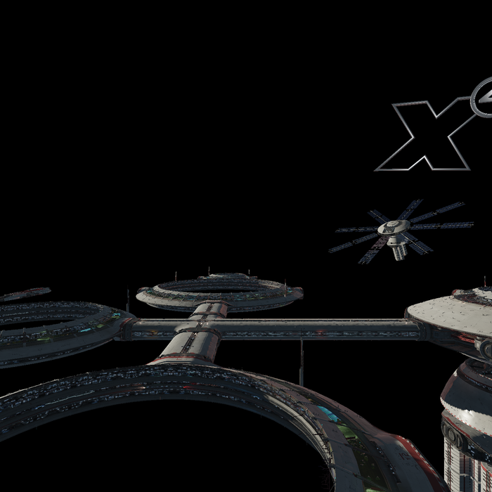

# Frame analysis (Phase 2, in progress)

Renderdoc findings on X4 9.0 (RADV, RX 7900 XTX). This is the empirical
basis for the double-render stereo mechanism; keep it updated as we learn
more.

---

## Where this stands (read this first)

**Verified live and tagged.** The frame renders two genuinely different eyes
from a single draw, up to the point where sampling takes over.

| Tag | What it holds |
|---|---|
| `stage1-multiview-verified` | Both array layers byte-identical (readback) |
| `stage1-complete` | …and a frame built entirely from layer 1 is correct end to end |
| `stage2-per-eye-k` | Per-eye `K` via `gl_ViewIndex` — one draw, two different eyes |
| `stage2-tonemap-masked` | The SRGB resolve replicates into both layers of `#103` (knob is misnamed) |
| `stage2-frag-patch` | A patched sampler reads layer N in view N — proven offline, **not usable on X4** |

**The frame is stereo up to the first sampled read, and mono after it.** That
is the entire remaining problem, and it is measured rather than assumed — the
per-image probe table under "Take nineteen" below.

### The frame graph, as far as it is known

Serials are assigned in creation order and **held identical across runs 47 and
take nineteen**, which was an inference and is now a measurement. Images come
in a repeating block — the same target set allocated several times (`#8–#23`,
`#46–#59`, `#92–#107`, …) — and the blocks align on their one unmistakable
member, the `mips=2 fmt=13` mask at offset **+9**.

| Serial | Format | Role | Stereo? |
|---|---|---|---|
| `#92`, `#95`, `#96`, `#97` | 97 `RGBA16F` | HDR colour / G-buffer | **per-eye** |
| `#93` | 126 | depth-stencil | per-eye |
| `#98`, `#99` | 83 `R16G16_SFLOAT` | G-buffer (normals/motion) | **per-eye** |
| `#100` | 50 `B8G8R8A8_SRGB` | LDR | not seen written |
| `#101` | 13 `R8_UINT`, mips=2 | classification mask, rp #25 + rp #27 | **per-eye** |
| `#102` | 9 `R8_UNORM` | mask | **per-eye** |
| **`#103`** | **50 `B8G8R8A8_SRGB`** | **LDR composition (scene + UI), rp #40 + rp #52** | replicates, **mono content** |
| `#104`, `#105` | 97 `RGBA16F` @352² | bloom ping-pong | replicates, mono |
| `#122`, `#123`, `#124` | 76 `R16_SFLOAT` @1408² | rp #61 / rp #63; unidentified | replicates, mono |
| — | 44 `B8G8R8A8_UNORM` | rp #0/#1/#4/#7/#10/#14/#17 → eye image | **not even masked** |

The last row is the remaining frontier. Everything that "replicates but is
mono" is mono for one reason — it is *sampled* through the bindless table — so
all of it is fixed by the same index offset. The format-44 chain needs masking
first, and that is where `SbsCompositor`'s two-layer eye image finally matters.

### X4 is bindless, and that decides the mechanism

**Read "Take twenty" before planning anything about sampling.** The measured
fact: every shader that draws into `#103` samples one descriptor —
`set 0 binding 7, count 53306`. X4 keeps every texture in the game in a single
bindless table, indexed by `S_diffuse_idx`, a `uint` in
`BLOCK_BUFFER_BINDING_SLOT_DYNAMIC` (set 4 binding 0).

Consequences, all of them load-bearing:

* **Promoting a texture's type is not available.** `Arrayed 0 → 1` on that
  table promotes all 53,306 entries; ~20 images are doubled. The patch already
  refuses (the pointee is an `OpTypeArray`), and a test now asserts it.
* **`patch_fragment_view_layer` is proof-of-mechanism, not the mechanism.** It
  is tagged `stage2-frag-patch` and its offline gate is real — a sample can
  follow `gl_ViewIndex` on this driver, measured before and after. Do not wire
  it into X4.
* **`#103` is not a tonemap output.** It is the LDR composition target: a
  generic textured-quad draw brings the scene in, UI geometry is drawn on top,
  and six pipelines share rp #40. `X4VR_MASK_TONEMAP` is a misnomer kept for
  continuity with the tagged runs.

### Next step: the bindless index offset (task #13)

Because the index is an integer in a uniform, per-view sampling becomes integer
arithmetic and nothing else changes type:

    element = S_diffuse_idx + gl_ViewIndex * OFFSET

with the layer writing, at `slot + OFFSET`, an ordinary 2D view of **layer 1**
of whatever image sits in `slot`. `sampler2D` stays `sampler2D`. The
shader/view pairing problem that the array approach had — a `sampler2DArray`
requiring a matching `2D_ARRAY` view, validation error if they disagree —
disappears entirely.

Best property: **the slot holding `#95` never has to be identified.** Mirror
every descriptor write into the twin region, substituting a layer-1 view for
per-eye images and duplicating the descriptor otherwise. Undoubled textures
then read identically in both views, so the patch needs no per-shader
targeting — and a shadow map's twin *is* the same shadow map, which defuses
that hazard instead of dodging it.

Headroom is not a problem: RADV allows 8,388,606 sampled-image descriptors per
set against X4's 53,306.

**What the survey settled about this plan** (details under Q1/Q2 above):

* The twin region **needs no allocation**. X4 declares and allocates all 53,306
  with `PARTIALLY_BOUND`, uses a dense 10,980-slot prefix, and leaves 42,326
  descriptors allocated-but-unwritten. `OFFSET = 26,653` splits the array in
  half with 2.4× headroom over the observed high-water mark.
* The mirror must be **per-write, not one-shot** — but for a reason the
  prediction got wrong. Slots do not appear late; their *contents* are rewritten
  ~2× per frame.
* The mirror must cover **bindings 5 and 7 both**; they hold identical
  populations.

**The open question is now cost, not feasibility.** X4 issues ~21,900
image-descriptor writes per frame. Mirroring each one doubles that. Two shapes
to weigh before writing code, and this should be decided by measurement:

1. **Mirror every write** in `vkUpdateDescriptorSets` — simple, always current,
   and it adds ~21,900 descriptor writes per frame of CPU work.
2. **Bulk-copy the prefix** with `VkCopyDescriptorSet` (one copy of
   0..10,979 → 26,653.., `descriptorCount` in one call) — far cheaper per frame,
   but it is a snapshot, so anything X4 rewrites after the copy is a frame stale
   in the second view. Since the table is rewritten twice per frame, "stale" is
   not hypothetical and needs bounding before this is chosen.

Neither is obviously right. Given "performance is king", option 1 gets built
first because it is correct by construction, and option 2 becomes an
optimisation with a measured baseline to beat.

### Task #13 is two runs, on purpose

The mirror and the shader patch are independent, and building both before
measuring either is how a broken frame becomes un-diagnosable — the mistake this
project has already paid four runs for. So:

**Step A — mirror only, with nothing reading it.** The layer duplicates every
image-descriptor write into `slot + OFFSET`, substituting a layer-1 view where
the image is per-eye and copying the descriptor verbatim otherwise. No shader is
patched, so nothing indexes the twin region and **the frame must not change at
all**. That makes it a clean isolation: any frame-time delta is the mirror's
cost and nothing else, and any validation error is the mirror's fault and
nothing else. It also proves the twin region is writable before a shader depends
on it, which is currently an inference from `PARTIALLY_BOUND` plus a
fully-allocated pool, not a measurement.

**Step B — the index offset, on the narrowest useful set of shaders.**
`element = S_diffuse_idx + gl_ViewIndex * OFFSET`. Gate: `#103` flips from
all-IDENTICAL to all-DIFFER.

Two notes on step B that step A does not need to wait for:

* **The new patch is much simpler than the abandoned one.** No retyping, no
  coordinate extension, no following a retyped value through function bodies
  with a taint set. It declares the `ViewIndex` builtin and rewrites one index
  operand into an `OpIAdd`/`OpIMul` pair. The hard parts of
  `patch_fragment_view_layer` do not recur.
* **Patch few shaders, not all 333.** Every patched shader can index any slot, so
  the twin must be complete regardless — but the *risk* scales with how many
  modules are rewritten, and the gate only needs the fragment modules drawing
  into `#103`. The `srgb-resolve rp #40: frag module #N` join already names them.

### What the next run (step A) is trying to find out

Predictions committed **before** the run, as usual. This one is mostly a cost
measurement, which means the prediction that matters is a number.

**P1 — Is the twin region actually writable?** Currently an inference: the count
is fixed, so allocation consumes all 53,306, so the pool backs them, so writing
above the high-water mark is legal.

> Predicted: **yes**, no validation error and no `VK_ERROR_OUT_OF_POOL_MEMORY`.
> If this is wrong the whole mechanism dies and options reopen at the
> replay-the-pass level.

**P2 — Does the frame change?** Nothing reads the twin region, so nothing should.

> Predicted: probe verdicts **identical to take twenty-one** — G-buffer DIFFER,
> `#103` IDENTICAL. Any change here means the mirror is writing somewhere it
> should not, and the most likely somewhere is a slot X4 is still using, i.e.
> `OFFSET` overlapping the live prefix.

**P3 — What does mirroring cost?** ~21,900 extra descriptor writes per frame.

> Predicted: **under 1.5 ms added to the median frame time.** A descriptor write
> on RADV for an `UPDATE_AFTER_BIND` binding is close to a small memcpy, so
> 21,900 of them should be well under a millisecond of CPU; the slack is for
> building the second `VkWriteDescriptorSet` array. If it lands above ~3 ms,
> option 2 (bulk `VkCopyDescriptorSet`) stops being an optimisation and becomes
> the design.

**P4 — How many sets come from the bindless layout?** The mirror has to cover
each of them, and the survey never counted.

> Predicted: **a small number, under 8** — one per frame in flight, or one
> outright, since the table is global and `UPDATE_AFTER_BIND` exists precisely so
> a single set can be rewritten while in use.

**P5 — Does the used prefix stay clear of `OFFSET` over a long session?** 10,980
after thirteen minutes.

> Predicted: **yes, comfortably** — the prefix grew 358 slots in thirteen
> minutes and `OFFSET` is 26,653 away. A guard logs it if the prefix ever
> crosses, because silent overlap would corrupt X4's own textures rather than
> merely break stereo.

P1 and P3 are the load-bearing ones: P1 can kill the mechanism, P3 can change
it. P2 is the control that says the instrument and the mirror are not lying to
each other. P4 and P5 are cheap and prevent a class of silent failure.

### What that run found — Q1–Q4, scored

Ran 2026-07-30, `X4VR_BINDLESS_SURVEY=1`, 9,934 frames of play. **Two of four
predictions right**, and the two that were wrong were wrong in ways that matter
more than the two that were right. Predictions are left verbatim with the
verdict underneath, so the record shows what was believed and not only what
turned out to be true. Numbers and narrative: *Take twenty-one*.

**Q1 — Does X4 allocate all 53,306 descriptors, or declare the array large and
bind fewer?** This decides the size of the job. If the layout really carries
53,306, the layer only has to *mirror writes* into a twin region. If X4 uses
`VARIABLE_DESCRIPTOR_COUNT` and binds a few thousand, the layer must widen the
descriptor set layout **and** the pool — a much bigger intervention, touching
object creation rather than data.

> Predicted: **variable count**, bound well below 53,306. 53,306 is suspiciously
> exact for a compile-time bound and bindless engines normally declare the
> maximum and size the set to the level's content.

**WRONG, and wrong in the good direction.** One layout, seven bindings with
`count > 1`, and `flags = 0x7` on every large one:
`UPDATE_AFTER_BIND | UPDATE_UNUSED_WHILE_PENDING | PARTIALLY_BOUND`. Bit 0x8,
`VARIABLE_DESCRIPTOR_COUNT`, is **not set anywhere in the run**, and no
`VkDescriptorSetVariableDescriptorCountAllocateInfo` was ever passed. X4
declares the full 53,306 and allocates the full 53,306.

    binding 2  INPUT_ATTACHMENT      58   partially-bound, update-after-bind
    binding 3  INPUT_ATTACHMENT      58   partially-bound, update-after-bind
    binding 4  SAMPLER               18   no flags
    binding 5  SAMPLED_IMAGE     53,306   partially-bound, update-after-bind
    binding 6  STORAGE_IMAGE     53,306   partially-bound, update-after-bind
    binding 7  SAMPLED_IMAGE     53,306   partially-bound, update-after-bind
    binding 8  STORAGE_IMAGE     53,306   partially-bound, update-after-bind

**The consequence deletes the biggest predicted job.** Because the count is
fixed and no variable count is used, `vkAllocateDescriptorSets` consumes all
53,306 from the pool — so the pool already backs every one of them, and
`PARTIALLY_BOUND` makes an unwritten descriptor legal as long as no shader
reads it. **The twin region already exists.** No widening the layout, no
resizing the pool, no intercepting object creation. Writing above X4's
high-water mark is just writing.

Independent cross-check that the layout reader is honest: binding 4 reports
`SAMPLER × 18`, and the SPIR-V survey independently found an 18-entry `sampler`
array at set 0 binding 4. Two instruments, different sources, same number.

**Q2 — How many slots does X4 actually write, and how?** Decides where a twin
region can live and whether an offset can be a compile-time constant.

> Predicted: a few thousand distinct slots, written **incrementally** as content
> streams in, not as one bulk update at load. Expect writes to keep arriving
> during play, which means the mirroring cannot be a one-shot pass at startup.

**Right about the conclusion, wrong about the reason — and the real reason is
worse.** The slot *set* is nearly static: 10,622 slots written before the first
present, 10,980 by the end, so 96.7% of it existed before a single frame was
shown and thirteen minutes of play added 358. "Streams in incrementally" is not
what happens.

What is dynamic is the *contents*:

    217,705,579 image-descriptor writes     (217,684,326 after the first present)
    /  9,934 frames   =  ~21,900 per frame
    /     10,980 used slots  ≈  two full rewrites of the table every frame

So mirroring still cannot be a one-shot pass at startup — but not because slots
appear late. It is because **every slot's contents are rewritten about twice per
frame**, which kills any plan built on identifying a slot once and mirroring it,
and sets the mirror's cost by X4's descriptor traffic rather than by table size.

Shape of the used region, which is what the offset needs:

    bindings 5 and 7:  10,980 distinct slots, range 0..10,979  — dense, no holes
    of 53,306 declared:  20.6% used, 42,326 free
    191 slots hold a per-eye (doubled) image: #101, #103, #600, #607

Bindings 5 and 7 carry the **same population** — same count, same range, same
191 per-eye slots, same image serials. X4 maintains two identical sampled-image
tables, so the mirror has to cover both.

Dense, and one-fifth full, means the offset can be a compile-time constant with
room to spare. `OFFSET = 26,653` (half of 53,306) leaves 2.4× headroom over the
observed high-water mark, and the layer can log if the prefix ever crosses it.

**Q3 — Does any shader index the table non-uniformly?** A non-uniform index
needs `NonUniformEXT` on the access chain, and the patch must preserve it.
`gl_ViewIndex` is draw-uniform, so it adds no non-uniformity of its own.

> Predicted: **no** — the indices seen so far come from uniform blocks, which is
> uniform by construction. If any shader computes an index from an interpolated
> input this flips, and the patch has to carry the decoration through.

**RIGHT, and settled without the run.** `NonUniform` appears in **0 of 409**
dumped modules. Indices are draw-uniform; the patch has no decoration to
preserve.

**Q4 — Is the same table used for storage images or subpass inputs anywhere?**
Those would need excluding: a storage image has no sampler, and a subpass input
is already view-indexed.

> Predicted: **no** — binding 7 is declared `sampled` (`Sampled=1`) in every
> module read so far, and the input attachments the layer already fixes arrive
> through `VK_DESCRIPTOR_TYPE_INPUT_ATTACHMENT`, a different descriptor type.

**RIGHT, and settled without the run.** All 333 declarations at set 0 binding 7
are plain 2D sampled images. The layout confirms it from the other side: the
storage images live at separate bindings (6 and 8) and the input attachments at
2 and 3, each its own descriptor type.

The two that would have changed the plan most were Q1 and Q3. Q3 held. Q1 broke
in the direction that removes work rather than adding it, which is the first
time in this project that a wrong prediction has been good news.

**Pass condition for the eventual patch:** `#103` flips from all-IDENTICAL to
all-DIFFER. Still nothing on screen — that waits for the format-44 chain.

**The same run also answered task #5's real question, unasked.** The per-eye
difference is already large and real in the G-buffer, and dies at exactly the
boundary the mechanism predicts. See *Where the difference dies*, below.

### Where the difference dies

The survey run had the probe on, and its verdicts across 9,934 frames locate the
failure boundary exactly. Counts are DIFFER / total probes for that image:

| image | shape | verdict |
| --- | --- | --- |
| `#97` | `RGBA16F` 1408² | **21 / 23 DIFFER** |
| `#95` | `RGBA16F` 1408² | **20 / 23 DIFFER** |
| `#98` `#99` | `RG16F` 1408² | **20 / 23 DIFFER** |
| `#102` | `R8_UNORM` 1408² | **6 / 6 DIFFER** |
| `#101` | `R8_UINT` 1408², 2 mips | **10 / 23 DIFFER** (6–9% of texels) |
| `#92` | `RGBA16F` 1408² | 6 / 23 DIFFER |
| `#103` | `BGRA8_SRGB` 1408² — the composition | **0 / 22 — always IDENTICAL** |
| `#104` `#105` | `RGBA16F` 352² | 0 / 21 IDENTICAL |
| `#122` `#123` | `R16_SFLOAT` 1408² | 0 / 18, 0 / 17 IDENTICAL |

Two things follow, and both are measurements rather than arguments.

**The stereo half of the mod works.** The shear and the per-view camera
constants produce genuinely divergent geometry in the lighting inputs — not a
uniform offset, not noise: `#101` differs in 6–9% of its texels with the first
differing texel scattered across the frame between probes ((9,0), (82,0),
(1274,0), (446,244)). Everything upstream of a sampler is already stereo.

**Everything downstream of a sampler is mono, and that is the whole remaining
problem.** `#103`'s writers are masked passes — the layer *does* run them
per-view — and their output is identical every single time, because what they
read arrives through a descriptor bound to layer 0. This is the central
asymmetry, finally measured end to end instead of reasoned about: multiview
view-indexes subpass inputs automatically and never view-indexes samplers.

**A free constraint on task #8.** `#122`/`#123` and `#104`/`#105` are *masked
yet identical* — the layer renders them twice with different view state and gets
the same answer both times. So their contents cannot depend on rasterized
geometry; they are derived purely from sampled data. That narrows what they can
be without guessing at them, which is the standing rule for these three.

### Why patching is the chosen mechanism

Decided with the user after measuring, not by default. The LDR domain is mono
*by construction*: every pass is single-subpass, no masked pass outputs LDR,
and the four passes writing the presented image are single-attachment — so
their input can only arrive by descriptor. **Multiview view-indexes subpass
inputs automatically but never samplers**, and a descriptor set has no
per-view form. Alternatives considered and rejected: replaying the LDR pass
range per eye (no shader knowledge needed, but invasive command-buffer
interception), and blitting to a double-wide source so a *vertex* patch could
offset UV (cheapest, but an extra full-res copy per frame).

Bindless narrows this further, and in the right direction. Replay would now be
*worse* than it looked — the source descriptor lives in a table shared by the
whole game, so pointing it at layer 1 between replays means rewriting a
descriptor other draws depend on, and descriptor sets cannot be updated while
in use. The index offset needs no replay, no extra copy, and no descriptor
rewrite: it adds a slot, and the shader picks which one.

The module-structure rules are shared and already proven (`d623ee1`):
`patch_vertex_clip` takes an optional right-eye matrix and selects
arithmetically rather than by branch or `OpSelect`, both cases validation-clean.
The index patch selects the same way — capability with the capabilities,
extension only below SPIR-V 1.3, decoration in the annotation section, new Input
added to the entry point's interface list. One caution specific to X4: a single
module carries **both** entry points, so a vertex patch and an index patch will
meet in the same module, each wanting its own `ViewIndex` input.

### Reading the instruments (hard-won; do not re-derive)

* **`X4VR_LOG` appends.** A "single run" log usually holds dozens. Segment on
  `instance created (app=X4)` before aggregating anything. Serials restart per
  run, so a whole-file summary is confident nonsense — it once produced a table
  contradicting the run it came from.
* **Writer lists need `X4VR_MV_INVENTORY=1`.** Without it every pass hashes to
  the `UINT32_MAX` sentinel and, because the list de-duplicates *by serial*,
  all of an image's writers collapse into a single `?`. Never read writer
  counts from a run without the inventory.
* **`(uniform 0xNN)` is not "content that agrees".** The probe reports a layer
  that is one repeated texel. Two layers merely *cleared* to the same value
  agree trivially, and counting that as evidence of mono behaviour is how a
  mono target passes for a stereo one. `(all zero)` is the special case it
  always named.
* **The inventory prints two verdicts now.** `MONO`/`STEREO` is about K;
  `+MASKED` is about replication. Since the split they are independent.

### The launch command that matches the baselines

    X4VR_GAMESCOPE=1 X4VR_ONE_EYE=1 X4VR_MV=1 X4VR_STEREO=1 \
    X4VR_MV_PROBE=1 X4VR_MV_INVENTORY=1 X4VR_MASK_TONEMAP=1 \
    ./launch/x4vr-launch.sh

`X4VR_GAMESCOPE=1` is not optional for comparability: X4 ignores
`res_width`/`res_height` while borderless and sizes to the display, so without
it every render target changes dimensions and the probe table stops being
comparable to the tagged runs. `X4VR_ONE_EYE=1` gives 1408×1408 (SBS width/2),
which is what every take from sixteen on has used.

### Knobs that matter now

    X4VR_MV=1                 doubling + masking (the whole stage-1 mechanism)
    X4VR_STEREO=1             per-eye K, both eyes baked, gl_ViewIndex selects
    X4VR_MASK_TONEMAP=1       mask rp #40/#52 so #103 replicates (keyed on the
                              SRGB attachment format; UNORM is left alone).
                              MISNOMER: those passes are not a tonemap, they
                              are LDR composition and are shared with UI
                              geometry. Kept for continuity with the tags.
    X4VR_MV_PROBE=1           the per-image layer0-vs-layer1 verdict table
    X4VR_MV_INVENTORY=1       pass/framebuffer/image inventory; required for
                              any join between passes and image serials
    X4VR_MV_DUMP=<prefix>     write the two layers as PPM on a DIFFER
                              (gated on RGBA16F — cannot dump #122/#123 yet)
    X4VR_SBS_LAYERS=2         allocate the second layer on the eye image
    X4VR_SBS_RIGHT_LAYER=1    …and actually show it in the right half
    X4VR_PRESENT_MODE=0       uncap the frame rate; every perf number before
                              this one measured the monitor, not the renderer
    X4VR_TEST_OUT_SRGB=1      test binary only: make its LDR second pass SRGB,
                              which is X4's tonemap in miniature
    X4VR_TEST_ARRAY_SAMPLER=1 test binary only: bind a 2D_ARRAY view instead of
                              a 2D one — goes with a patched fragment shader
    X4VR_DUMP_SHADERS=<dir>   write every module X4 creates as <dir>/mod-NNNN.spv;
                              the srgb-resolve log names which serials matter
    X4VR_BINDLESS_SURVEY=1    measure the bindless table: layout counts, variable
                              descriptor counts, distinct slots written, and
                              which slots hold a doubled image. No behaviour
                              change. Independent of X4VR_MV, deliberately —
                              MV=0 is the control

### Deliberately still open

* **What `#122`/`#123`/`#124` are** (task #8). Full-res single-channel
  `R16_SFLOAT`, a two-pass ping-pong sitting right after the `88×88×128` froxel
  volumes (`#116`–`#121`). Shape fits AO or a screen-space shadow resolve.
  Deliberately *not* guessed at: globally-applied shadows wrecked the earlier
  X4 VR attempt, so this gets identified before it is touched. They already
  replicate, so they need only the fragment half — a cheap second customer for
  the same patch once named.
* **The doubling overshoot** — 91 images / ~566 MB against ~18–21 / ~135 MB
  needed. Untouched on purpose so a tightening regression cannot be confused
  with a stereo bug.
* **No real perf number yet.** `X4VR_PRESENT_MODE` now makes one obtainable;
  `X4VR_MV=0` remains a valid baseline, so this is not urgent. Note the
  masked tonemap adds a second full-resolution fullscreen pass, so the
  measurement should happen with the knob in both states.
* **Lighting constants are still the left eye's.** Per-eye `K` shears clip
  space; `M_invprojection`, `V_cameraposition` @736 and
  `V_light_direction_view` @864 are not yet per-view, so the right eye's
  deferred lighting reconstructs position with the left eye's matrices. Not
  yet visible, and it will be once the LDR chain carries the difference.
* **`#100`** is the other `B8G8R8A8_SRGB` target in the block and no pass has
  been seen writing it. If a second SRGB writer ever appears, the
  `X4VR_MASK_TONEMAP` carve-out would catch it too — worth a check rather than
  a surprise.

### What the method has been worth

Four guesses have been overturned by measuring before patching, each of which
would have cost a wrong-looking live run and a false conclusion about the
mechanism:

* `#122`/`#123` "are the tonemap pair" — they are `R16_SFLOAT`. Patching them
  would have changed nothing and read as the fragment patch failing.
* `#101` "is intermittently mono" — it was a constant clear the instrument
  could not name. Patching near it would have been patching a non-problem.
* **"X4 binds textures per descriptor"** — it is bindless, one 53,306-entry
  table for the whole game. The type-promotion patch was built, proven offline,
  and is unusable here. Wiring it first would have promoted every texture X4
  owns and produced a spectacular, hard-to-attribute mess.
* **"`#103` is the tonemap output"** — it is the LDR composition target, and
  the pass it is written by is shared with UI geometry.

Three instruments have also been quietly wrong for at least one run each: the
probe's zero-only test, the writer-list `?` sentinel, and the sampler lister's
blindness to `OpTypeArray`. Enough of a pattern to be a rule: **check a new
instrument's first non-trivial reading against something already known.**

And one implementation trap caught offline: dropping SRGB from
`is_ldr_format`, the obvious one-line way to mask the tonemap, also shears it.
The suite reports that as `rp=sheared fb=masked` rather than merely going red.

---

## Per-view frame-constants UBO ("camera constants")

Found on a complex scene object's constant buffer. One UBO holds all the
per-view matrices, each a `mat4` (16 floats = 64 bytes). The reported
offsets are in **floats**, so the byte offset = float-offset × 4:

| # | Name | Float off | Byte off | Role | Per-eye action |
|---|------|-----------|----------|------|----------------|
| 1 | `M_view` | 0 | 0 | world → view | **PATCH** — apply ±IPD/2 along view-space X (and, in VR, the headset pose) |
| 2 | `M_projection` | 16 | 64 | view → clip | **PATCH** — per-eye projection (re-square to the eye's 1:1 aspect; VR: OpenXR frustum) |
| 3 | `M_invprojection` | 32 | 128 | clip → view (depth→pos) | **PATCH** — `inverse(M_projection_eye)`; drives deferred lighting reconstruction |
| 4 | `M_projection_uj` | 48 | 192 | unjittered projection | **PATCH** — eye projection without TAA jitter (== #2 with AA off) |
| 5 | `M_invprojection_uj` | 64 | 256 | unjittered inv-projection | **PATCH** — `inverse(#4)` |
| 6 | `M_jitter` | 80 | 320 | TAA jitter | leave (should be identity/zero with AA off) |
| 7 | `M_prevjitter` | 96 | 384 | previous TAA jitter | leave |
| 8 | `M_viewprojection` | 112 | 448 | world → clip | **PATCH** — `M_projection_eye × M_view_eye` (primary geometry transform) |
| 9 | `M_viewinverse` | 128 | 512 | view → world | **PATCH** — `inverse(M_view_eye)` |
| 10 | `M_shadowCSM0Clip` | 144 | 576 | world → shadow cascade 0 clip | **LEAVE** — light-space, shared by both eyes |
| 11 | `M_shadowCSM1Clip` | 160 | 640 | world → shadow cascade 1 clip | **LEAVE** |

Buffer is ≥ 704 bytes (11 × 64). **7 matrices patched, 4 left** (jitter ×2,
shadow ×2).

### What this tells us

- **X4 is a deferred renderer.** `M_invprojection` / `M_viewinverse` are the
  classic depth→view-space and view→world reconstruction matrices used by
  deferred lighting and screen-space effects. Because they live in the *same*
  per-view UBO as `M_view`/`M_projection`, **patching this one UBO per eye
  makes both geometry and lighting render for that eye** — the whole reason
  we chose double-render, achieved at a single interception point.
- **Shadows are view-independent.** The CSM clip matrices are light-space and
  shared, so we do not touch them and both eyes sample the same shadow maps.
- **TAA jitter is out of the way** once AA is disabled (jitter → identity;
  `M_projection == M_projection_uj`).

### Per-eye math (to validate empirically in Phase 3/4)

Let `V` = X4's `M_view`, `P` = X4's `M_projection` (computed for the 2:1
2816×1408 frame). For a flatscreen SBS eye with interpupillary `ipd`:

```
Veye = Translate(±ipd/2, 0, 0)_viewspace · V      # sign TBD; swap if eyes reversed
Peye = perspective(fovy_from(P), aspect = 1.0)    # re-square: 1408×1408 eye viewport
       # fovy from P[1][1] = 1/tan(fovy/2), aspect-independent
Peye_uj = Peye                                     # AA off
M_invprojection      = inverse(Peye)
M_invprojection_uj   = inverse(Peye)
M_viewprojection     = Peye · Veye
M_viewinverse        = inverse(Veye)
```

In VR (Phase 5), `Veye` = `eyeFromHead · headPose` from OpenXR and `Peye` =
the runtime's per-eye asymmetric frustum, instead of the ±ipd/2 + re-square.

Note X4 renders the 2:1 frame with a 2:1 projection; per eye we replace the
projection with a 1:1 one, so no squish. Handedness / reversed-Z convention
must be read off `P` once and matched exactly.

## Full-frame analysis (capture: `x4-capture-cockpit.rdc`, cockpit, static)

Parsed with `tools/parse_capture.py` from the XML conversion
(`renderdoccmd convert -c xml`). Frame = 2816×1385 (window at capture time),
742 draws, 52 dispatches, 47 render passes, ~2 queue submits.

### THE key finding: the view-constants arena (buffer 967)

- `VkBuffer` **967**: size **229,376 = 128 × 1792**, usage UNIFORM_BUFFER,
  bound at **memory 793 + 251,887,616**.
- It is an **array of per-view constant blocks, stride 1792 bytes**. The
  11-mat4 camera block (704 bytes) documented above is the head of each
  block; the remaining ~1088 bytes are other per-view constants.
- 62 descriptor-set slots reference it with `range 1792` at different
  offsets — one block per *view* in the frame:
  - **offset 3584 (block #2) = the main camera** — credited by ~211 scene
    draws (the G-buffer pass alone has 249);
  - other offsets (105728, 111104, 16128, 53760, 75264, 17920, 5376, …) are
    shadow-cascade and auxiliary views (~40–120 draws each).
- Memory 793 (and 829) are **huge (~268 MB) host-coherent persistently
  mapped arenas**; X4 updates constants by **plain CPU memcpy into the
  mapping** (zero `vkCmdUpdateBuffer` in the whole frame; renderdoc shows
  whole-arena `Coherent Mapped Memory Write` flushes).
- Descriptor sets are **baked** (1652 allocations, no dynamic offsets, no
  in-frame UBO descriptor writes — set state appears as renderdoc
  `Initial Contents`). So per-draw constants are addressed by *static*
  (buffer, offset) pairs in per-object sets.

**Interception consequences:**
1. The per-eye patch is a **CPU write into mapped memory** (the main-view
   1792-byte block), not a command-stream edit.
2. Because both eyes' submissions would read the *same* block, double-render
   needs either (a) submit-L → sync → rewrite block → submit-R
   (simple, serializes eyes), or (b) a layer-recorded clone command buffer
   with the eye-R constants sourced from a different block/copy (parallel,
   more machinery). Start with (a), optimize to (b).
3. Offsets are likely ring-allocated and can move frame to frame; at runtime
   the layer identifies the arena by "UBO with descriptor range 1792" and
   the *main* view block as the one bound by draws in the big G-buffer pass.

### Render-pass skeleton (frame order)

| # | Passes | FB size / formats | Content |
|---|--------|-------------------|---------|
| 1–4 | 4 | 2816×1385, 6 att: D32 + 3×RGBA16F + 2×RG16F | **G-buffer** (pass 3 = main geometry, 249 draws) |
| 5–8 | 4 | 2048×2048 D16 | **Shadow cascades** (4) |
| 9 | 1 | 2816×1385, 5 att | secondary geometry (60 draws) |
| 10 | 1 | 2816×1385, D32+R8_UINT | ID/stencil-ish pass (41 draws) |
| 11–22 | 12 | 1408×692 → 1×1, R32F | **depth/luminance pyramid** (auto-exposure) |
| 23–25 | 3 | 1408×692 RGBA16F | half-res ping-pong (bloom/blur head) |
| 26–31 | 6 | 2816×1385, 6 att | **deferred lighting/composite** (31 has 53 draws — light volumes) |
| 32–39 | 8 | 704×346 RGBA16F | bloom pyramid ping-pong |
| 40–41 | 2 | 2816×1385 R16F (+52 dispatches) | AO/exposure compute block |
| 42–45 | 4 | 2816×1385 | more composite (2×RGBA16F pairs) |
| 46 | 1 | 2816×1385 **B8G8R8A8_SRGB, 232 draws** | **UI/HUD pass** |
| 47 | 1 | 2816×1385 B8G8R8A8_UNORM, 1 draw | final blit → present |

Other UBO patterns for reference: per-object slots of range 768 (×724) and
4096 (×587); big arenas buffer 7243 (8 MB) / 9805 (4 MB) in memory 829.

### Notes / caveats

- The plain-`xml` conversion **omits buffer payloads** (`MapData` bodies),
  so matrix *values* can't be read from the XML — structure only. Values can
  be inspected in the qrenderdoc UI when needed.
- All 6-attachment targets are **full-frame sized**: intermediate passes are
  not split. First SBS implementation should therefore be **sequential
  full-frame per eye + composite into halves at the end** (option (a)),
  rather than trying to halve every intermediate target.
- The UI pass (46) is a separate SRGB pass after all 3D — good news: it can
  be rendered once and composited per-eye at a chosen depth plane.

## Cross-capture comparison (cockpit vs walking vs map)

Three captures parsed (`x4-capture-cockpit.rdc`, `x4-walking-cockpit.rdc`,
`x4-map.rdc`). The architecture is **identical across scene types**:

| | Cockpit | Walking | Map open |
|---|---|---|---|
| Passes / draws | 47 / 742 | 43 / 273 | 50 / 1283 |
| View arena | buffer 967 | buffer **838** (different run) | buffer 967 (same run as cockpit) |
| Arena stride/mem | 1792, mem 793+251.9M | 1792, mem 793+251.7M | 1792, mem 793+251.9M |
| Main-view block | off 3584 (211 draws) | off 8960 (59 draws) | off 8960 (498) **+ 91392 (256), 12544 (131), …** |
| Shadow cascades | 4× 2048² D16 | 4× | 4× |
| Compute block | 52 dispatches | 52 | 52 |
| UI pass | SRGB, 232 draws | SRGB | SRGB, 255 draws |
| Final | 1-draw blit | same | same |

Conclusions:

1. **Stable architecture.** Same pipeline in every mode; the view arena is
   always "the UNIFORM_BUFFER referenced by descriptor slots of range 1792"
   in the memory-793 arena. Buffer *ID and block offsets vary by run and
   scene* → runtime discovery must be dynamic (pattern-match, don't hardcode).
2. **The map is a real 3D scene**, not a 2D overlay — 717-draw G-buffer pass
   of galaxy/sector geometry, plus *multiple* simultaneously-active view
   blocks. Menu-mode (mono, world-locked quad) remains the right first
   design, but stereo-map is genuinely possible later.
3. Consequently, **mode detection cannot come from the render graph** (map
   looks like gameplay to Vulkan) — it must come from the injector (Lua /
   game state), as designed.
4. **Main-view selection rule** for the layer: the range-1792 block bound by
   draws of the *largest* 6-attachment G-buffer pass. Unambiguous in
   cockpit/walking; with the map open there are several big views, which is
   fine because menu mode doesn't patch cameras.

## Live validation (harness run, full gameplay session, 17,430 frames)

Ran the harness on X4 directly (menu → load save → cockpit → walking → map →
menu). Results:

- **Harness is stable**: no crash across 17,430 frames, save load, loading
  screens, and all scene transitions.
- **The view arena is double-buffered**: two UBO buffers alternate as the
  winner every frame (frames-in-flight). Per-eye patching must target the
  *current frame's* buffer.
- **The main-view block offset is NOT stable** — it **ring-moves** across the
  128-block arena over a session (observed blocks #0, #1, #2, #3, #4, #6–#9,
  #39, #41, #44, #54, #59, …). So the offset **cannot be hardcoded**; the
  layer must discover it dynamically every frame. Confirmed:
- **The dynamic "most-drawn range-1792 block wins" heuristic works** — in
  cockpit gameplay it locks onto the block credited by ~202 draws (matches
  the cockpit capture's ~211 main-view weight); in menus it correctly falls
  to a 1-draw block.
- **config.xml is read via `fopen(".../EgoSoft/X4/<id>/config.xml", "r")`** —
  the Phase-1 interposition point (note `ventureconfig.xml` shares the
  substring; match the exact basename).

**Refinement noted for Phase 3/4:** scope draw-crediting to the *main
G-buffer render pass* (the largest 6-attachment pass) rather than all draws,
so the winner is unambiguous even mid-transition. The current whole-frame
heuristic is adequate for detection but we want render-pass precision before
we start writing eye matrices.

## Still to determine (updated)
- The remaining ~1088 bytes of the 1792 block (per-view params that may also
  need per-eye patching, e.g. camera world position for specular).
- Present-time details: swapchain image count, present mode, and how the
  final pass maps onto the swapchain image (single full-screen draw — easy
  overlay point). *Partly answered live:* `1408x1408 images>=4 format=44
  presentMode=2`, and the SBS composite already blits at present time.
- All three captures are 2816×1385 (config height fix hadn't taken effect);
  re-verify 2816×1408 next session. *Superseded:* the target is now 1408×1408
  per eye (tag `one_eye_baseline`); the live pass inventory in Phase 4b below
  is at that size and confirms the capture's pass map.
- Which render targets are distinct **images** rather than distinct passes —
  needed to turn the Phase 4b doubling estimate into a real number, and the
  same `vkCreateImage` hook the doubling itself needs.

## Phase 3 findings: camera-relative rendering (the blocker)

Live experiments with the layer writing into the view arena (all under
gamescope, menu 3D scene, verified by screenshots):

| Experiment | Result |
|---|---|
| Read the view block | **Works.** Values are live and correct: the projection's aspect tracked the swapchain exactly (1.778/0.889 = 2.000 at 2816×1408; 1.778/0.744 = 2.39 at 3440×1440). |
| `M_view` contents | **Always IDENTITY**, in every block of the arena (survey of 128 blocks). |
| `M_projection` | Reversed-Z, infinite far plane, near = 0.1, column-major (m[11]=±1, m[15]=0), Y-flipped (m[5] negative). |
| Write eye offset into `M_view` + rebuild `M_viewprojection`/`M_viewinverse` | **No visual effect.** |
| Zero `M_viewprojection` in the credited block | **No visual effect.** |
| Hammer-zero `M_viewprojection`+`M_projection` at ~10 kHz from a thread | **No visual effect** (rules out any write/read race). |
| Write-then-verify at present time | Block is **STILL ZERO** at present → X4 does not rewrite it; the GPU is reading its camera data from elsewhere. |
| Zero the **entire** arena buffer (229,376 B) | **Screen goes fully black** → the arena *is* consumed by the GPU. |

**Interpretation.** `M_view` being identity everywhere means X4 renders
**camera-relative**: object transforms are baked against the camera on the
CPU (normal for a space sim, to avoid float precision loss at astronomical
distances). So the per-view `M_view`/`M_viewprojection` are not what
positions the geometry — which is exactly why writing them changes nothing,
while wiping the whole arena still kills the image (the deferred lighting
and post passes *do* read this block, most likely `M_invprojection` /
`M_viewinverse` for depth→view reconstruction).

**Also fixed along the way:** draw-crediting ignored the descriptor *set
index*, so an auxiliary/UI view could win the frame. The capture shows the
main camera block is the range-1792 UBO bound at **descriptor set 1** during
the 6-attachment G-buffer pass (84% of its 249 draws). Crediting is now
scoped to set 1, though in the menu scene the winner is unchanged.

### Consequences for the stereo design

Patching one per-view matrix is **not** sufficient on this engine. The
realistic options, in order of preference:

1. **Pre-multiply the per-object transforms.** With `V = I`, an object's
   baked transform already includes the camera. An eye offset `d` is then a
   fixed pre-multiplication: `MVP_eye = P · T(−d) · P⁻¹ · MVP`. This needs
   the per-object constant layout (the range-204/256/768/4096 blocks bound
   at set 2+) — a renderdoc shader-reflection job, same method that gave us
   the 11 view matrices.
2. **Patch the projection only** for a *sheared* stereo (off-axis frustum).
   Cheap, but gives parallax without a true eye translation — needs testing
   for comfort, and depends on `M_projection` actually being consumed by
   geometry (not yet proven: zeroing it had no effect, which suggests
   geometry uses baked MVPs including projection).
3. **Intercept at the shader level** (SPIR-V patching) to inject an eye
   offset into the vertex stage uniformly — heaviest, most invasive, but
   independent of how the CPU bakes transforms.

Next diagnostic (cheap, decisive between the above): zero **only**
`M_invprojection` (float offset 32) and only `M_projection` (offset 16),
separately, in every block. If invprojection alone blackens the image, the
view block is confirmed lighting-only and option 1 becomes the main path.

## Ground truth: shader reflection (SPIR-V debug names)

X4 ships its shaders **with full debug info**, so the constant layouts can be
read directly instead of inferred. Extracted all 140 `vkCreateShaderModule`
payloads from the capture's blob archive and disassembled with `spirv-dis`
(see `tools/extract_shaders.py`). The engine binds **five** descriptor sets:

| Set | Block | Purpose |
|-----|-------|---------|
| 1 | `BLOCK_BUFFER_BINDING_SLOT_CAMERA` (64 members, 1792 B) | per-view constants |
| 2 | `BLOCK_BUFFER_BINDING_SLOT_MATERIAL` (64 members) | material params |
| 3 | `BLOCK_BUFFER_BINDING_SLOT_WORLD` (15 members) | **per-object transforms** |
| 4 | `BLOCK_BUFFER_BINDING_SLOT_DYNAMIC` (11 members) | texture/envmap matrices |

### Set 3 — `BLOCK_BUFFER_BINDING_SLOT_WORLD` (the missing piece)

| Off | Member |
|-----|--------|
| 0 | **`M_worldviewprojection`** |
| 64 | `M_world` |
| 128 | `M_prevworldviewprojection` |
| 192..448 | `M_shadowCSM0..4` |
| 512 | `V_blendcolor` |
| 528 | `F_alphascale` |
| 532+ | `B_packedtangentframe`, `B_vertexdata0..2`, `B_useskinning` |

**This explains every Phase-3 result.** Geometry is transformed by
`M_worldviewprojection` from the *per-object* set-3 block — already baked on
the CPU, camera included (hence `M_view` = identity). The set-1 camera block
we were patching is consumed by lighting/post (and by `V_cameraposition`,
`M_invprojection`, …), which is why zeroing the whole arena blackened the
screen while patching `M_view`/`M_viewprojection` did nothing at all.

### Set 1 — camera block, beyond the 11 matrices

The block is 64 members; the first 11 are the matrices already documented.
The rest matter for stereo correctness:

| Off | Member | Note |
|-----|--------|------|
| 704 | `V_viewportpixelsize` | per-eye viewport size |
| 720 | `V_screenresolution` | |
| 736 | **`V_cameraposition`** | must move with the eye (specular/parallax) |
| 752..848 | `V_ambient1`, `V_direction1..3`, `V_lightcolor1..3` | |
| 864 | `V_light_direction_view` | **view-space** light dirs — per-eye |
| 928 | `V_csmthresholds` | |

### Revised stereo plan

Per eye we must patch **two** places, not one:

1. **Set 3, offset 0** — `M_worldviewprojection` for *every object drawn*:
   `MVP_eye = P · T(−d) · P⁻¹ · MVP`, a single fixed 4×4 pre-multiplication
   (`M_view` is identity, so the eye offset is a pure view-space translate).
   `M_prevworldviewprojection` (off 128) needs the same treatment for
   motion-vector correctness.
2. **Set 1** — the camera block: `M_view`/`M_viewprojection`/`M_invprojection`
   (+`_uj` variants) *and* `V_cameraposition` and `V_light_direction_view`,
   so deferred lighting matches the eye. This is the "per-eye lighting" the
   design called for.

Shadow matrices (`M_shadowCSM*` in both blocks) stay shared — light-space.

Open question for the next step: per-object blocks are numerous (724×768 B +
587×4096 B observed). Patching them on the CPU each frame is feasible but
touches a lot of memory; the alternative is a GPU-side `vkCmdUpdateBuffer`
injected per draw, or SPIR-V patching of the vertex stage to apply the eye
transform once. Measure before choosing.

## Phase 3b: clip-space injection works (the Phase-4 mechanism)

`common/x4vr_spirv.hpp` patches scene vertex shaders to append
`gl_Position = K * gl_Position`, with `K` baked in as SPIR-V constants at
`vkCreateShaderModule` time — **zero per-frame CPU or GPU cost** beyond one
mat4×vec4 per vertex.

Validation, offline against all 140 shader modules extracted from the
capture:

- **136 patched, 0 rejected by `spirv-val`, 4 correctly skipped** (compute).
- X4's modules are **multi-entry**: 136 contain *both* a Vertex and a
  Fragment entry point in the same module. The patcher scopes its injection
  to the Vertex entry function only — verified by disassembly (the injected
  `OpMatrixTimesVector` appears exactly once, inside `%main` (Vertex), never
  in `%main_0` (Fragment)).

Live in X4 (`X4VR_CLIP_SHIFT=0.35`): shaders patch during load with no
driver rejections, and the rendered scene is visibly translated in NDC.
**This is the mechanism Phase 4 will use**, with `K = P·T(−d)·P⁻¹` per eye.

### Known follow-up: the UI shifts too

The 2D UI/HUD is drawn with vertex shaders as well, so it is displaced by
`K` along with the world. For stereo this is wrong — the UI must either be
excluded from the patch or given its own (smaller, or zero) eye offset so it
sits at a comfortable fixed depth. Options, cheapest first:

1. Skip patching modules whose vertex shader does **not** bind the set-3
   `BLOCK_BUFFER_BINDING_SLOT_WORLD` block (UI draws are unlikely to use
   per-object world transforms) — a static, zero-cost classification made at
   module creation.
2. Patch UI shaders with a separate `K_ui` (identity, or a mild depth
   offset), which also gives us the "UI at a chosen depth plane" the design
   wants for menu mode.

The frame map already shows the UI is a **separate late SRGB pass**, so a
per-pass distinction is available as a fallback.

### Classification attempt 1: set-3 presence (partial success)

`x4vr::spv::classify()` splits vertex modules by whether they declare the
set-3 per-object world block. On X4's 140 modules: **96 WORLD, 40 UI, 4
compute**. The 40 "UI" modules all have the interface signature
`%IO_uv0 %_ %gl_VertexIndex` — the classic fullscreen-triangle pattern, i.e.
**fullscreen post-process passes** (bloom, lighting composite, blits).

Keeping those at identity is important in its own right: giving a screen-space
pass a world eye offset would corrupt it, not merely misplace it. So this
classification earns its keep regardless of what happens with the HUD.

**But it does not isolate the HUD.** Live test with `K_world` shifted and
`K_ui` identity: the menu text still moved with the world (its origin went
from x≈215 to x≈500 in a 2000-px-wide capture). So X4's UI/text shaders
*also* declare set 3 — presumably they share the standard pipeline layout
even when the block's contents are irrelevant to them. Declaring a set is
not the same as being positioned by it.

Better discriminators to try, cheapest first:

1. **Vertex input attributes.** World geometry declares
   `SPECIAL_VERTEXLOCATION_POSITION/NORMAL/TANGENT`; UI/text quads are far
   more likely to be index- or uv-driven. X4 names its interface variables,
   so this is readable straight from the SPIR-V at module creation — still
   zero per-frame cost.
2. **Per-render-pass selection.** The frame map already shows the UI is a
   separate late SRGB pass. This is exact, but needs two pipeline variants of
   the same module (one per K) selected at bind time, so it costs pipeline
   memory and some bookkeeping.
3. **Whether the shader actually *reads* `M_worldviewprojection`** (member 0
   of the set-3 block) rather than merely declaring the block — a data-flow
   check on the SPIR-V. More precise than (1), more work.

Note for Phase 4: a shifted HUD is not fatal to a first SBS milestone (it
lands at *some* depth rather than the right one), so this can be solved in
parallel with the eye split rather than blocking it.

## Phase 4a: the per-eye matrix, and where it may/may not be applied

### Derivation (implemented in `x4vr::make_eye_shear`)

X4's projection gives, for a view-space point `(x, y, z, 1)`:

```
x_c = sx*x     y_c = sy*y     z_c = near (constant!)     w_c = z
```

Offsetting the camera by `dx` means translating the world by `-dx`, so
`x_c' = x_c - sx*dx`. Because `z_c` is the constant `near` for every vertex,
that constant term can be carried by `z_c`, giving an identity matrix with a
single shear term:

```
K[0][2] = -sx*dx/near        (column-major m[8])
```

In NDC this is `x_ndc' = x_ndc - (sx*dx)/z`: the shift falls off with view
depth, i.e. **true stereo parallax** — near geometry separates strongly,
distant stars not at all. (The Phase-3b proof used a plain clip-space
translation, which slides everything uniformly and carries no depth cue; it
proved the injection mechanism, not the stereo math.)

Env: `X4VR_EYE=left|right`, `X4VR_IPD=<metres>` (default 0.064),
`X4VR_PROJ_SX` / `X4VR_PROJ_NEAR` (defaults are the values measured at
2816×1408; to be derived from the live camera block later).

**Caution:** the shear scales as `dx/near` with `near = 0.1`, so it is ~10×
`sx*dx`. An "exaggerated for visibility" IPD must stay small — 0.3 m is
already a strong effect; several metres produces meaningless output.

### Where the matrix is valid — and where it is not

The derivation assumes clip `z_c` is the constant camera near plane. That
holds only for draws going through the main perspective projection. It is
**wrong for shadow passes**, which transform through `M_shadowCSM*` in
light space.

Classification was therefore tightened: a module counts as World only if its
vertex stage actually **reads member 0 (`M_worldviewprojection`)** of the
set-3 block, not merely declares the block. On X4's shaders: **94 World / 42
UI / 4 compute** (this correctly moved two shadow-related fullscreen modules
into the non-shifted bucket).

That still does not separate shadow *geometry* draws, because X4 bakes the
light-space matrix into the same `M_worldviewprojection` slot and reuses the
same shader modules. But the capture settles how to handle it:

> **Shadow and main passes share no pipelines** (shadow passes 5–8 use 9
> pipelines, main geometry passes 3/46 use 11, intersection = **0**).

So the exclusion belongs at **pipeline creation**, not module creation:

1. Hook `vkCreateRenderPass` and record which passes are depth-only
   (shadow passes are 2048×2048, D16, no colour attachments).
2. In `vkCreateShaderModule`, keep **both** variants — the original and the
   K-patched one.
3. In `vkCreateGraphicsPipelines`, pick the original variant when the
   pipeline's render pass is depth-only, the patched variant otherwise.

Static, decided once per pipeline, zero per-frame cost — and it generalises
to the two-eye case (one pipeline variant per eye) that Phase 4b needs.

## UI input is CPU-side and does not follow GPU-side transforms

Live finding (2026-07-25 cockpit session, right-eye shear at IPD 0.3): with
the UI misclassified as world geometry, every UI surface — main menu, cockpit
HUD, and the map — rendered shifted left by the same amount. Two conclusions:

1. **The menu, the HUD and the map share one reference frame.** They are all
   driven by the same per-object block and all inherit `K_world` together, so
   they can be fixed (or moved) as a single unit.
2. **Their interaction boxes did NOT move.** To click an item that appeared at
   position *x*, the mouse had to go to its original, unshifted position —
   noticeably far to the right of where the element was drawn.

Point 2 is the important one and it is a hard architectural constraint:

> **X4 hit-tests the UI on the CPU, in unshifted screen space.** Anything we
> do to UI geometry on the GPU desynchronises what the player sees from what
> the player can click.

Consequences for the design:

- `K_ui` must stay **identity**. Shearing the UI is not merely cosmetically
  wrong, it breaks input. This is now a correctness requirement, not a
  preference.
- The "world-locked menu quad" idea in menu mode **cannot** be implemented by
  transforming UI vertices in the layer alone. Whatever transform is applied
  to the UI for VR must be accompanied by the *inverse* transform on pointer
  coordinates, applied before X4 sees them — i.e. in the `LD_PRELOAD`
  injector (SDL mouse events), not in the Vulkan layer.
- This is precisely the job of the planned **cursor shim**, and it is a
  stronger requirement than "make the cursor visible in VR": the shim owns the
  mapping between VR pointing and X4's canonical 2816×1408 screen space.
- Because the map renders in the UI pass, excluding that pass from the eye
  shear also lands the map in mono — which is what menu mode wants anyway.

### UI-pass exclusion (same mechanism as the shadow exclusion)

Pass 46 is a separate SRGB pass (`B8G8R8A8_SRGB`, 232 draws) after all 3D,
and pass 47 is the final `B8G8R8A8_UNORM` blit; every world pass writes
multi-attachment float targets (RGBA16F / RG16F / D32). So a render pass
whose colour attachments are **all 8-bit UNORM/SRGB** is screen-space, and
its pipelines take the unpatched module variant — decided once, at pipeline
creation, exactly like the depth-only case.

## Phase 4a validated: the shear is real parallax

Measured 2026-07-25 with `tools/measure_parallax.py`, comparing two captures
of the same save at the same camera pose: one with `X4VR_EYE` unset (no
shader patching at all) and one with `X4VR_EYE=right X4VR_IPD=0.3`.

| Region | Shift | Corr | Implied z |
|---|---:|---:|---:|
| Starfield (top right) | **0 px** | 0.999 | ∞ |
| HUD radar (screen space) | **0 px** | 0.708 | — |
| HUD bars (screen space) | **0 px** | 0.892 | — |
| Canopy strut (mid) | **−117 px** | 0.788 | 1.60 m |
| Right hull panel (near) | **−172 px** | 0.801 | 1.09 m |

Three distinct behaviours from one constant matrix:

- **Screen-space UI: exactly 0** — the pipeline-creation exclusion works.
- **Stars: 0 at correlation 0.999** — this is simultaneously the strongest
  possible camera-alignment check (the two loads are pixel-identical at
  infinity) and the far reference. Anything other than 0 here would have
  meant the poses did not match, not that parallax vanished.
- **Cockpit: −117 and −172 px** — and crucially the two near regions differ
  *from each other*, ordered correctly: the hull panel is nearer than the
  canopy strut, so it moves more.

A uniform clip-space translation would have moved all five regions by an
identical amount. Four distinct values (0, 0, −117, −172) can only come from
a shift proportional to 1/z. **The clip-space identity holds in the engine,
not just on paper.**

The measured displacements are below the 190–375 px band predicted before the
run, but that band assumed cockpit geometry at 0.5–1 m. The implied depths are
1.09 m and 1.60 m, and `shift = sx·dx/z` reproduces the measured values there
exactly — the model is confirmed; only the guessed distances were off.

Note this validates the **geometry** half of a stereo eye. Per-eye *lighting*
still requires patching the camera block (`M_view`, `M_viewprojection`,
`M_invprojection(_uj)`, `V_cameraposition` @736, `V_light_direction_view`
@864), which the deferred passes read; that is the remaining Phase-4a work
before `sbs_lighting_done`.

## Phase 4b: multiview — the device, and the render-pass partition

The second eye arrives as **array layer 1** rather than as the right half of a
wider frame. That choice is forced, not stylistic: X4 lays its UI out from the
*window* size while rendering into the swapchain extent, so a wide window with
a narrow render desynchronises what is drawn from what can be clicked (the
"two left halves" symptom — see `docs/x4-quirks.md`). An extra array layer is
invisible to X4's sizing; an extra half-width is not. Render size stays equal
to window size, which is the arrangement verified end to end at tag
`one_eye_baseline`.

### The device supports it; X4 switches it off

Probed at `vkCreateDevice` (`X4VR_MV_INVENTORY` is not needed for this — it
always logs):

```
multiview: supported=1 maxViews=8 maxInstanceIndex=2147483647
           geomShader=1 tessShader=1
multiview: X4 requests it? ext=0 feature=0 — device api 1.4, app api 1.2
multiview: enabled in X4's existing feature struct
```

Three facts worth keeping:

1. **X4 declares Vulkan 1.2**, where multiview is core. No extension to add,
   no KHR alias to chase, `VkRenderPassMultiviewCreateInfo` under its core
   name.
2. **X4 leaves the feature disabled**, and a disabled feature makes every
   multiview render pass invalid. The layer enables it.
3. **X4 already supplies a feature struct** with `multiview = VK_FALSE`, so
   the layer takes the *flip* path, not the prepend path. Adding a second
   `VkPhysicalDeviceMultiviewFeatures` beside an existing
   `VkPhysicalDeviceVulkan11Features` is forbidden outright, which is why the
   code searches the chain before prepending.

Regression-tested by `tests/run-multiview-enable.sh`, which proves the feature
is *live* (it creates a two-view render pass and lets validation judge) rather
than merely requested, and includes two cases that must fail.

### Half of X4's render passes never run

`X4VR_MV_INVENTORY=1`, joined with the framebuffer log by
`tools/mv_inventory.py`, over a full session (cockpit → walking → map → exit):

| Verdict (seed) | Reason | Declared | Instantiated |
|---|---|---:|---:|
| MONO | all-LDR/UI | 9 | 6 |
| MONO | depth-only/shadow | 10 | 5 |
| STEREO | "world" | 47 | 23 |

**66 render passes are declared; only 34 ever get a framebuffer.** X4 builds
several variants of each pass and instantiates one — with antialiasing forced
off, the MSAA twins are dead.

*Trap:* the dead twins must still be classified **identically** to their live
siblings. Pipelines are created against a render pass, so giving one variant a
view mask while its twin keeps none splits them into incompatible passes. Do
not "optimise" by skipping passes that were never seen with a framebuffer.

### The live frame, by role

| Passes | Extent | Attachments | Role |
|---|---|---|---|
| 23 | 1408² | `RGBA16F, RGBA16F, RG16F, RG16F` + `D32` | **G-buffer** — exactly one |
| 13, 28–32, 51, 53, 60, 65 | 1408² | `RGBA16F` + `D32` | forward / transparent geometry |
| 25 | 1408² | `R8_UINT` + `D32` | ID / selection buffer |
| 38, 39 | 1408² | `RGBA16F` | fullscreen HDR |
| 62, 64 | 1408² | `R16_SFLOAT` | single-channel fullscreen |
| 34, 36 | 352² | `RGBA16F` | bloom, quarter-res |
| 21 | 256² | `RGBA16F` | small aux target |
| 27 | 704² | `R8_UINT` | half-res mask |
| 55, 57, 59 | **4096×1** | `RGBA16F` | **exposure / luminance reduction** |
| 42, 44, 46, 48, 50 | 2048² | `D16` | 5 shadow cascades |
| 0, 1, 7, 14, 40, 52 | 1408² | `BGRA8(_SRGB)` | UI / final blit |

The G-buffer's shape (4 MRT + D32, and only one instance) confirms the
capture's pass map against a live session.

### The seed's axis was wrong — "world" is not the question

Reusing the shear classification (`unsheared`) as the multiview seed exposed a
flaw that had been latent in it all along.

`is_ldr_format()` recognises only **four-channel** 8-bit formats. Every
single- and two-channel target — `R8_UNORM`, `R8_UINT`, `R8G8_UNORM`,
`R16_UNORM`, `R16_SFLOAT`, `R16G16_UNORM` — therefore fails the LDR test, is
treated as HDR, and lands in the "world geometry" bucket. Their shape gives
them away: **one colour attachment, no depth attachment**. A pass with no
depth attachment is a fullscreen quad, not world geometry.

*Why this never broke the shear:* the shear has a **second gate** — a module
counts as World only if its vertex stage actually reads `M_worldviewprojection`
(member 0 of the set-3 block). Fullscreen quads do not, so they were excluded
at the shader level regardless of what the pass classification claimed. The
pass-level over-claim was absorbed silently and invisibly.

**Multiview has no such second gate.** Doubling is decided per pass, so the
over-claim would ship.

But the fix is not to move those passes to MONO. A bloom or tonemap pass
consuming the per-eye lighting result *must* run per eye.

### Two orthogonal decisions, not one

The seed conflates two questions that have different answers, and untangling
them is the whole of the partition:

> **1. How many layers?** — does this pass contribute to the final per-eye
> image?
>
> * **2 layers:** G-buffer, lighting, all screen-space post, tonemap, **and the
>   UI**.
> * **1 layer:** shadow cascades (light space, shared by construction) and the
>   exposure reductions (a shared scalar).
>
> **2. Which `K` per view?** — this is what `unsheared` already answers.
>
> * **World:** the per-eye shear.
> * **UI:** identity for *both* views.

**The UI is the case that proves they are separate.** "The UI must be mono"
means *it must not be sheared* — not *it must be rendered once*. The UI has to
appear in **both** eyes, at the same screen position. So its passes are
two-layer like everything else, drawn twice with an identity `K`, which puts it
at zero parallax in both eyes.

That is also what keeps input working: identity `K` means the drawn position
equals the unshifted screen position X4 hit-tests against (see the CPU
hit-testing section above). Rendering the UI into only one layer would leave
the other eye without a HUD.

So the seed's *verdicts* are largely right for question 2 while its *reasons*
are wrong, and it does not answer question 1 at all. Question 1 is tracked as a
separate `per_eye` classification; `unsheared` is left alone so the
verified-good shear does not move while something else changes.

### Reductions are shared, and they announce themselves by shape

Passes 55/57/59 are **4096×1**. A one-pixel-tall target is a scan, not a view
of the world — the luminance/exposure chain.

These must be **MONO**, and for a reason that is not thrift: per-eye exposure
lets the two eyes auto-expose independently and flicker against each other,
which is far worse in a headset than on a monitor. The seed had them as
STEREO, so this is a correctness fix the seed would have shipped.

> **Measured at the start of stage 2, and the fix is not needed.** This was
> carried for three phases as a correctness item to do before `K` differs. It
> was never tested, and it is wrong.
>
> Divergence requires the read to be **view-indexed**, and nothing in the
> reduction chain is. All seven 4096×1 targets are `SAMPLED |
> COLOR_ATTACHMENT` (`usage=0x14`) with no `INPUT_ATTACHMENT` bit anywhere,
> and the reduction framebuffers carry `attachments=1` — with a single
> attachment there is no second one to read as a subpass input, so the source
> can only arrive through a descriptor. A plain `sampler2D` on a single-layer
> view reads layer 0 whatever `gl_ViewIndex` says, and the shipping path does
> not substitute sampler descriptors (only input attachments, and only
> `X4VR_MV_PRESENT_LAYER` touches the sampled ones).
>
> So both views read the same texels, compute the same value, and write it to
> their own layer; whatever samples the result reads layer 0. The chain
> already produces **one shared exposure, derived from the left eye** — which
> is the behaviour the "fix" was meant to produce.
>
> Leaving it masked costs two 4096×1 passes instead of one and ~224 KB of
> doubled targets. Not worth a change that would have been made on an
> untested premise, in the one part of the frame where a mistake shows up as
> the whole image being the wrong brightness.
>
> Note the shape of this: the claim was structural and confident, and the
> refutation came from data already on disk — the same framebuffer log, from
> the same run. Cf. the correction at the overlap check: a log from the
> *right* run is the cheapest instrument there is.

`tools/mv_inventory.py` flags any STEREO pass with a dimension ≤ 4 for exactly
this reason — found by shape rather than by guessing which passes are
reductions.

### VRAM is not the pruning criterion

Costing every instantiated STEREO pass at double gives **330 MB**. That number
is an upper bound and almost certainly a large overestimate: it bills *passes*,
not *images*, so the ten `RGBA16F + D32` geometry passes — very likely one
colour/depth pair reused ten times — are counted ten times over. Resolving it
needs `vkCreateImage`.

Either way the conclusion holds: on a 24 GB card even the inflated figure is
noise. **Memory is not a reason to exclude a pass.**

The real cost of stereo is **fragment shading** — every per-eye pass shades
twice the pixels, and that is inherent to drawing two eyes, not something
multiview avoids. What multiview saves is CPU submission and vertex work
versus double-submitting the frame.

*Consequence:* passes are excluded for **correctness** (light-space, shared
exposure, CPU-hit-tested UI), never for thrift. Everything genuinely
downstream of the camera stays doubled and costs what stereo costs.

### Known remaining work

* **Multiview does not cover compute.** A compute dispatch reading a doubled
  image sees layer 0 and silently produces a mono result for both eyes. The
  overrides already disable most of that chain (`ssao=0`, `ssr=false`,
  `glow=0`, `antialiasing=none`), so what remains is shadows → G-buffer →
  lighting → exposure → UI. Re-enabling any of those settings reopens this.
* **The deferred lighting pass samples the G-buffer.** Once the G-buffer is
  two-layer, those samplers must become `sampler2DArray` indexed by
  `gl_ViewIndex`. Bounded to one pass and a handful of modules, but it is real
  SPIR-V work and the one part of Phase 4b that is not plumbing.

  > **Wrong, and the error was expensive (takes 6–15).** X4's lighting passes
  > (rp 30/31/32/64) do not *sample* the G-buffer — they read it as **subpass
  > inputs** (`S_subpassInput_AUTOMS`). Under multiview a subpass input is
  > already view-indexed by the spec: view N reads layer N, with no shader
  > change at all. So the predicted "real SPIR-V work" was zero SPIR-V work.
  >
  > What it was instead: the *descriptor* has to name the same subresource the
  > framebuffer does. `vkCreateFramebuffer` was swapping attachments for
  > two-layer array views while X4's input-attachment descriptors still named
  > single-layer ones, so view 1 read an image that had no layer 1. Fixed by
  > substituting the array view at `vkUpdateDescriptorSets`.
  >
  > Worth keeping as written, because the wrong prediction is instructive: it
  > named the right pass and the right resource and still pointed at the wrong
  > *mechanism*, which is exactly the kind of near-miss that survives review.
  > The lesson for the sampled case is that it may yet arrive — if a later
  > phase re-enables a chain that reads the G-buffer through an ordinary
  > sampler, `sampler2DArray` becomes real again. It just was not this.

### Measured: the real doubling cost, and the sharing that hid it

`vkCreateImage` + `vkCreateImageView`, joined at `vkCreateFramebuffer`
(session: menu → flight → dock at a station → walk around):

```
attachment images bound to a framebuffer: 27
of those, touched by a per-eye pass:       21
REAL extra VRAM to double them:              135.3 MB
  (pass-level upper bound was               316.8 MB)
```

The 2.3× overcount is exactly the aliasing predicted: **one D32 depth image
(`#93`) is shared by 11 render passes**, and three G-buffer targets
(`#97/98/99`) by 9 each. Counting passes billed each of them nine or eleven
times.

1376 `vkCreateImage` calls in the session, of which 27 are framebuffer
attachments — the rest is streamed station and ship texture.

**No conflicts.** No image is written by both a per-eye and a shared pass, so
the write-side partition is clean and nothing needs an arbitration rule.

*Caveat on the number:* X4 builds a complete set of targets for the menu
(`#46/47/51-53`) and another for the game a second later (`#92-99`). Without
destroy tracking both are counted, so 135.3 MB is an upper bound on an upper
bound; the true figure is likely nearer 80 MB. `img #N: destroyed` was added
afterwards so later runs discount them. It changes no decision — every
candidate figure is far below where memory matters.

### The swapchain is the cut point

Passes 0, 1, 7 and 14 attach a **driver-owned swapchain image** (printed `?` by
the inventory, because it never passes through `vkCreateImage`). A swapchain
image cannot be given a second array layer — it is the thing being presented.

So the per-eye chain has to stop one step earlier, and the natural place is
already built: `SbsCompositor` hands X4 its own images from
`vkGetSwapchainImagesKHR`. Those become **one two-layer image** rather than
per-eye images, X4's final pass writes both layers, and the compositor blits
layer 0 and layer 1 into the real swapchain — side by side for SBS on a flat
screen, or straight into an OpenXR swapchain later.

## Phase 4b stage 1: doubling the frame — what it took to get layer 1 rendered

Stage 1 renders the frame into two array layers with the **same** eye matrix for
both, so a correct result is indistinguishable from before. Enabled with
`X4VR_MV=1` (off by default). Gate 1: `fallbacks=0`, and the game visually
unchanged.

> **Correction (take sixteen).** "The game visually unchanged" was recorded
> here as if it verified something. It did not, and could not: what reaches the
> screen is layer 0 in every configuration except an explicit redirect, so an
> unchanged screen says nothing whatever about layer 1. Every run in this
> document that "looked normal" had a broken second view. Stage 1 was actually
> verified ten takes later, by reading the two layers back and comparing bytes
> — see *take sixteen* at the end. A test whose passing condition is "nothing
> looks different" is only a test if the thing under test can change what you
> are looking at.

Measured on X4 with `X4VR_MV=1`:

```
mv final: doubled=90 masked=46 substituted=21 per_eye_images=18
          redirected=0 fallbacks=0
mv final: pipelines masked=570 unmasked=595 dynamic_rendering=0
mv: X4 uses vkCreateRenderPass (v1)
```

`substituted=21` independently reproduces the 21 per-eye images found offline
by joining framebuffers to passes — two unrelated methods agreeing.

### THE finding: multiview replicates draws, not transfers

> **X4 copies between its render targets, and every per-eye image carries
> `TRANSFER_SRC | TRANSFER_DST`. A copy region names `layerCount = 1`, so it
> moves layer 0 and leaves layer 1 holding whatever was there before. One such
> copy anywhere in the chain drains the second view.**

*Symptom it was found through:* the 3D scene entirely black while the HUD
renders perfectly — the UI never passes through a doubled image. Note the
wording: this finding was *found via* that symptom, and does not *explain* it.
Widening the transfers fixed 14554 real copies and left the screen exactly as
black. See takes three to five below.

*Why nothing reported it:* copying one layer of a two-layer image is **legal**.
Validation has nothing to say. There is no error anywhere; the data simply
stops propagating.

*Fix:* `vkCmdCopyImage`, `vkCmdBlitImage`, `vkCmdResolveImage` and
`vkCmdClearColorImage` widen a region to cover both layers — but **only** when
it starts at layer 0 and covers exactly one. Anything else is a deliberate
per-layer access. Counted as `transfers_widened`.

*Generalisation worth carrying into every later phase:* **multiview only
replicates what happens inside a render pass.** Transfers, clears outside a
pass, and compute dispatches all still act on layer 0 alone and must be widened
by hand. Compute is not a problem today only because the config overrides
disable most of that chain (`ssao=0`, `ssr=false`, `glow=0`).

### How it was found — the elimination chain

Each step killed an entire class of cause, and the order mattered because the
cheap tests came first:

| Evidence | Ruled out |
|---|---|
| Layer-0 control renders correctly | The test instrument itself |
| `dynamic_rendering=0`, v1 render passes | Mask living in a struct we never touch |
| `pipelines masked=570` | Pipelines not being multiview-aware |
| 1 of 90 doubled images has `STORAGE` | Compute writes |
| **Offline: `LAYER1_DRAWN=1`** | The multiview mechanism itself |

The decisive one is the last. `tests/run-multiview-render.sh` draws through the
layer into a doubled target and reads both layers back, proving in **one
second** that draw replication works here. That turned the question from "why
doesn't multiview work" into "what else touches these images", and the usage
flags answered immediately.

*Lesson:* three live runs were spent on a question a 200-line offline test
settled instantly. When a live symptom has several candidate causes, reproduce
the mechanism offline **before** spending runs discriminating between them.

### Two broken instruments, and what they cost

Both were mistaken for real failures. Recorded because the failure modes are
generic to this kind of work:

1. **The layer-1 redirect was applied at image-view creation**, which moved
   `baseArrayLayer` on *every* doubled image. 90 images are doubled but only 18
   are ever written by a masked pass, so the rest had their reads pointed at a
   layer nothing had rendered into. Produced a black frame with an intact HUD —
   the exact signature predicted for a genuine failure. Moved to
   **descriptor-update time**, where the per-eye set is known.
2. **Validation was never actually running.** It reports through its own
   channel, so its output went to stderr and never reached `X4VR_LOG`. "Zero
   validation errors" meant only that we were grepping a file it never writes
   to. Now `X4VR_VALIDATE=1` sends it to a file.

*Rule adopted:* an instrument gets the same "include a case that must fail"
discipline as the code under test. `X4VR_MV_PRESENT_LAYER=0` now redirects
through the **same** substitution path to layer 0, which holds known-good
content — so a black layer 1 can be told apart from a broken redirect.

> **Refined at take fifteen.** This rule is necessary and not sufficient. The
> readback probe was built with a must-fail case, passed it, and still shipped
> a blind spot that made 4759 of 5994 comparisons vacuous — because the case
> could not fail for the reason that mattered. The must-fail case has to be
> able to fail *the specific way the instrument is likely to be wrong*, not
> merely to fail at all.

### Cost, and where it overshoots

| | Images | VRAM |
|---|---:|---:|
| Doubled | 90 | 565.6 MB |
| Actually per-eye | 18–21 | ~135 MB |

The permissive rule is deliberate — at `vkCreateImage` there is no framebuffer
and no render pass, so the precise question cannot be asked, and the two errors
are not symmetric (over-doubling wastes memory; under-doubling is a hard
validation error naming the attachment). But "memory is not the constraint" was
argued on a 24 GB card and does not hold on 8 GB.

Tightening is low-risk for the same reason the rule was loose: cutting too far
is caught by validation, by name. Signals available at creation time, all from
the live inventory: `D16` is the shadow atlas while main depth is `D32_SFLOAT`;
extents unrelated to the render size or a clean downscale of it;
`TRANSIENT_ATTACHMENT`-only images. Deferred until stereo works, so a tightening
regression cannot be confused with a stereo bug.

### Stage 2 (not yet done)

* The **UI is still mono**. It belongs in both eyes, but the final blit writes
  the swapchain image, which cannot take a second array layer because it is the
  thing being presented. The handoff needs `SbsCompositor`'s images to become
  one two-layer image. Costs nothing while both eyes match.
* The **exposure reductions are still masked**, and — measured at the start of
  stage 2 — that turns out to be fine. See the correction under "Reductions
  are shared": nothing in the chain is view-indexed, so both views already
  compute one shared exposure. No change needed.
* Then per-eye `K` via `gl_ViewIndex`, and per-eye camera constants so the
  deferred lighting follows.

## Stage 1, takes three to five: the frame was black for a second reason

Take two produced a black 3D scene with a perfect HUD, and the transfer
finding above explained it. It was true, and it was not enough: take three
widened 14554 transfer regions and the scene stayed exactly as black.

What followed is recorded as much for the method as the result, because four
runs went into a question that turned out to be badly posed.

### Ruled out without a run

The gate-2 redirect points reads at layer 1 only for images a masked pass
renders into. If X4 recycled a render target between a masked and an unmasked
pass, the redirect would point at a layer the unmasked pass never wrote, and
the black would be an artifact of the instrument rather than a finding.

Answered from the framebuffer logs already on disk: **20 images attached to
masked passes, 7 to unmasked, 0 in both.** No reuse, no confound. A log that
already exists is cheaper than a run, and this one had been sitting there
since the inventory pass.

> **Correction (take fifteen): this measurement was invalid and should never
> have been believed.** The framebuffer lines came from an inventory run
> recorded *before* masking existed, and image serials restart every run — so
> the two halves of the join described different images that merely shared
> numbers. The answer happened to be right (measured properly inside a live run
> at take fifteen: 26 images tracked, 20 masked, 6 unmasked, 0 mixed), but it
> was right by luck, and for five runs it was used to close a door that was
> never actually shown to be shut. The "cheaper than a run" reasoning is the
> trap: a log that already exists is only cheaper if it is a log *of the thing
> you are asking about*.

### Take four: two candidates, measured rather than argued

`pipe_masked` / `pipe_unmasked` count where a pipeline was *built*. Nothing
counted where one was *used* — neither `vkCmdBeginRenderPass` nor
`vkCmdBindPipeline` was hooked. A pipeline compiled against an unmasked but
compatible render pass and bound inside a masked one draws to a single view,
legally and silently, because the driver settled the view count at compile
time. Engines build pipelines against template passes routinely, so this was
not exotic.

The second candidate was barriers: the render pass transitions both layers,
since its attachment is the two-layer view we substitute, but an explicit
barrier between passes names `layerCount = 1` and moves layer 0 alone.

| Measured | Verdict |
|---|---|
| `binds ok=276755 MISMATCHED=0` | Dead. Every pipeline bound in a masked pass was compiled for one. |
| `barriers narrow=322363 wide=0` | Present at scale — and harmless. Validation raises no layout error on layer 1. |
| Validation, read live for the first time | No multiview, framebuffer or render-pass VUID anywhere. |

Both hooks were deliberately measurement-only. Widening a barrier changes what
the driver may do to the image, and a behaviour change does not belong in the
run whose job is to identify a cause.

Worth recording separately: the 20 `VUID-VkGraphicsPipelineCreateInfo-
renderPass-06038` errors are **X4's own** — a fragment shader reading input
attachment 20 where the subpass declares 4 — and predate the layer. Also that
`VK_KHRONOS_VALIDATION_LOG_FILENAME` finally made the oracle readable; every
earlier "validation was clean" in this document meant "we never read it".

### Take five: testing layer 1 without the instrument that kept being wrong

Every test of "is layer 1 shaded?" had run through the gate-2 descriptor
redirect — our own code, wrong twice. `X4VR_MV_MASK=2` removes it: view 0 of a
masked pass maps to array layer **1**, so the frame renders into layer 1 alone
and X4 reads layer 0 through its own untouched views. The detector becomes the
game's own read path.

Pinned down offline first (`drawn=0/1`, the exact inverse of the ordinary
case) so the live run would have one interpretation instead of two. The render
suite now asserts `LAYER0_DRAWN` as well — without it the new case would have
passed by looking identical to the old one.

**Result: black.** So the mask really does steer draws, and layer 1 really is
being shaded. The write path was never the problem.

### The contradiction, and the cause it wrongly named

> **Correction (takes 6–15).** The contradiction below is real and is still the
> most useful thing in this section — it is what eventually located the bug.
> The cause it was resolved *into*, immediately below, is **wrong**. Every
> candidate in the list that follows was hooked and then measured at zero
> (`per-eye images written layer-0-only=0`). Pixels were not arriving outside
> draws. The actual cause was that view 1's *lighting* read a descriptor
> naming a single-layer view — see the next section. Kept unedited because the
> reasoning is sound and the conclusion still false, which is the more useful
> thing to be able to recognise later.

Put the three results side by side:

| Mask | Reads | Screen |
|---|---|---|
| `0x3` | layer 0 (normal path) | normal |
| `0x3` | layer 1 (redirect) | **black** |
| `0x2` | layer 0 (normal path) | **black** |

Row 3 proves draws reach layer 1. Row 1 proves layer 0 is complete. With one
eye matrix the two layers should hold the same picture, so row 2 should be
indistinguishable from row 1 — and it is not.

The resolution is that **not every pixel arrives by a draw.** Multiview
replicates draws; the transfer fix widened image-to-image copies where both
images were doubled, and that is a strict subset of the ways an image gets
written. Everything else still lands in layer 0 alone:

* the Vulkan 1.3 spellings — `vkCmdCopyImage2`, `BlitImage2`, `ResolveImage2`
  — which were not hooked at all, leaving a hole exactly as wide as the one
  the v1 fix closed;
* `vkCmdClearDepthStencilImage`, and depth is what the whole deferred chain
  reconstructs position from, so missing layer 1 there blacks the scene by
  itself;
* `vkCmdCopyBufferToImage`, which **cannot** be widened — the source holds one
  layer's worth of bytes and asking for two reads past its end. This one has
  to be repaired by copying layer 0 across afterwards, not by widening.

One such write into a per-eye image leaves layer 1 stale, and the staleness is
invisible until something reads layer 1 — at which point it cascades through
every pass downstream and the scene goes black.

`layer0_only` now counts these and names the first dozen by image serial,
because "something writes only layer 0" is not actionable and "image #37 does,
via `vkCmdCopyBufferToImage`" is.

**And it counted zero, in every run since.** The hooks were worth adding —
those really are holes, and a later phase that re-enables the compute chain
will need them — but none of them was the black frame. The instrument built to
confirm this hypothesis is what refuted it, which is the only reason the
hypothesis cost one run instead of five.

### The rule this cost four runs to learn

The transfer finding was *true*. It was promoted to *sufficient* without
anything checking that it was, and three runs went into the gap. A confirmed
cause is not a complete one — when a fix fires 14554 times and changes nothing
visible, the fix worked and the inventory of causes was incomplete.

The corollary is the cheaper one: a result that contradicts a property the
design guarantees (here, that identical eye matrices make the layers
identical) locates the bug faster than any number of new hypotheses. Row 2 of
that table was measured in take two and its significance was not read until
take five.

## Stage 1, takes 6 to 15: the second view rasterised but was never lit

Take five ended with the write path proven and the frame still black. What
follows took nine more runs, and the cause turned out to be one line's worth
of Vulkan: **a subpass input descriptor that no longer named the same
subresource as the framebuffer attachment it read.**

### The bug

X4's deferred lighting passes — rp 30/31/32/64 — declare six attachments: one
colour, one depth, and four more read as **subpass inputs**. That is the
`S_subpassInput_AUTOMS` named in X4's own `VUID-VkGraphicsPipelineCreateInfo-
renderPass-06038` errors, which we had seen at take four, correctly identified
as X4's own, and then filed away as irrelevant.

`vkCreateFramebuffer` replaces a masked pass's attachments with two-layer array
views. Nothing replaced the matching **descriptors**, which still named X4's
single-layer views. A subpass input is view-indexed — view N reads layer N of
the attachment — so in a view-masked pass the descriptor and the attachment
disagree: view 1 is meant to read layer 1, and the descriptor describes an
image that has only layer 0.

Rasterisation is ordinary and reaches view 1 regardless. Lighting arrives
through `subpassLoad` and did not. Hence:

 

Same station, same silhouettes, pixel-aligned, and no light. Measured rather
than eyeballed: `missing=0 changed=439272 extra=0`, with the non-empty counts
of the two layers **exactly equal**. Every texel that had content differed in
value; not one was absent.

It also explains the star. With the gate-2 redirect on, everything downstream
read this unlit layer, auto-exposure chased a near-black frame, and the only
thing bright enough to survive was the sun — which is precisely what was
visible in all that black.

**The substitution was reachable only when `X4VR_MV_PRESENT_LAYER` was set.**
So every run without the redirect — all the ones that "looked normal" — had the
mismatch live. A clean screen was never evidence about layer 1, because the
screen only ever showed layer 0.

### What was eliminated, and how

| Candidate | Killed by |
|---|---|
| Transfers not replicating | Fixed, `transfers_widened=14554`, still black. True but not sufficient. |
| Pipelines compiled against unmasked passes | `binds ok=276755 MISMATCHED=0` |
| Narrow image barriers | `narrow=322363` but validation reports no layout error on layer 1 |
| Draws not reaching layer 1 | `X4VR_MV_MASK=2`: render into layer 1 alone, screen goes black |
| Unwidened writes to per-eye images | `layer0_only=0` |
| Compute writes | 42 images carry `STORAGE`; exactly one is doubled, none per-eye |
| Stale redirect cache | `redirect_stale=0` (the bug was real; it was not this one) |
| Render-target reuse across masked/unmasked passes | `writers tracked for 26 images`, 20 masked-only, 6 unmasked-only, 0 mixed |
| The redirect mechanism itself | Offline: `MASK=2 PRESENT_LAYER=1` → `drawn=0/1 sampled=1` |

### Three instruments, and what each got wrong

The diagnosis cost far more than the fix, and every overrun traces to an
instrument that was trusted before it was tested.

* **The gate-2 redirect** reported black frames for eight runs. It was sound in
  miniature and irrelevant in practice: it could only ever say "something is
  wrong downstream", never what.
* **The readback probe** hashed a fixed 64×64 patch at the origin. In X4 that
  corner is blank most frames, so **4759 of 5994 captures compared two empty
  regions** and agreed. It passed its own must-fail case because the offline
  image was exactly 64×64, making a corner copy and a full copy the same bytes.
  The suite now renders 128×128 and asserts the probe's reported extent.
* **The masked/unmasked overlap check** at take four returned "0 overlap" and
  closed a door for five runs. It read framebuffer lines from an inventory run
  recorded *before* masking existed, and image serials restart every run — so
  it answered for the wrong run with the wrong numbering. Recomputed inside a
  live run, it was still 0, but that was luck, not method.

### Rules taken from this

1. **A confirmed cause is not a complete one.** The transfer finding was true.
   Promoting it to sufficient, with nothing checking that it was, cost three
   runs.
2. **A measurement against the wrong baseline is worse than none**, because it
   closes a door. Serials restart per run; anything joining two runs by serial
   is invalid.
3. **An instrument needs a must-fail case that can actually fail for the reason
   you care about.** The probe had one and still shipped a blind spot, because
   the case could not distinguish the failure it was written to catch.
4. **When a result contradicts a property the design guarantees, the property
   is the thing to doubt.** "Identical eye matrices mean identical layers" was
   used to rule out every content-side explanation. It was false, and the run
   that showed it false was take two.
5. **Look at the image.** Twelve runs went into inferring what layer 1 held
   from aggregate numbers. One dump answered it in a glance, and the dumping
   code was smaller than most of the counters that preceded it.

## Stage 1, take sixteen: both views identical, stage 1 done

The prediction above, unchanged: no `DIFFER` on `#95`, `input attachments
fixed` non-zero. Run was `X4VR_MV=1 X4VR_MV_PROBE=1 X4VR_ONE_EYE=1
X4VR_GAMESCOPE=1`, redirect deliberately off — the screen shows layer 0 either
way, so it is not evidence; the probe is.

    43 probe captures, 0 DIFFER, 43 IDENTICAL
    24 of the 43 non-empty on both sides
    input attachments fixed = 43730

`#95` — the image that had reported `DIFFER` in every previous run — came back
identical six times, twice with genuinely non-zero content
(`7ffe7b2d2d907af0`, `0a5b0fe54fc6d9f2`).

Two non-zero captures is a small sample, so the reason it settles the question
is the correlation in the run before it, where the same image was probed under
the same conditions with the fix absent:

| | non-zero `#95` captures | `DIFFER` | `IDENTICAL` |
|---|---|---|---|
| before the fix | 5 | 5 | 0 |
| after the fix | 2 | 0 | 2 |

Before, *every* capture with content in it diverged and every all-zero one
agreed — agreement was purely a statement about emptiness. After, the all-zero
captures still agree and the ones with content agree too. The variable that
predicted the verdict stopped predicting it.

That closes stage 1: one frame, two array layers, same eye matrix, byte-identical.

### A sentinel that read like data

The same run printed `img #95 writers — masked rp [4294967295]`, where the run
before it printed `[31,30,32,38,39,64]`. Not a regression: pass serials are
only assigned when `X4VR_MV_INVENTORY` is on, and this run did not set it, so
every entry was `UINT32_MAX`.

Fixed anyway, to print `?`. Rule 2 above is about baselines, but the same edge
applies to a single number: `4294967295` reads like a render pass, `?` reads
like "not measured", and only one of those can be mistaken for a finding by
someone reading the log six weeks from now — including me.

## Stage 2: the LDR domain is mono by construction, and that is the real work

Measured before writing any of it, from the pass inventory:

* Every render pass X4 creates is **single-subpass** — `rp #N.0` and never
  `.1`, across the whole inventory.
* Every **STEREO** (masked) pass outputs only HDR formats: `[9H] [13H] [16H]
  [70H] [76H] [77H] [97H]`. Not one masked pass writes an LDR attachment.
* The passes that write the image X4 presents are `rp #0, #1, #7, #14` — the
  ones whose framebuffer attachment logs as `?` because it came from
  `vkGetSwapchainImagesKHR` rather than `vkCreateImage`. All four are
  `1 colour [44L] no-depth -> MONO (all-LDR/UI)`, and all four carry
  **`attachments=1`**.

Those three facts together settle the shape of stage 2, and it is not the shape
the plan assumed.

The chain is per-eye up to the point it stops being HDR. G-buffer and lighting
are masked and correct — stage 1 proved it. Then tonemap and UI write LDR, and
by the classification rule an LDR-output pass is MONO, so the entire LDR domain
is mono *by construction*. The eye image is LDR. There is therefore no way to
get a per-eye image on screen without changing how LDR passes work.

And they cannot be fixed the way the lighting pass was. A single-attachment
pass has no second attachment to read as a subpass input, so its source arrives
through a **descriptor sampler** — and this is the asymmetry that matters:

> **Multiview view-indexes subpass inputs automatically. It does not
> view-index samplers.** `subpassLoad` in view N reads layer N with no shader
> change. `texture(sampler2D, uv)` in view N reads layer 0, in every view,
> forever. A descriptor cannot fix it either, because a descriptor set is
> bound once for the whole pass and has no per-view form.

So stage 1's fix — point the descriptor at the array view and let multiview do
the indexing — has no analogue here. Masking the four LDR passes would give
them two layers and then write *the same left-eye image into both*.

This is the "real SPIR-V work" predicted three phases ago for the lighting
pass. The prediction was right that the work existed and wrong about where: the
lighting pass needed none, and the post/UI chain needs it all.

### The mechanism, proven offline before any run

`patch_vertex_clip` now takes an optional second matrix. With it the module
reads `gl_ViewIndex` and uses `K_left` for view 0 and `K_right` for view 1 —
one module, one draw, two eyes. Selection is arithmetic rather than a branch:

    col = colL + float(view) * (colR - colL)

`float(view)` is exact for 0 and 1, so this selects rather than blends. A
branch would mean splitting the basic block these instructions append to, and
`OpSelect`'s rules for a scalar condition with a vector result only relaxed in
SPIR-V 1.4; every op used here is core 1.0.

Two offline cases, both validation-clean:

    ok  stereo patch, same K both eyes    layers=2 drawn=1/1 identical=1
    ok  stereo patch, per-eye K differs   probe=DIFFER own=0

The second is the one that earns its place. This mechanism's most likely
silent failure is `gl_ViewIndex` always reading 0 — the module would still
compile, still draw, still fill both layers, and be quietly mono. That case
fails if it does. The first proves the patch does not corrupt a module that
has nothing to select between.

The suite's own command pool was fixed in the same commit: it had been
emitting a validation error while passing, and a suite that is not
validation-clean cannot be used to clear a patch of validation errors.

### Take eighteen: per-eye K, where DIFFER becomes the pass

Written before the run.

    X4VR_MV=1 X4VR_STEREO=1 X4VR_MV_PROBE=1 X4VR_ONE_EYE=1 X4VR_GAMESCOPE=1

*Prediction:* `#95` reports **`DIFFER`**, and that is the **success**
condition — inverted from take sixteen, where `IDENTICAL` was the pass. The
same probe, the same image, the opposite verdict, because the frame is now
supposed to differ between the eyes.

*The screen should look unchanged.* The presented image still comes from
layer 0 alone: the whole LDR chain is mono until the tonemap patch lands. A
changed screen would mean the shear reached something it should not have.

Readings decided in advance:

| Reading | Meaning |
|---|---|
| `DIFFER`, screen unchanged | Stage 2's payload works. Proceed to the tonemap patch. |
| `IDENTICAL` | The per-view matrices are not reaching the shaders. Check `stereo=N` on the "patched vertex shader" lines. |
| `stereo=0` in the log | Classification put X4's world shaders in the UI bucket, so nothing got a right eye. |
| Screen changed | The shear leaked into a pass that should not have it — the UI, or a fullscreen post pass given `K_world`. |

Note what makes this readable at all: `#95` has been `IDENTICAL` under exactly
this instrument for two runs, with non-zero content. There is a measured
baseline to invert, which is the thing take sixteen's numbers bought.

**Result: the inversion is exact.**

    stereo: ipd=0.0640 sx=0.8890 near=0.100 -> shear m8 L=0.28448 R=-0.28448
    patched vertex shader #400 (world, per-view) [world=336 ui=64 stereo=336]
    mv probe: img #95 ... DIFFER 1975540/1982464 (99.65%)

`#95` differed on **every** non-empty capture (4 of 4) and agreed only when
both layers were empty (3 of 3) — the precise mirror of take sixteen, where
every non-empty capture agreed. 336 world shaders took the per-view patch; the
64 UI modules stayed mono, as intended. The screen was unchanged, and the
session covered cockpit, flight, leaving the seat, walking the ship interior
and the map.

### The probe also drew the map of where stereo stops

Not something the run was designed to answer, and the more useful half of it.
Counting only captures with content in them:

| Image | Extent | Differ / non-empty |
|---|---|---:|
| #92, #95, #97, #98, #99 | 1408×1408 | **all** |
| #101 | 1408×1408 | 3 / 7 |
| #122, #123 | 1408×1408 | 0 |
| #104, #105 | 352×352 | 0 |

Every one of these is a masked pass's colour attachment — the probe covers
nothing else. So the bottom four rows are passes that render into **both**
layers and put the **same picture** in each. That is the sampler boundary,
observed directly: the lit HDR chain is genuinely per-eye, and everything
downstream of the first sampled read is masked-but-mono, exactly as the
single-attachment analysis predicted.

This hands the tonemap patch its target list without a further run. `#122`,
`#123`, `#104` and `#105` are the passes whose input arrives through a
`sampler2D` reading layer 0; they are what task 4 has to fix. `#101` differing
on 3 of 7 is the one genuinely open question — worth understanding before
patching it, not after.

Recorded because the general point keeps recurring in this document: an
instrument built to answer one question answered a harder one for free, and
only because it reports *per image* rather than a single verdict per frame.
The blank-corner version of this probe could not have produced this table.

### Take seventeen: the redirect run, and why the probe does not replace it

Written before the run.

The probe compares layer 0 against layer 1 for the images it happens to
capture. That is a strong result and a narrow one. Three things it cannot say:

* **Coverage.** Take sixteen probed 13 distinct images. 21 are per-eye. The
  probe round-robins, so a short run simply does not reach all of them, and an
  image it never captured is an image it never checked.
* **Presentability.** Identical bytes in the attachment is not the same claim
  as "layer 1 survives the whole downstream chain" — post, exposure,
  `SbsCompositor`, the final blit. Every one of those runs after the point the
  probe reads.
* **The configuration stage 2 actually uses.** Stage 2 makes the layers differ
  on purpose; it runs with the reads pointed at layer 1. If that path is broken
  for some reason unrelated to shading, it should be found now, while the two
  layers are still known to be identical and any difference on screen is
  therefore a bug in the read path and nothing else.

The redirect run is also the only test here with a **demonstrated failure
mode**: before the fix it produced a black scene, ten times. A test that has
actually failed before is worth more than one that has only ever passed.

    X4VR_MV=1 X4VR_MV_PRESENT_LAYER=1 X4VR_ONE_EYE=1 X4VR_GAMESCOPE=1

*Prediction:* the scene renders normally and is indistinguishable from a
`X4VR_MV=0` run — because both layers hold the same bytes, so reading the
second one should change nothing visible. Specifically, no black scene, and the
sun no longer the only visible object.

*If it is instead black or dim:* the shading is right and something downstream
still only handles layer 0. First suspects, in order: the `SbsCompositor` blit,
the exposure reductions (which are masked and should not be — a per-eye
exposure chain fed from layer 1 could plausibly settle somewhere dark), and any
per-eye image the probe never reached. That last one is checkable without a new
run by comparing the probe's image list against the 21.

**Result: as predicted.** Everything visible, lighting correct, no black and no
dimming. Exercised well past the cockpit — the map, several menus, landing at a
station and walking around inside it.

    viewMask=0x3 doubled=91 masked=49 substituted=22 per_eye_images=19
                 redirected=857470 fallbacks=0
    binds ok=1824971 MISMATCHED=0 | layer-0-only=0 | input attachments fixed=467878

`redirected=857470` is the line that makes the run mean anything. This test
passes by *nothing looking different*, which is the same shape as the gate-1
claim corrected earlier in this document — so the first thing to check is that
the instrument was actually on. It was: 857,470 descriptor reads were pointed
at layer 1, against `redirected=0` in take sixteen. The frame on screen was
built by reading the second view, and this exact configuration produced a black
scene ten times before the fix.

Coverage is also much wider than the probe's: a station interior and the map
pull in per-eye images the cockpit never touches (`doubled` 89 → 91,
`substituted` 21 → 22), and `fallbacks=0` held across all of it.

*Not measured:* performance was reported as good, not instrumented. Stage 1
doubles fragment shading by construction, so "good" here means "no visible
regression at one-eye resolution", not a number.

### Why there is still no stage-1 perf number

The layer has had a frame-time histogram all along (`perf frame N: median …`),
so the first attempt at costing stage 1 was just to read it back. It does not
work, and the reason is worth recording because it invalidates every perf line
in the log to date:

    perf frame 2401: median 16.91 ms (59.1 fps) … worst 18.47
    perf frame 3001: median 16.83 ms (59.4 fps) … worst 17.63

That is the monitor, not the renderer. X4 asks for `FIFO`, so the frame rate is
pinned to the display refresh and a stage-1 run and an `X4VR_MV=0` run both
report ~59.4 fps whatever the GPU is actually doing. The histogram was never
wrong; it was answering a different question than the one being asked of it.

Added `X4VR_PRESENT_MODE=<n>` for measurement runs, checked against the
surface's supported modes and logged either way — a run that silently stayed
capped would produce a confident number about the refresh rate.

Correcting an overstatement made when this gap was first raised: the argument
for measuring *before* stage 2 was that the clean `X4VR_MV=0` baseline was
about to disappear. It is not — `X4VR_MV=0` stays a supported configuration
through stage 2 and beyond, so the A/B remains available later. The real
blocker was never timing, it was the vsync cap, and that is now removable.

### State

Stage 1 is complete, verified two independent ways: the two layers hold
identical bytes (readback, take sixteen), and the frame built entirely from
layer 1 is correct end to end through post, exposure, the compositor and the
present blit (take seventeen, `redirected=857470`, `fallbacks=0`).

Tagged `stage1-complete`. This is the last point at which both eyes are
supposed to match — every stage-2 change makes them differ on purpose, so a
regression after this can be bisected against a state known good on the screen
and in the bytes.

Still open from stage 1: the doubling overshoot (90 images, 565.6 MB, against
~18–21 and ~135 MB needed). Untouched deliberately, so a tightening regression
cannot be confused with a stereo bug.

Stage 2 is under way. Per-eye `K` via `gl_ViewIndex` is **done and verified
live** (take eighteen): the lit HDR chain renders two genuinely different eyes
from one draw. What remains is carrying that difference through the sampled
part of the frame, which is where it currently stops.

One piece of groundwork, not two. The exposure un-masking was checked first and
is not needed (above). What remains is the UI: `SbsCompositor`'s eye image has
to become one two-layer image, because it is what X4 renders into believing it
is the swapchain, and the composite currently copies layer 0 into *both* halves
of the real swapchain image. Until that changes there is nowhere for a second,
different eye to land.

---

## The investigation before the tonemap patch — and why the target was wrong

Two questions were left open at take eighteen: which pass writes `#122`/`#123`,
and why `#101` differs on only 3 of 7 non-empty captures. Both were answerable
from logs already on disk. Neither needed another run, and it is as well they
were asked, because the first answer invalidates the patch target the previous
section committed to.

### The join was already on disk

`X4VR_LOG` appends, so the file kept as "take eighteen" actually holds **51
runs**. Aggregating it whole produces confident nonsense: serials restart every
run, so `#101` in one segment and `#101` in another are different images. The
first pass at this analysis did exactly that and produced a table in which
`#92`/`#97`/`#98`/`#99` differed on 3–4 of hundreds of captures, contradicting
take eighteen's own finding. Segmenting by `instance created (app=X4)` and
recomputing per run reproduces the published table exactly.

**Run 47** (`t=375273`) turned out to carry *both* instruments at once — 40
probe captures and 53 `fb rp` lines. The join Q1 needed had been sitting in the
log since before the question was asked.

> **Method note.** The writers report is only meaningful with
> `X4VR_MV_INVENTORY=1`. Without it every render pass hashes to the
> `UINT32_MAX` sentinel, and because the writer list de-duplicates *by serial*,
> all of an image's writers collapse into a single `?` entry. Run 51 reports
> `img #95 writers — masked rp [?]`; run 47 reports `[31,30,32,38,39,64]` for
> the same image. The sentinel does not merely print badly, it destroys the
> multiplicity. Do not read writer counts from a run without the inventory.

### Q1: `#122` ← rp #61, `#123` ← rp #63 — and they are not the tonemap

    fb  rp #61: 1408x1408 layers=1 attachments=1 imgs=[#122] MASKED
    fb  rp #63: 1408x1408 layers=1 attachments=1 imgs=[#123] MASKED

The pass numbers were the easy half. The formats are the finding:

    img #122: 1408x1408 mips=1 fmt=76 usage=0x97 DOUBLED
    img #123: 1408x1408 mips=1 fmt=76 usage=0x97 DOUBLED

Format 76 is `VK_FORMAT_R16_SFLOAT` — **single channel, half float**. That is
not a tonemapped image. The previous section's "`#122`/`#123` are almost
certainly the tonemap/post pair, and they are the patch target" was a guess
from size and adjacency, and it is wrong.

> The format decode does not rest on recalling a Vulkan enum. The probe's
> all-zero hash for `#122` is `15bf3eca82f30383`, which is exactly FNV-1a over
> `1408×1408×2` zero bytes — confirming 2 bytes per texel independently of what
> the enum table says.

### Where the tonemap actually is

The image inventory repeats: the same render-target set is allocated several
times over (`#8–#23`, `#46–#59`, `#92–#107`, …). Aligning the blocks by their
one unmistakable member — the `mips=2`, `fmt=13` mask at offset +9 — names
every slot in the probed block:

| Serial | Format | What it is |
|---|---|---|
| `#92`, `#95`, `#96`, `#97` | 97 `RGBA16F` | HDR colour / G-buffer |
| `#93` | 126 (depth) | depth-stencil |
| `#98`, `#99` | 83 `R16G16_SFLOAT` | two-channel G-buffer (normals/motion) |
| `#100` | 50 `B8G8R8A8_SRGB` | **LDR** |
| `#101` | 13 `R8_UINT`, mips=2 | classification mask |
| `#102` | 9 `R8_UNORM` | single-channel mask |
| **`#103`** | **50 `B8G8R8A8_SRGB`** | **the tonemapped LDR image** |
| `#104`, `#105` | 97 `RGBA16F` @352² | bloom ping-pong |

And its writers:

    fb  rp #40: 1408x1408 layers=1 attachments=1 imgs=[#103]      <- no MASKED
    fb  rp #52: 1408x1408 layers=1 attachments=1 imgs=[#103]      <- no MASKED

**The tonemap output is `#103`, and its passes are unmasked.** Not by accident
— by our own rule. `classify_subpasses` marks a subpass MONO when every colour
attachment is an LDR format, and `is_ldr_format` returns true for exactly
`B8G8R8A8_SRGB`. So rp #40 and rp #52 are deliberately excluded from masking.

This changes the size of the job. `#122`/`#123` are masked: they already
replicate into both layers, and merely put the same picture in each, so for
them a fragment patch alone would have been enough. `#103` is **not masked at
all** — there is no second layer being drawn. Reaching stereo there takes two
changes, not one:

1. the pass must be masked, so the draw replicates into both layers of `#103`;
2. its fragment shader must sample `#95` per eye via `gl_ViewIndex`.

Patching only the shader on rp #61/#63, as planned, would have produced no
visible change whatsoever — and, worse, it would have *looked* like a failure
of the fragment-patch mechanism rather than a wrong target.

### Q2: `#101` is not intermittent — the instrument is too narrow

`#101` is `R8_UINT`, `mips=2`, written by two masked passes:

    fb  rp #25: 1408x1408 attachments=2 imgs=[#93,#101] MASKED
    fb  rp #27:   704x704 attachments=1 imgs=[#101]     MASKED

So hypothesis 1, "written by more than one pass", is **true as a fact and
irrelevant as an explanation**. 704 is half of 1408 and the image has exactly
two mips, so rp #27 writes mip 1 — and `probe_emit` hardcodes
`mipLevel = 0`. The second writer's output is never in the comparison.

Hypothesis 2 is the answer. Three of `#101`'s four IDENTICAL captures carry the
same hash, `b1fa160a7e480383`, which recurs across unrelated runs. Recomputing
FNV-1a over 1,982,464 bytes of a constant identifies it exactly:

    byte 0x10 -> b1fa160a7e480383   MATCH

`#101` is **cleared to 0x10** in those frames. It is a uniform buffer, not
content that happens to agree. The probe reports `(all zero)` only when every
byte is zero, so a buffer cleared to any *non-zero* constant is silently
promoted to "non-empty" and its trivial agreement is counted as evidence of
mono behaviour.

Corrected, run 51's seven `#101` captures are: **3 uniform-fill** (trivially
identical), **3 DIFFER**, and **1** genuinely identical with content — the
first capture of the run. And where it differs it differs the way a per-eye
mask should: ~97% of the image is non-empty (1,919,783 of 1,982,464) and ~8.7%
reclassifies, mostly `changed` rather than `missing`. The first-difference
column is 78, 80 and 1371 across the three — no consistent edge story, so
hypothesis 3 (edge-only parallax visibility) is not supported either.

**`#101` is not anomalous. It is per-eye like the rest of the G-buffer, and the
"3 of 7" was an artifact of the zero test.** It needs no special handling, and
nothing near it should be patched on the strength of the old reading.

> **Instrument fix this earns.** The probe should report *uniform* — all texels
> equal — not merely all-zero. Without it, every constant-cleared target reads
> as content that agrees, which is precisely the shape of evidence that would
> make a mono buffer look correctly stereo. `#122`/`#123` survive this check
> (their hashes change frame to frame, so their agreement is real), but that
> was luck, not design.

### What still is not known

Not what `#122`/`#123` *are*. Full-res single-channel `R16_SFLOAT` written as a
two-pass ping-pong, immediately after the `88×88×128` froxel volumes
(`#116`–`#121`) — consistent with an ambient-occlusion or screen-space shadow
resolve, and there is a third sibling `#124` that never appeared in a probe.
Given that globally-applied shadows wrecked the previous attempt at this mod,
the guess is not worth acting on: read the shaders bound to rp #61/#63, or dump
the images. The probe's PPM dump is currently gated on
`VK_FORMAT_R16G16B16A16_SFLOAT` and so cannot dump them today.

### The fix is a predicate split, not a format edit

`classify_unsheared` answers one question and is consumed as if it answered
two. `needs_original` uses it to decide **"does K apply to this pass's vertex
shaders?"**; `pass_is_per_eye` uses its inverse to decide **"does this pass
render into both layers?"**. Stage 1 made them the same predicate on purpose —
the comment above `pass_is_per_eye` says so — and stage 2 is where that stops
being true.

The tonemap needs opposite answers to the two questions. It is a fullscreen
post pass, so K must **not** be applied to it (shearing a fullscreen triangle
is meaningless). But it must **be masked**, so the draw replicates into both
layers of `#103`. Dropping `B8G8R8A8_SRGB` from `is_ldr_format` would get the
masking right and silently start shearing the tonemap's fullscreen triangle.

So: split the predicate. `unsheared` keeps its current definition. `per_eye`
gains the SRGB single-attachment case.

The discriminator is available at render-pass creation, where no framebuffer
and no extents exist yet. Run 47's complete MONO set:

| Count | Shape | What |
|---|---|---|
| 10 | `0 colour, depth 124` | shadow cascades — stay mono, light space |
| 7 | `1 colour [44L]` | `B8G8R8A8_UNORM` — blit/UI chain into the eye image |
| **2** | **`1 colour [50L]`** | **`B8G8R8A8_SRGB` — rp #40, rp #52 → `#103`** |

Format 50 appears nowhere else in the MONO set, so the exception is one format
wide and structurally cannot catch rp #0/#1/#7/#14.

### Why this splits into two testable halves

Masking and patching are separable, with a measured gate between them:

* **Mask only.** `#103` starts appearing in the probe table at all — today it
  cannot, because `probe_emit` only records attachments of masked passes — and
  reports **IDENTICAL**. The fullscreen triangle replicates into both layers
  and samples `#95` layer 0 in each, so identical is the *correct* result here.
  This proves the masking works with zero SPIR-V risk.
* **Then patch.** `#103` flips to **DIFFER**. Only now is the fragment patch
  under test, and it is under test alone.

Nothing changes on screen at either gate: the eye image is still written by the
mono format-44 chain, so the right eye has nothing new to show. That is
expected, and it is why the pass condition is the probe table rather than a
look at the monitor.

### The split, implemented

`X4VR_MASK_TONEMAP=1`, off by default. `classify_unsheared` is untouched and
still drives `needs_original`; a new `classify_per_eye` drives the masking, and
the two are no longer inverses. The carve-out is `subpass_is_srgb_resolve` —
single colour attachment, `B8G8R8A8_SRGB` or `R8G8B8A8_SRGB`.

The inventory log now distinguishes the two verdicts, because after the split
"MONO" no longer implies "single layer":

    rp #1.0: 1 colour [50L] no-depth -> MONO (all-LDR/UI) +MASKED

MONO is the shear verdict, `+MASKED` the replication verdict. A pass showing
both is exactly what the tonemap should look like.

Preconditions checked before writing any of it, not after: `#103` is `DOUBLED`
(so `CreateFramebuffer` can build the two-layer array view rather than taking
the `FALLBACK` path) and carries `TRANSFER_SRC` in `usage=0x97` (so the probe
can read it back at all). Both hold.

Four offline cases, over the test's own LDR second pass — which the file
already described as "exactly X4's shape, where the per-eye chain is consumed
by passes that are not themselves per-eye", i.e. the tonemap in miniature.
`X4VR_TEST_OUT_SRGB=1` switches its format, so a case can flip one thing:

    ok   tonemap masks when SRGB       rp=masked fb=masked
    ok   ...but not without the knob   rp=mono   fb=mono
    ok   ...and not for UNORM LDR      rp=mono   fb=mono
    ok   LDR pass unmasked by default  rp=mono   fb=mono

The third is load-bearing: it proves the carve-out keys on the format and not
on "LDR" generally, which is the whole difference between masking the tonemap
and masking the final blit into the presented image.

Each case asserts the classification **and** the framebuffer, because a pass
classified masked whose framebuffer is not is a fallback in disguise; and each
fails on any `FALLBACK` line.

> **Verified by mutation, including the wrong fix.** Dropping SRGB from
> `is_ldr_format` — the tempting one-liner — produces `rp=sheared fb=masked`:
> the masking looks right while K is silently applied to a fullscreen triangle.
> That is the failure mode the split exists to prevent, and the suite names it
> rather than merely going red. Deleting the uniformity flag updates likewise
> fails only "real content is not called uniform".

### Next: the live gate

Run with `X4VR_MV=1 X4VR_STEREO=1 X4VR_MV_PROBE=1 X4VR_MASK_TONEMAP=1`.

**Pass condition:** `#103` appears in the probe table — it cannot today, since
`probe_emit` only records attachments of masked passes — and reads
**IDENTICAL**, with *no* `(uniform …)` or `(all zero)` annotation on the
captures that matter. Identical is the correct answer here: the fullscreen
triangle replicates into both layers and samples `#95` layer 0 in each. The
annotation is what distinguishes "drew the same picture twice" from "drew
nothing twice", and until this run there was no way to tell those apart.

**Also check:** `fallbacks=0` in the `mv final` line, and no new validation
errors. Nothing changes on screen; that is expected, not a failure.

---

## Take nineteen: the tonemap replicates, and the instrument earns its keep

Run: `X4VR_GAMESCOPE=1 X4VR_ONE_EYE=1 X4VR_MV=1 X4VR_STEREO=1 X4VR_MV_PROBE=1
X4VR_MASK_TONEMAP=1 X4VR_MV_INVENTORY=1`. Cockpit, left the seat, map,
dialogue with the relief pilot to exercise the HUD. **Screen unchanged**, which
is the prediction: the chain reading `#103` is still mono, so there is nowhere
for a second eye to appear yet.

**The join needed no inference this time.** The inventory was on, so the run
named its own passes:

    rp #40.0: 1 colour [50L] no-depth -> MONO (all-LDR/UI) +MASKED
    rp #52.0: 1 colour [50L] no-depth -> MONO (all-LDR/UI) +MASKED
    fb  rp #40: 1408x1408 attachments=1 imgs=[#103] MASKED
    fb  rp #52: 1408x1408 attachments=1 imgs=[#103] MASKED
    mv final: img #103 writers — masked rp [40,52] unmasked rp []

Exactly the passes predicted from run 47, and the serials held across runs —
which was an inference then and is a measurement now. Both passes read MONO
(no K) and `+MASKED` (replicates): the split doing precisely what it was for.

**Pass condition met.** `#103` appears in the probe table for the first time —
it could not before, since `probe_emit` only records attachments of masked
passes — with **7 captures, all IDENTICAL, none uniform and none all-zero**.
Every capture is real, frame-varying content. So the pass genuinely drew the
same picture into both layers, rather than drawing nothing into both.

`fallbacks=0`, `MISMATCHED=0`, `per-eye images written layer-0-only=0`,
`image barriers wide=0`, `stale redirect entries=0`. Shader counters
`[world=336 ui=64 stereo=336]`, identical to take eighteen.

### The uniformity fix reproduced the hand analysis, live

`#101` came back annotated:

    layer0=db085906001d2323                  IDENTICAL   <- real content, agrees
    layer0=b1fa160a7e480383 (uniform 0x10)   IDENTICAL   } the clear
    layer0=b1fa160a7e480383 (uniform 0x10)   IDENTICAL   } trivially
    layer0=b1fa160a7e480383 (uniform 0x10)   IDENTICAL   } identical
    DIFFER 128914/1982464 (6.50%)
    DIFFER 150976/1982464 (7.62%)
    DIFFER 188901/1982464 (9.53%)

3 uniform, 3 differ, 1 genuine agreement — the *same structure* the FNV
arithmetic derived by hand from take eighteen, now produced by the instrument
without anyone recomputing a hash. `0x10` is even printed, matching the
constant the offline search found. That is independent confirmation the fix is
right, not merely that it compiles.

Under the old probe every one of those four IDENTICAL lines would have read as
content that agrees, and `#103`'s seven would have been indistinguishable from
a pass that never ran.

### The rest of the table, unchanged

| Image | real captures | differ | reading |
|---|---|---|---|
| `#92`, `#95`, `#97`, `#98`, `#99` | 4–5 | **all** | the per-eye HDR chain |
| `#101` | 4 | 3 | per-eye mask (1 agreement, as at take eighteen) |
| `#102` | 1 | 1 | newly captured; `R8_UNORM` mask, per-eye |
| **`#103`** | **7** | **0** | **newly captured; replicates, mono content** |
| `#104`, `#105` | 5 | 0 | bloom, mono — samples a mono source |
| `#122`, `#123` | 3 | 0 | mono, unchanged from take eighteen |

`#103` has joined the group that renders into both layers and writes the same
picture into each — the group whose members are all fixed by a fragment patch,
not by a masking change. That is the whole point of this step: it moved `#103`
from "not even replicating" to "replicating but mono", which is the state the
shader patch knows how to finish.

Tagged `stage2-tonemap-masked`.

---

## The fragment patch, built and proven offline

`patch_fragment_view_layer` in `common/x4vr_spirv.hpp`, beside
`patch_vertex_clip`. What it does to one texture:

    uniform sampler2D src       ->  uniform sampler2DArray src
    texture(src, uv)            ->  texture(src, vec3(uv, gl_ViewIndex))
    texelFetch(src, xy, 0)      ->  texelFetch(src, ivec3(xy, gl_ViewIndex), 0)

Both read forms are handled, because both appear: `texture` becomes
`OpImageSampleImplicitLod` with float coordinates, `texelFetch` becomes
`OpImage` + `OpImageFetch` with integer ones. A patch that handled one and
walked past the other would have looked correct on half of X4's shaders.

### Two decisions where the cheap version is wrong

**The image type is rebuilt, not edited.** Flipping `Arrayed` on the existing
`OpTypeImage` is a single word — and glslc gives every `sampler2D` in a module
the *same type id*, so that word promotes every other texture in the shader to
an array as well. None of those were doubled. The patch builds a private type
reachable only from the variable it was asked about.

**The variable is relocated, not retyped in place.** This was found by reading
the disassembly rather than by reasoning: in `tests/sample.frag.spv`, glslc
emits

    %src = OpVariable %_ptr_UniformConstant_11 UniformConstant
    %int = OpTypeInt 32 1
    %v2int = OpTypeVector %int 2

— the variable comes **before** the integer types the patch needs for an
`ivec3` coordinate. Declarations parked in front of it would reference types
that do not exist yet. So the variable moves to the end of the globals section
with its new type, which is also where `patch_vertex_clip` already puts things.

### What the offline gate measures

`tests/run-multiview-render.sh` grew a GPU pair. Same frame, same source, only
the shader and the bound view type differ:

| Case | `OUT1_NONZERO` | `OUT_DIFFER` |
|---|---|---|
| patched shader + 2D_ARRAY view | **1** | **1** |
| unpatched + 2D view | 0 | 0 |

The source's two layers are separated with `X4VR_MV_MASK=2` — only layer 1 is
ever drawn — rather than with the vertex patch. That matters: a sheared vertex
shader would move the *second* pass's own triangle and make the output layers
differ for a reason that has nothing to do with sampling, and the control would
stop controlling anything.

The second row is the asymmetry stated as a measurement instead of a claim. The
draw replicated (`LAYER1_DRAWN=1`) and the sample did not follow it.

A third case runs the patch with both source layers identical and requires
`OUT_DIFFER=0`, so a patch that offset the coordinate or returned the view
index itself cannot pass the first case for the wrong reason.

### The shader and the view are a pair

`sampler2DArray` bound to a 2D view is a validation error, and the patch on its
own changes nothing because a 2D view has no layer 1 to reach. Neither half is
useful alone. This is the coupling the live wiring still has to solve, and the
offline test forced it into the open by needing an explicit `aview`.

### What mutation testing said, which is not what it looked like

Four mutations, each reverted after measuring:

* **Third coordinate is a constant 0** — a perfectly valid module that samples
  a fixed layer, i.e. `gl_ViewIndex` never reaching the sample, which is the
  failure this mechanism actually risks. The must-pass case fails with
  *exactly the unpatched control's answer*. This is the one carrying the
  weight.
* **Flip `Arrayed` on the shared type** — caught only by the two-texture
  shader. Every GPU case still passes, because `sample.frag` has one texture.
  Without that shader the bug ships.
* **Accept depth samplers** — caught nothing. The shadow module is refused
  independently by the type guard, the unknown-use rule *and* the never-read
  rule; deleting all three still refuses it, because GLSL cannot express a
  shadow-sampler read that is not a `Dref` op. The case asserts the outcome and
  justifies no single guard — recorded so it is not mistaken for coverage.
* **Wave through unknown uses** — caught nothing *until the shader was fixed*.
  `sample_size.frag` originally only called `textureSize`, so it was refused as
  "declared but never read" and the case passed with the rule deleted. Giving
  it a real sample as well is what made it depend on the rule it is named
  after.

Two of four assertions were weaker than they read. Both were strengthened; the
third was documented as over-determined rather than dressed up.

### Next: which slot does the tonemap sample?

The patch takes a (set, binding). Nobody has read X4's tonemap shader, and
inventing that number is how the last two wrong turns started. So the layer now
measures it: `record_render_pass` remembers the passes masked *because* of the
SRGB carve-out — rp #40 and #52, and nothing else — and pipelines built against
them print their fragment module's sampled slots.

Committed prediction, before the run:

* **Two** `tonemap rp #…` lines, one for rp #40 and one for rp #52, naming the
  **same** module serial. They are the same pass created twice.
* The module samples **more than one** texture. A tonemap normally wants the
  HDR colour plus at least a bloom target and often an exposure/lookup buffer,
  so a single-texture answer would mean the pass is not what it is assumed to
  be.
* **None** flagged `(already array)` or `(DEPTH)`.
* The HDR source is *not* identifiable from the log alone — the slot list gives
  no image identity, so the dump plus a descriptor-side join will be needed to
  say which binding is `#95`.

If the third point is wrong the patch will refuse the shader outright, and that
is worth knowing before any wiring is written rather than after.

---

## Take twenty: X4 is bindless, and the prediction was wrong on every point

The measurement run (`X4VR_MV_INVENTORY=1` + `X4VR_DUMP_SHADERS`), 409 modules
dumped. Predicted versus measured:

| Predicted | Measured |
|---|---|
| Two lines, rp #40 and rp #52 | **Nine** lines, all rp #40; rp #52 got none |
| The same module serial in both | **Six different** modules |
| More than one sampled texture | **One** — and "samples nothing" was printed |
| None flagged `(already array)`/`(DEPTH)` | Correct, but for the wrong reason |

Four for four wrong, and each wrong answer was worth more than the predicted
one would have been.

### X4 is bindless

Every shader drawing into `#103` samples exactly one thing:

    TEX set=0 binding=7 count=53306

One array of **53,306** textures at set 0 binding 7, a separate array of 18
samplers at set 0 binding 4, and the element index arrives as a plain `uint`
from a uniform block. X4 ships debug names, so it is not a guess:

    %326 = OpAccessChain %_ptr_UniformConstant_193 %SRGB_sampler2D %325
    %327 = OpLoad %193 %326
    %330 = OpSampledImage %280 %327 %329
    %332 = OpImageSampleImplicitLod %v4float %330 %331

where `%325` is **`S_diffuse_idx`** — member 11 of
`BLOCK_BUFFER_BINDING_SLOT_DYNAMIC`, set 4 binding 0. Every material in the
game shares that one table.

Also: **one module carries both entry points**, both called `main`:

    OpEntryPoint Vertex %main "main" %IO_uv0 %_ %gl_VertexIndex
    OpEntryPoint Fragment %main_0 "main" %OUT_RT0 %IO_uv0_0

So `classify()` and `patch_vertex_clip` have been operating on modules that
also contain a fragment stage all along. Harmless — they key on the Vertex
entry point — but it means a fragment patch and a vertex patch would land in
the *same* module, each adding its own `ViewIndex` input.

### This kills the type-promotion patch for X4

`patch_fragment_view_layer` promotes a texture's `OpTypeImage` to `Arrayed 1`.
Applied here that promotes **all 53,306 entries** to `sampler2DArray`, and only
about twenty images are doubled. Every other texture in the game would then be
read at an array layer that does not exist.

It already refuses — the pointee is an `OpTypeArray`, not an image, so it bails.
That was luck as much as design, so `tests/sample_bindless.frag` now asserts it.

The offline work is not wasted: it proved *that* a sample can follow
`gl_ViewIndex`, on this driver, with a measured before/after. But the
type-promotion route is not the mechanism for X4 and should not be wired in.

### `#103` is not a tonemap output

The label came from shape — an SRGB LDR target sitting after the HDR chain —
and the shaders contradict it. rp #40's framebuffer covers `#103` and *six*
pipelines draw through it. Three carry full vertex attributes
(`SPECIAL_VERTEXLOCATION_POSITION`, `IO_uv0`, `IO_uv1`, `IO_color`) — ordinary
geometry, i.e. UI. The one that is fullscreen-shaped, `mod-0022`, has a vertex
stage using only `gl_VertexIndex` and a fragment stage doing **one** sample:

    colour = table[S_diffuse_idx] * S_diffusestr * S_diffuse_color
             * U_useralphascale * F_alphascale

That is X4's generic material shader drawing a textured quad. No exposure
curve, no bloom combine, one texture. So `#103` is the LDR **composition**
target — something copies the post-processed scene into it and UI is drawn on
top — and the actual tonemapping happens elsewhere (`#95`'s writers are rp
#31/#30/#32/#38/#39/#64).

`X4VR_MASK_TONEMAP` therefore masks more than a tonemap: it masks every
single-SRGB-attachment pass, UI geometry included. Empirically harmless — the
screen was unchanged and `MISMATCHED=0`, `layer-0-only=0`, `wide=0` — because
those UI pipelines take the unpatched modules via the existing unsheared-pass
exclusion. The knob keeps its name for continuity with the tagged runs; the
name is wrong.

**One prediction this corrects.** Task #5 expected "no HUD in the right eye if
the UI chain stays mono". The opposite should happen: the HUD is drawn *into*
`#103`, which replicates, so it will appear in both eyes at the same screen
position — which is what is wanted.

### rp #52 got no pipelines, and that is not a bug

Vulkan lets a pipeline be used with any *compatible* render pass, so X4 creates
pipelines against rp #40 and uses them with rp #52. A join from render pass to
pipeline is therefore one-way: every pipeline names a pass, but a pass does not
enumerate its pipelines. Anything built on "the pipelines of pass X" has to
tolerate that.

### The instrument lied, and the fix is regression-tested

"samples nothing" about a shader that samples, because the lister looked for
`OpTypeImage` behind the pointer and found `OpTypeArray`. Fixed, with `count`
reported. Reverting the fix makes `sample_bindless.frag` report nothing again —
the same failure, reproduced offline in a second.

That is the third instrument to have been quietly wrong here, after the probe's
zero-only test and the writer-list `?` sentinel. The pattern is consistent
enough to state as a rule: **a new instrument's first non-trivial reading should
be checked against something already known**, because all three were believed
for at least one run.

### What bindless makes possible instead

The index is a plain integer in a uniform. So per-view sampling becomes an
*integer* selection, with no type change anywhere:

    element = S_diffuse_idx + gl_ViewIndex * OFFSET

with the layer writing, at `slot + OFFSET`, an ordinary 2D view of **layer 1**
of whatever image sits in `slot`. `sampler2D` stays `sampler2D`; a 2D view of
layer 1 is an entirely ordinary view. The whole shader/view pairing problem —
`sampler2DArray` needing a matching `VK_IMAGE_VIEW_TYPE_2D_ARRAY`, and a
validation error if they disagree — simply disappears.

The property that makes it attractive: **we never need to know which slot holds
`#95`.** The layer mirrors every descriptor write into the twin region,
substituting a layer-1 view when the image is per-eye and duplicating the
descriptor otherwise. A shader reading an undoubled texture in view 1 gets the
identical texture, so the patch can be applied broadly without per-shader
targeting — and a shadow map's twin slot is the same shadow map, which defuses
the hazard that killed the earlier attempt rather than dodging it.

Feasibility, measured on this device (RADV, RX 7900 XTX):

    maxPerStageDescriptorSampledImages       = 8388606
    maxDescriptorSetSampledImages            = 8388606
    X4's table                               =   53306

About 150× headroom, so a twin region at a fixed offset fits with room to
spare. Descriptor memory roughly doubles for that binding — on the order of a
megabyte or two, against the ~566 MB the doubling already costs. Per-frame cost
is one integer multiply-add in the fragment shader, and *zero* extra work per
frame on the CPU.

Open questions before any of this is built, in order:

1. Does X4 **allocate** 53,306 descriptors, or declare the array large and bind
   fewer via `VARIABLE_DESCRIPTOR_COUNT`? This decides whether the layer must
   widen the descriptor set layout and pool, which is a far bigger intervention
   than mirroring writes.
2. How many slots does X4 actually write, and how — one bulk update or
   incremental? Determines where the twin region can live.
3. Do any shaders index the table with something that is *not* uniform across a
   draw? That would need `NonUniformEXT`, which the patch would have to
   preserve. `gl_ViewIndex` itself is draw-uniform, so it adds no
   non-uniformity of its own.
4. Is the same table used for storage images or subpass inputs anywhere? Those
   would need excluding.

None of these needs a guess: all four are answerable with counters in the
descriptor hooks the layer already has.

---

## The survey, and a fourth instrument caught being wrong

Two of the four questions never needed a run. They were answered from the 409
dumped modules, offline, in a minute:

* **Q3 — non-uniform indexing?** `NonUniform` appears in **0 of 409** modules.
  Every index comes from a uniform block, so it is draw-uniform by
  construction and the patch has no decoration to preserve. Prediction correct.
* **Q4 — storage images or subpass inputs in the same table?** No. All **333**
  declarations at set 0 binding 7 are plain 2D sampled images. Prediction
  correct.

The same scan found something not predicted at all: **there is more than one
table.**

|  n  | set | binding | dim | kind |
|---:|---|---|---|---|
| 474 | 0 | 5 | 2D | sampled |
| **333** | **0** | **7** | **2D** | **sampled** |
| 148 | 0 | 5 | Cube | sampled |
| 26 | 0 | 2 | SubpassData | subpass-input |
| 10 | 0 | 5 | 3D | sampled |
| 5 | 0 | 6 | 3D | storage |
| 4 | 0 | 0 | 2D | storage |
| 2 | 0 | 6 | Cube | storage |

Binding 5 has *more* 2D declarations than binding 7, and appears as 2D, Cube and
3D across different modules — which means different pipelines use different
descriptor set layouts for the same set and binding. So "the bindless table" is
the wrong mental model; there are several, split by dimensionality, and which
one a given shader uses is per-pipeline.

That makes the live question sharper than Q2 was: not *how many slots does X4
write* but **which binding, and which slots, receive a view of a doubled
image**. Those are the only descriptors the twin region has to mirror, and it is
knowable only at run time — an image is classified per-eye at framebuffer time,
long after creation, and the slot is X4's choice.

`X4VR_BINDLESS_SURVEY=1` reports exactly that, plus the layout counts for Q1.

### The instrument was verified against known ground truth, and failed

The offline test's sampled image *is* a doubled per-eye target, so the survey's
first reading has a right answer: one slot, one per-eye image, `img #0`. It said
so. Then the negative case — doubling off, same descriptor, same slot, image not
doubled — **passed vacuously**. The report was gated on `g_mv`, so with
`X4VR_MV=0` nothing printed at all, and the test mapped "no output" to "found
none".

Two real defects behind one weak assertion:

* `X4VR_BINDLESS_SURVEY=1` printed **nothing** unless `X4VR_MV=1` happened to be
  set too. A knob that silently does nothing is a wasted live run — and this one
  would have been wasted on the control.
* The suite could not tell "ran and found nothing" from "never ran".

Fixed by reporting independently of `X4VR_MV` and by asserting the binding line
exists before believing its zero. Mutation check: removing the per-eye
membership test now fails the negative case with `per-eye=1` where 0 is
required. Before the fix, that mutation passed.

**Four instruments, four times wrong** — the probe's zero-only test, the
writer-list `?` sentinel, the sampler lister's blindness to `OpTypeArray`, and
this. The rule earns another clause: a new instrument needs a **negative** case
whose zero is provably a measurement, not an absence of output.

## Take twenty-one: the twin region already existed

The run that was supposed to size a job discovered the job was already done by
X4, and then a second instrument — one that was only along for the ride —
answered the question three tasks ahead of it.

`X4VR_BINDLESS_SURVEY=1`, 9,934 frames, ~13 minutes of play. Scores against the
committed predictions are inline under *What that run found*; this section is
what the numbers mean.

### The prediction that was wrong was the expensive one, and it collapsed

Q1 asked whether X4 declares 53,306 descriptors and binds fewer. Predicted yes,
which would have meant widening the descriptor set layout **and** the pool —
intercepting object creation, rewriting `VkDescriptorSetLayoutCreateInfo`,
tracking pools, and hoping nothing else in X4 depended on the sizes. That was
the largest single piece of work on the roadmap.

It does not exist. `flags = 0x7`, never `0xF`; `VARIABLE_DESCRIPTOR_COUNT` never
appears; no variable-count allocation info is ever passed. X4 declares 53,306
and allocates 53,306, so the pool already backs every descriptor, and
`PARTIALLY_BOUND` makes the 42,326 it never writes legal-but-unwritten rather
than absent. The twin region is not something to build. It is free space that
has been sitting there the whole time.

This is the first wrong prediction in the project that made the work smaller.
The four before it all made it bigger.

### The prediction that was "right" was right for the wrong reason

Q2 predicted slots streaming in during play, concluding that mirroring cannot be
a startup pass. The conclusion holds. The reason is wrong, and the true reason is
harsher.

96.7% of the table is written before the first frame is ever presented — 10,622
slots — and thirteen minutes of play adds 358. The slot set is essentially
static. What moves is the contents: **217.7 million image-descriptor writes**,
~21,900 per frame, about two complete rewrites of the 10,980-slot table every
frame.

That distinction is not pedantry. A plan built on "slots appear late" would
mirror on first sight of a slot and cache it. A plan that survives ~21,900
rewrites per frame has to mirror on **every write**, forever, and its cost scales
with X4's descriptor traffic rather than with the size of the table. Had the
prediction been scored on its conclusion alone it would have counted as a hit and
the wrong design would have been built.

The measured shape, which is what the offset actually needed:

    bindings 5 and 7:  10,980 distinct slots, range 0..10,979 — dense, no holes
    of 53,306 declared: 20.6% used, 42,326 free
    191 slots hold a per-eye image: #101, #103, #600, #607

Dense and one-fifth full means `OFFSET` can be a compile-time constant. 26,653
— half the array — clears the high-water mark by 2.4×.

An unpredicted detail with real consequences: **bindings 5 and 7 hold the same
population.** Same count, same range, same 191 per-eye slots, same image
serials. X4 keeps two identical sampled-image tables. Anything that mirrors one
must mirror the other.

### The finding nobody asked for: where the difference dies

The probe was on only because it is part of the tagged baseline. Its verdicts
across the run are tabulated under *Where the difference dies*, and they settle
task #5's question without a single line of new code.

The G-buffer is already stereo. `#95`, `#97`, `#98`, `#99` differ between the
eyes in 20–21 of 23 probes; `#102` in 6 of 6; `#101` in 6–9% of its texels with
the first differing texel landing in a different place each time. The shear and
the per-view camera constants are not merely plumbed — they are producing real,
spatially-structured parallax in the lighting inputs.

And every image downstream of a sampler is identical, every time. `#103` — the
composition — is written by *masked* passes, so the layer genuinely runs them
twice with different view state, and both runs produce the same bytes. The
difference does not fade or degrade across the chain. It stops dead at the first
descriptor read.

That is the central asymmetry, measured end to end for the first time rather than
inferred from the specification. Everything before a sampler is stereo;
everything after it is mono; the index offset exists precisely to move that
boundary.

It also hands task #8 a constraint for free. `#122`/`#123` and `#104`/`#105` are
masked yet identical — rendered twice with different view state, same answer
both times — so their contents cannot depend on rasterized geometry. They are
derived purely from sampled data. That is a real narrowing of what they can be,
obtained without guessing at them, which is the standing rule for those three.

### Two more instruments wrong, and both were in the new one

The rule about verifying a new instrument's first reading paid off in one place
and was not applied in another. Binding 4 reported `SAMPLER × 18`, and the SPIR-V
survey had independently found an 18-entry sampler array at set 0 binding 4 —
two sources, two methods, same number, so the layout numbers are trustworthy.

The slot bookkeeping had no such check, and it has two defects:

* **`g_desc_slots` and `g_desc_pe` are keyed by binding alone, not by
  `(set, binding)`.** `VkWriteDescriptorSet` carries `dstSet` as a handle, not a
  set index, and the survey never recorded the mapping — so writes to binding 7
  of *any* set land in the same bucket. The stray `binding 0 — 1 distinct slots`
  in the log is the proof: nothing in the bindless tables lives at binding 0.
  The offset has to be applied to one specific table, so this must be fixed
  before the mechanism is built on these counts.
* **The per-eye slot list silently truncates.** It is capped at 360 characters
  and printed **26 of 191** entries with no minimum, maximum, or indication that
  it had stopped. All 26 fall in 10,863..10,955, which suggests the per-eye slots
  cluster at the top of the prefix — and if they do, a cheap partial mirror
  becomes possible. But 191 distinct slots cannot fit in a 93-wide window, so the
  real population is wider than anything the log shows. The clustering is
  **inferred, not measured**, and inferring it is exactly the mistake this
  project keeps paying for.

Both are cases of a reading that looks like data and is actually a sample of
unknown provenance. **Six instruments, six times wrong.** The rule gains its
third clause: an instrument that summarises a set must report the set's
**extent** — count, min, max — and must say so when it truncates. A truncated
list with no marker is indistinguishable from a complete one.

### The road the survey was not watching

Take twenty-one's slot counts are complete only if X4 writes image descriptors
exclusively through `vkUpdateDescriptorSets`. Nothing established that.
`vkUpdateDescriptorSetWithTemplate` is **core Vulkan 1.1** and X4 declares API
1.2, so using it requires no extension string — the log contains no mention of
templates, and that proves precisely nothing. The layer did not hook the call at
all.

The consequence is worse than an undercount. A mirror that hooks
`vkUpdateDescriptorSets` alone would silently miss every template write, and
view 1 would read a twin descriptor **nobody ever wrote** — an invalid
descriptor read, not a wrong colour.

Now counted rather than assumed, and the zero is printed unconditionally so "no
template line" and "templates never used" stay different readings. The template's
entries are recorded at creation because the update call carries no type or
binding information of its own; if the path turns out to be live, that record is
also exactly what mirroring it needs.

This is the seventh instrument-shaped hole, and the first one caught **before**
a run rather than after. The pattern is stable enough to state plainly: every
count this project makes is a count of what one hook saw, and the question
"which other road could carry this?" has never once been safe to skip.

## Step A built: two bugs the offline gate caught before the run

The mirror is written, and building it found two defects that a live run would
have reported as success.

### The knob that silently did nothing, again

`X4VR_BINDLESS_MIRROR=1` mirrored nothing at all unless
`X4VR_BINDLESS_SURVEY=1` happened to be set too, because the layout bookkeeping
the mirror depends on — attributing a write to a table, which is how it knows a
twin region exists — was gated on the survey flag. Identical in shape to the
defect fixed one commit earlier, where the survey printed nothing without
`X4VR_MV=1`.

It was diagnosed in a single run because the mirror's counter line prints its
zero unconditionally. `0 twin writes` in a report that exists is a measurement;
no report at all would have sent me looking at the GPU.

### The twin that read layer 0

Worse, and the reason step A exists as its own run. The layer-1 view helper was
extracted from the redirect, which builds its view at `g_mv_present_layer` —
the layer *being presented*, named by the knob that enables the redirect. The
mirror wants the layer view index 1 renders to, which is 1 by definition. Two
different concepts, and they coincide only because `g_mv_present_layer` defaults
to 0 and nothing but the redirect ever sets it.

So the mirror was writing twins that viewed **layer 0**: a perfect no-op that
would have passed every gate step A has. The frame would not have changed (P2
green), the cost would have measured correctly (P3 green), the twin region would
have proven writable (P1 green) — and step B would then have produced a
stereo-identical frame with nothing in the log to explain it, two steps and one
shader patch away from the cause.

`view_of_layer(d, device, view, layer)` now takes the layer as an argument
because the callers genuinely disagree, and the cache records which layer each
entry views so an entry for the wrong one is rebuilt like a stale one rather
than quietly handed to the other caller.

**What caught it was the GPU differential, and only that.** The mutation that
reintroduces it leaves the accounting line reading `4 of them layer-1` —
correct, and useless, because the counter cannot see *which* layer. The pair of
shaders reading slot 4 and slot 0 of the same table is what pins it: one must
come back with content and the other empty, and a mirror that retargets X4's own
slot instead of adding a twin fails the second while passing the first.

The general form, which is worth keeping: **a counter can only confirm that code
ran, never that it was right.** Every instrument in this project that was wrong
for a run was a counter trusted to mean correctness. Where the answer is a
pixel, the gate has to be a pixel.

## Take twenty-two: the mirror runs, and costs nothing measurable

Ran 2026-07-30 with `X4VR_BINDLESS_MIRROR=1` on the take-twenty-one baseline,
9,000+ frames, ~12.5 minutes. **All five predictions held** — the first clean
sweep in this project, and the reason is that the two bugs that would have
broken it were caught offline the day before.

### P1 — the twin region is writable

209,361,616 twin descriptors written. No validation error, no
`VK_ERROR_OUT_OF_POOL_MEMORY`, no skip for want of room, and the mirror never
disabled itself. The inference from `PARTIALLY_BOUND` plus a fully-allocated pool
is now a measurement.

The accounting closes exactly, which is a stronger check than the absence of
errors:

    image-descriptor writes seen : 209,361,617
    twin descriptors written     : 209,361,616
    difference                   : 1

The one unmirrored write is the set reported as `layout ? binding 0` — a set not
allocated from a table layout, which is precisely what must *not* be mirrored.
The mirror covered everything it should and nothing it should not, and the
off-by-one is the proof rather than a worry. That single stray write is also why
the `(set, binding)` attribution fix mattered: keyed by binding alone it was
invisible inside binding 0's bucket.

### P2 — the frame did not change

No image changed category. The G-buffer still differs between the eyes, and
everything downstream of a sampler is still identical:

| image | take 21 | take 22 |
| --- | --- | --- |
| `#95` `#97` | 20/23, 21/23 DIFFER | 19/21, 19/22 DIFFER |
| `#98` `#99` | 20/23 DIFFER | 20/22 DIFFER |
| `#101` | 10/23 DIFFER | 14/21 DIFFER |
| **`#103`** | **0/22** | **0/21** |
| `#104` `#105` `#122` `#123` | 0 | 0 |

Counts move with what was on screen — `#92` and `#101` were already known to be
scene-dependent — but nothing crossed the line. `#103` staying at zero is the
control working: nothing reads the twin region yet, so nothing may become
stereo, and a mirror writing where it should not would have shown up here first.

### P3 — no measurable cost

Median of the per-window medians, steady state, menu and load windows dropped:

    take 21, no mirror : 11.42 ms
    take 22, mirror    : 11.32 ms

209 million extra descriptor writes for no measurable frame time. Predicted
"under 1.5 ms"; measured nothing distinguishable from noise. That settles the
design: **per-write mirroring stays**, and the bulk `VkCopyDescriptorSet` with
its staleness problem is not needed.

**The measurement has limited power and the conclusion should be read with
that.** It compares two play sessions rather than an A/B within one — take
twenty-two contains two windows at 31 and 39 ms that take twenty-one has no
counterpart for, which is scene content, not the mirror. And this build is
GPU-bound at ~12 ms with the probe doing full-image readbacks, so CPU headroom
could hide CPU cost entirely. The claim that survives is the one the design
needs: mirroring is not *expensive enough to change the plan*. If frame time
ever becomes tight, this deserves a within-session A/B without the probe.

### P4, P5, and the blind spot

**P4:** 2 sets allocated from the table layout. Predicted under 8.

**P5:** the used prefix reached 10,984, against `OFFSET` at 26,653 — four slots
more than take twenty-one's 10,980 after a comparable session. The prefix is
remarkably stable and the margin is not in danger.

**The template path measures zero.** `0 template updates` — X4 writes image
descriptors exclusively through `vkUpdateDescriptorSets`. Take twenty-one's
counts were complete after all, which is now a measurement instead of a hope,
and the mirror is not missing a road.

### The inference that was wrong, caught by the fix

Take twenty-one showed 26 of 191 per-eye slots, all between 10,863 and 10,955,
and I wrote that they appear to cluster at the top of the prefix — noting it
would make a cheap partial mirror possible. The extent line now reports the
whole set:

    186 in 1..10983, showing 23

They span essentially the entire used prefix. There is no compact high band and
no partial mirror to be had.

Worse than wrong: it was **already contradicted by data in the same log**. Take
twenty-one's first-present line read `1=img#46` — a per-eye slot at index 1,
nowhere near the top. I had the counterexample and inferred the pattern anyway,
from a sample I knew was truncated.

That is the exact failure the extent fix was written to prevent, and it caught
its author one run later. The rule stands and gains a sharper edge: **a
truncated sample cannot support a claim about a distribution**, and the fact
that the visible entries agree with each other is not evidence — it is what
truncation looks like.

Incidentally `#95` now appears in the table at slot 10954. The design note said
the slot holding `#95` never has to be identified; it still does not, but it is
good to see it flow through the mechanism it was written about.

### Why five for five is not a sign the gates were soft

P3 could have come back at 10 ms and forced a redesign. P2 could have caught an
off-by-one in the offset corrupting X4's own textures. Those were live risks.
What made the run clean was that the two genuine bugs — the knob that did
nothing, and the twin that viewed layer 0 — were caught by the offline gate
before the game ever started. The layer-0 bug in particular would have passed
every one of P1 through P5 and surfaced two steps later with nothing in the log
to explain it.

That is the method paying for itself: the run was boring because the work was
done first.

## Step B built: the corpus found four defects that reasoning had not

The index-offset transform is written, wired, and tagged. Nothing has been run
against X4 yet — this section is what it took to get there, and it is mostly a
record of being wrong in ways only 409 real modules could show.

The transform itself is as small as predicted: declare the `ViewIndex` builtin,
rewrite one index operand into an `OpIAdd`/`OpIMul` pair. No retyping, no
coordinate extension, no following a retyped value through function bodies. The
hard parts of `patch_fragment_view_layer` genuinely do not recur, because the
index is an integer and `sampler2D` stays `sampler2D`.

Measured against the dumps rather than argued about:

    366 of 409 modules patch and validate (--target-env vulkan1.2), 0 invalid
    228 of those declare two tables and get both patched in sequence
     43 refused — all of them vertex-only, or fragment with no table to index
      0 refused that were fragment shaders with a bindless table

### Every patched module was invalid, and so was the old patch

An integer `Input` in a fragment shader must carry `Flat`
(`VUID-StandaloneSpirv-Flat-04744`). `gl_ViewIndex` is no exception — being a
builtin does not excuse it. All 352 first-attempt modules failed on this.

`patch_fragment_view_layer` — tagged `stage2-frag-patch`, "proven on the GPU" —
had the **identical defect**, and the suite had been reporting `val=OK` for it
the whole time. The reason is that the suite ran `spirv-val` with the *default*
universal target env, which does not enforce Vulkan's standalone VUIDs. The
module was invalid Vulkan and passed the check anyway; RADV happened to accept
it, which is why the GPU case went green.

That is the eighth instrument-shaped hole, and the most quietly dangerous so
far, because the instrument was a well-known external tool being called with
the wrong argument. **A validator is only as strict as its target environment**,
and "spirv-val passed" is not a claim about Vulkan unless it was told which
Vulkan.

### Three more, each found by the corpus and none by thought

* **One index type per module was too strict.** X4 indexes the same table with
  a `uint` loaded from the dynamic block in one place and a literal `%int_21` in
  another. Requiring agreement refused twelve otherwise perfect shaders. Each
  chain now carries its own type.
* **The extension check compared only the first word.** `"SPV_"` matched
  `SPV_EXT_descriptor_indexing`, which X4's bindless modules all declare, so the
  patch concluded multiview was already enabled and emitted `OpCapability
  MultiView` without the extension that permits it. The two older patches
  compare all five words; this one had been written fresh and worse.
* **Two tables meant two `ViewIndex` builtins.** 228 modules declare both
  binding 5 and binding 7, and patching them in sequence produced two variables
  decorated with the same builtin — invalid. The second call now reuses the
  first call's input.

### The gate could not see the bug that matters most

The end-to-end case — mirror on, patched shader, `OUT_DIFFER=1` — passed
immediately, and it was wrong to believe it.

`X4VR_MV_MASK` is global. It masks the *second* pass as well as the first, so
under `mask=2` output layer 0 is never rendered at all. `OUT_DIFFER=1` therefore
means "layer 0 is blank", not "the two views sampled different slots". A patch
that added `OFFSET` **unconditionally** — ignoring `gl_ViewIndex` entirely,
sending view 0 to the wrong texture and breaking the left eye — would have
produced exactly the same reading.

The fix needs no new machinery, only a second run of the same shader under
`mask=1`, where only view 0 renders and only source layer 0 has content. A
correct patch leaves view 0 on its own slot and draws; an unconditional offset
sends view 0 to a slot that was never drawn, and the frame comes back blank.

Mutation confirms the split cleanly: the unconditional-offset mutation is
**invisible** to `view 1 reads the twin` and caught **only** by `view 0 still
reads its own`.

The pattern is now familiar enough to name. Every confounded gate in this
project has had the same shape: a signal that moves for the reason you want and
also for a reason you forgot, checked in a configuration where only one of them
can happen. The cure has been the same every time — **find the second
configuration where the two explanations disagree**, and run that too.

## Take twenty-three: the mechanism works, and `#103` was the one place it did not

First run with `X4VR_BINDLESS_PATCH=1`. ~3 minutes, cockpit plus the map and
leaving the seat. No validation errors, no rejected modules, no mirror disable,
400+ fragment shaders patched. The screen looked completely normal, which is
what a correct patch should look like from view 0.

### The difference now survives a sampler

Four images that had been identical in every probe of the last two runs flipped,
and flipped completely:

| image | take 21 | take 22 | take 23 |
| --- | --- | --- | --- |
| `#104` `#105` | 0 / 21 DIFFER | 0 / 19 | **5 / 5** |
| `#122` `#123` | 0 / 18, 0 / 17 | 0 / 18 | **4 / 4** |
| **`#103`** | 0 / 22 | 0 / 21 | **0 / 8** |

The mechanism works. `#104`/`#105` and `#122`/`#123` are the images that were
*masked yet identical* — rendered twice with different view state and producing
the same bytes because everything they read came through a sampler bound to
layer 0. They now differ in every single probe. This is the first time in the
project that a **sampled** read has been per-eye, and it is what the whole
bindless index offset was built for.

It also retires the free constraint those four gave task #8: their content does
depend on the view after all, once the sampler can see it.

### Why `#103` alone did not move

Not a subtle failure, and the log names it directly.

`#103` is written by rp #40 and rp #52. The layer prints `srgb-resolve rp #40`
for exactly those subpasses that are **masked and unsheared** — masked because
they render to both layers, unsheared because they draw a fullscreen triangle
and must not get the per-eye clip matrix `K`. That is the same predicate
`needs_original()` uses, and for those pipelines the layer swaps in the twin
module kept in `g_variants.original`.

That twin was the **pristine bytes**. It existed so an unsheared pass could keep
the original geometry path — and it threw away the fragment patch along with the
shear. So every pipeline drawing into `#103` sampled view 0's slots in both
eyes, while the rest of the frame did not.

"Unsheared" is a statement about vertices. An unsheared pass still has to sample
per view. The twin now carries the fragment edit and loses only the geometry
edit.

### The gate could not have caught this, and that is the interesting part

Every offline case passes a **separate module per stage**. X4 ships **one module
carrying both entry points** — `OpEntryPoint Vertex %main "main"` and
`OpEntryPoint Fragment %main_0 "main"` — so in the game the same bytes are both
vertex-patched and fragment-patched, and the twin registered for the vertex edit
governs the fragment stage too. With separate modules that interaction cannot
occur: the fragment module is never vertex-patched, so no twin is ever
registered for it, so nothing is ever swapped.

The harness was not wrong about anything it modelled. It modelled the wrong
**shape**.

Fixed with `spirv-link`, which produces exactly X4's structure from the two test
shaders. `sample_combined.spv` is now passed as both stages, with the vertex
patch enabled so a twin is registered and the layer doing the fragment patch
itself. With a pristine twin the case reads `0/0` — the precise `#103` symptom —
and `1/1` with the fix.

Two things worth keeping from this:

**A test harness that reproduces a system's behaviour can still miss its
packaging.** Nine instrument-shaped holes so far, and this is the first where
every instrument was correct and the *model* was wrong. The question to ask of a
harness is not only "does it do what the real thing does" but "is it *built* the
way the real thing is built".

**The hardcoded bindings went too.** The layer used to patch set 0 bindings 5
and 7 by name; it now patches every declared table whose count exceeds the
mirror offset — the same bound the mirror applies before writing a twin, so the
two rules cannot drift apart. That is also what let the test use a table at
binding 0 without the layer needing to know about it.

## Take twenty-four: the fix landed, `#103` did not move, and the diagnosis was wrong

The unsheared twin now keeps the fragment patch. The binary confirms it (`.so`
built 09:15:54 against a source last touched 09:15:48), 300+ shaders were
patched, and the four images that flipped in take twenty-three flipped again:

| image | take 22 | take 23 | take 24 |
| --- | --- | --- | --- |
| `#104` `#105` | 0/19 | 5/5 DIFFER | **6/6 DIFFER** |
| `#122` `#123` | 0/18 | 4/4 DIFFER | **4/4 DIFFER** |
| `#103` | 0/21 | 0/8 | **0/7** |

`#103` did not move at all. So the take-twenty-three diagnosis — "rp #40 takes
the pristine twin, which discarded the fragment patch" — was **not** what was
holding `#103` mono, or was not the only thing.

This is worth stating plainly because the diagnosis was persuasive: the log
line `srgb-resolve rp #40` *is* printed for exactly the masked-and-unsheared
predicate that `needs_original()` uses, the twin *was* pristine, and the fix
*was* correct on its own terms — the offline case that reproduces it went from
`0/0` to `1/1`. All of that was true. It just was not the cause.

A correct fix for a real defect, validated by a test that genuinely reproduces
the symptom, is still not evidence that the defect explained the observation.
The offline case reproduced *a* bug with `#103`'s shape; it never established
that bug was `#103`'s.

### What the log could not be asked

Three questions had no answer anywhere in the run:

1. **Was `#103`'s own fragment shader patched?** The log printed
   `patched fragment shader #300` — a running count. A count is not an
   identity. `patch_fragment_index_offset` has five distinct refusal
   conditions and none of them were ever logged, so "300 patched" was
   compatible with "and the six that draw `#103` were not".
2. **Did the twin swap ever fire?** `g_variants.swapped` was incremented and
   never printed. So "the twin was wrong" and "no pipeline ever took a twin"
   were indistinguishable — and take twenty-three's whole argument rested on
   the first.
3. **What is `#103`?** The probe dumps PPMs only for images that **DIFFER**,
   and only for `R16G16B16A16_SFLOAT`. `#103` is IDENTICAL and 8-bit. The one
   image most in need of a look was the one the dumper structurally could not
   write.

Number 3 is the **tenth instrument-shaped hole**, and the sharpest of them: a
dumper gated on DIFFER can only ever show you what you already know. Every
question of the form "why is this one *not* different?" was out of its reach
by construction. It was built to confirm, not to investigate.

All three are now closed:

- `srgb-resolve` names the module **and** says `[index-offset APPLIED]` or
  `[NOT APPLIED]`.
- The summary prints modules edited **and** modules that declared a mirrorable
  table and refused, plus the twin-swap count.
- The dumper writes 8-bit BGRA/RGBA as well as half-float, dumps IDENTICAL
  images too, and takes `X4VR_MV_DUMP_IMG=N` to name one.

### The competing explanation, recorded before the run that tests it

`rp #40` and `rp #52` are the **only** two format-50 (`B8G8R8A8_SRGB`) passes
in the frame. Both write `#103`, both are `all-LDR/UI`, and six distinct
fragment modules draw into them over a run. That is the shape of a **UI pass**,
not a scene composition.

If `#103` is the HUD, then **`#103` being IDENTICAL is correct behaviour, not a
bug.** The HUD is mono; its shaders sample font atlases and icons, which are
not doubled images, so their twin slots hold verbatim duplicates and produce
identical output — exactly what the mirror is specified to do. The gate
inherited from the plan, "`#103` flips from all-IDENTICAL to all-DIFFER", would
then have been **wrong from the moment it was written**, and two runs have been
spent trying to satisfy it.

Predictions, committed before the measurement:

- **P6** — `srgb-resolve rp #40` reports `index-offset APPLIED` for every
  module it names. *(If NOT APPLIED: the patch is refusing X4's UI shaders and
  the refusal count says how widely.)*
- **P7** — the twin-swap count is greater than zero. *(If zero,
  `needs_original()` never fires for rp #40 and take twenty-three's mechanism
  was never in play at all.)*
- **P8** — the refusal count is small relative to the edited count.
- **P9** — the `#103` dump shows **HUD elements over black or over a
  non-scene background**, not the rendered world. This is the one that decides
  whether `#103` is a target at all.

P9 is the load-bearing one. P6–P8 only matter if P9 says `#103` was supposed
to differ.

### Take twenty-five: P6, P7 and P8 confirmed; P9 could not be asked

| prediction | result |
| --- | --- |
| **P6** every `srgb-resolve` module reports `APPLIED` | **held** — modules #16, #263, #265, #267, #279, #440, all APPLIED |
| **P7** twin-swap count > 0 | **held** — 1309 pipeline stages |
| **P8** refusals small relative to edits | **held, and stronger** — 420 edited, **0 refused** |
| **P9** the `#103` dump shows HUD, not the world | **undecidable from this run** |

P6–P8 together close the mechanism question completely. The index-offset patch
reaches **every** module that declares a mirrorable table — zero refusals in a
whole run — the twin swap fires 1309 times, and the specific shaders drawing
`#103` are all patched. There is no longer any version of "the patch did not
reach `#103`" left standing.

Which forces the conclusion by elimination: **`#103`'s shaders sample nothing
that is doubled.** With the patch applied, view 1 reads `index + 26653`, and
that slot holds a verbatim duplicate — so the two views produce the same bytes
because their *sources* are the same bytes. The mirror behaved exactly as
specified.

### The dump landed in the start menu

`X4VR_MV_DUMP_IMG=103` wrote its pair on the **first** probe of `#103`, which
happens before the save is loaded. The picture is the Start Menu: white and
blue text on black.

That is consistent with `#103` being the UI layer. It is equally consistent
with `#103` being the final composite — **in the start menu those are the same
picture.** The dump answered nothing, and the reason is the `static bool
dumped` one-shot: "first" was standing in for "representative", and for an
image whose first appearance is a menu, first is the one frame that cannot
discriminate.

Now sequence-numbered, capped at six pairs, so a run yields menu *and*
gameplay.

### The possibility the elimination opened

The probe copies immediately after `vkCmdEndRenderPass` of the masked pass. For
`#103` that is the end of rp #40 or rp #52 — **not** present time. So the probe
reads `#103` at an intermediate point in the frame, and "`#103` holds no
per-eye content" is a statement about that instant, not about the finished
frame.

`#103`'s usage is `0x97`, which includes `TRANSFER_DST` (0x2) and
`INPUT_ATTACHMENT` (0x80). Both are routes by which per-eye content could
arrive **without passing through a sampler**, and therefore without the
index-offset patch being involved at all. Multiview view-indexes input
attachments automatically; transfers are widened separately
(`transfers_widened=10020`). So the scene may well reach `#103` — just not at
the moment the probe looks, and not by the path the patch governs.

`#103` has two writers, rp #40 and rp #52, and the probe has been reporting
both as one number for four runs. The dump now names the pass it followed.

- **P10** — the gameplay dumps show `#103` containing HUD elements over the
  rendered world, i.e. `#103` is the final composite. *(If HUD over black, it
  is the UI layer and the take-23 gate was wrong from the start.)*
- **P11** — if P10 holds, the world in `#103` is identical between layers,
  because it arrived by a route the sampler patch does not govern.

## Take twenty-six: `#103` is the HUD, and the gate was never satisfiable

The sequence-numbered dump answered it in one picture. Six pairs, all captured
after **rp #52** (never rp #40):

| dump | contents |
| --- | --- |
| n0 | start menu, text on black |
| n1 | loading screen — full-bleed art, tip text, spinner |
| n3, n4 | **in-game HUD on pure black**: reticle, radar, shield arcs, weapon list, "Steering Mode Activated", message boxes |

**P10 refuted. P9 confirmed.** `#103` is the HUD layer, rendered over black and
composited later. There is no world in it at any point during flight.

So `#103` being IDENTICAL between layers is **correct behaviour**. The HUD is
mono by construction: its shaders sample font atlases, icon sheets and UI
textures, none of which are doubled, so their twin slots hold verbatim
duplicates and both views produce the same bytes. The mirror and the patch both
did exactly what they are specified to do.

The gate inherited from the take-19 plan — "`#103` flips from all-IDENTICAL to
all-DIFFER" — was **unsatisfiable from the moment it was written**. Three runs
(twenty-three, twenty-four, twenty-five) were spent trying to satisfy it, and
one commit (`35db59f`, the unsheared-twin fix) exists solely because of it. That
commit is still correct and still wanted — an unsheared pass does have to sample
per view — it just never had anything to do with `#103`.

The lesson is about the gate, not the runs: **a pass condition asserted before
anything is known about the target is a guess wearing the costume of a
measurement.** `#103` was chosen as the gate because it was the image the probe
kept reporting IDENTICAL — which is exactly what a correctly-mono HUD looks
like. The evidence that named it was the evidence that should have exonerated
it.

Task #13 is **done**. The mechanism is proved by `#104`, `#105`, `#122`, `#123`
flipping to DIFFER and staying there across four runs.

## The eleventh instrument-shaped hole, and it was one commit old

Take twenty-five reported `420 modules edited, 0 declared a mirrorable table and
REFUSED`, and I read that as "the patch reaches every module that needs it".

It does not. The counter was built on `list_sampled_textures`, which is
**fragment-only and 2D-only** — by design, and by its own name. X4's skybox is
a **compute** shader sampling the same 53306-entry heap as a **cube** array:

```
mod-0267:  OpEntryPoint GLCompute %main "main"
           %_arr_154_uint_53306 = OpTypeArray %154 %uint_53306
           OpName %S_samplerCube / %ray_dir / %U_output_rt_decl
```

`list` reports `TEXTURES=0` for it. So the module was never a candidate, never
counted, and the zero that looked like complete coverage was the instrument
failing to see. **This counter was added one commit earlier, specifically to
close a blind spot, and it inherited the blindness of the helper it was built
on.** Reusing a function is reusing its filters — and the filters were correct
for its own purpose, which is what made this invisible.

Fixed with `survey_image_tables`, which is stage-agnostic and dim-agnostic
because the *mirror* is: the heap holds mixed image types and the twin region
covers every image descriptor at those bindings regardless. The summary now
reports compute refusals separately, since those are refusals **by
construction** — there is no `gl_ViewIndex` in a compute shader.

`tests/skybox_cube.comp` reproduces the shape (compute + cube + large array)
rather than committing X4's module, and the suite asserts both halves: that
`survey` sees it *and* that `list` does not. 49 cases.

### What this does not yet mean

The skybox being mono is very likely **correct**. Parallax at infinity is zero:
both eyes share a rotation and differ only by a translation, so an infinitely
distant sky is genuinely identical between them. This is a case where the
missing per-view mechanism costs nothing.

That is a prediction about X4's skybox, not a proof — recorded here as one:

- **P12** — forcing the two eyes to differ everywhere *except* the skybox
  produces no visible seam or misregistration at the sky.

## Where the frame actually merges — the open question for task #5

`#103` is the HUD. The scene is `#95`/`#97`/`#98`/`#99`/`#101`, all DIFFER. So
something combines them, and the inventory says it is **not a render pass**:

- `#100` — 1408×1408, `fmt=50` (`B8G8R8A8_SRGB`), `usage=0x97`, DOUBLED — is
  created, never appears in any writer list, and is destroyed. It is the twin
  of `#103` in every declared respect and nothing renders into it.
- The final writers list contains no unmasked pass writing a full-resolution
  LDR target; the unmasked passes (42–50) are the shadow cascades.

`#103`'s usage `0x97` includes `TRANSFER_DST` (0x2) and `INPUT_ATTACHMENT`
(0x80). Both deliver content without a sampler, so the index-offset patch has
no say over either. Multiview view-indexes input attachments automatically;
transfers are widened separately.

And the layer hooks **no compute entry point at all** — not
`vkCreateComputePipelines`, not `vkCmdDispatch`. Ten of the 409 dumped modules
are compute. Whatever merges the frame, if it is a dispatch, is currently
invisible to every instrument in this project.

- **P13** — the scene/HUD merge is a compute dispatch or a blit, not a draw.

## The two paths nothing was watching

Task #14 begins by admitting a structural gap. Every instrument in this layer
is built around render passes — the writer lists, the masked/unmasked split,
the pipeline provenance, the probe. So a frame stage performed some other way
is not merely unhandled, it is **invisible**: it leaves no line anywhere.

"No render pass writes `#100`, therefore the merge is not a draw" is a sound
inference only if the non-draw calls are on record. They were not. Two hooks
now put them there:

**Transfers.** `vkCmdCopyImage` / `BlitImage` / `ResolveImage` (and the `2`
variants, and buffer→image) were already hooked to widen `layerCount`, and
already counted — `transfers_widened=10020` — but the count says how many
happened and never *which images they joined*. The inventory now records the
edge: `xfer #N -> #M via vkCmdBlitImage — R region(s), W widened`.

**Compute.** The layer hooked **no compute entry point at all**:
`vkCreateComputePipelines`, `vkCmdDispatch`, `CmdDispatchIndirect`,
`CmdDispatchBase` all went straight through the loader untouched. Now each
compute pipeline is joined to its module serial at creation, the bound pipeline
is tracked per command buffer, and dispatches are counted per shader. Nothing
about behaviour changes — this records, it does not intervene.

Both are gated on `X4VR_MV_INVENTORY=1`, and **that gate is reported**: with it
off the summary says `not measured (needs X4VR_MV_INVENTORY=1)` rather than
printing `0`. A zero that means "never looked" is the exact shape of the fourth
hole, and repeating it here — in the instruments built to close the eleventh —
would have been hard to defend.

### The harness caught a harness bug

Adding the two test cases broke eleven existing ones. The cause was in the test
program, not the layer: the edit that inserted the blit dropped the
`vkEndCommandBuffer` / `vkQueueSubmit` / `vkQueueWaitIdle` that followed it, so
the second pass was recorded and never submitted. Every sampling assertion went
to `out1=0 differ=0` at once.

That is the suite working. A silent version of this — a new instrument that
perturbs the thing it measures — is precisely what the last five sections have
been about, and here it announced itself in one run with no game involved.

`tests/noop.comp` has no resources on purpose: what is under test is the
bookkeeping chain (`CreateComputePipelines` → module serial → `CmdBindPipeline`
→ `CmdDispatch` → counter), and bindings would only add setup the assertion
does not rest on. The blit goes into a throwaway image in its own submission,
after every readback, so it cannot perturb what the suite asserts. 54 cases.

## Take twenty-seven: P13 refuted, and the sentinel that made it plausible

| prediction | result |
| --- | --- |
| **P13** the merge is a dispatch or a blit, not a draw | **refuted** |

The transfer inventory found exactly **one** image→image transfer in the entire
frame: `#95 -> #96 via vkCmdCopyImage — 1344 region(s), 1344 widened`. Nothing
blits a finished frame anywhere. Everything else was texture streaming.

The merge is a **draw**. `rp #0` and `rp #1` — `1 colour [44L] no-depth ->
MONO (all-LDR/UI)`, the only two format-44 passes — render straight into the
**swapchain images**.

### Why elimination pointed the wrong way

Those images have no serial. They arrive through `vkGetSwapchainImagesKHR`, not
`vkCreateImage`, so they never entered `g_images`, and every instrument keyed
by serial printed `?` for them: `fb rp #0: 1408x1408 layers=1 attachments=1
imgs=[?]`, twenty-four times a run, since the beginning.

The writer list is keyed by serial. So "**no render pass writes `#100`,
therefore the merge is not a draw**" was reasoning over a list that
**structurally could not contain the pass that matters**. The sentinel did not
merely omit information — it made a false conclusion look supported, and it
sent a whole run after compute and blits.

This is the `?` sentinel from the running tally — hole #2. It was found early,
described accurately, and *left*, because nothing at the time depended on
naming those images. That is the twelfth hole and the first repeat: **a known
gap, documented and unfixed, is a loaded gun.** The cost was not the run; the
run also bought the compute and transfer inventories, which are worth having.
The cost is that the wrong hypothesis looked confirmed by evidence.

Swapchain images now get a serial at `vkGetSwapchainImagesKHR`, with `usage`
set to `COLOR_ATTACHMENT` only — what the swapchain guarantees, rather than
inventing a create-info that was never called.

**This fix is not covered by the offline suite.** The headless tests have no
surface and therefore no swapchain images to register; the next live run is its
first test. Recorded rather than glossed, because "54 cases green" would
otherwise read as though this were among them.

### What compute turned out to be

Not the merge, but not nothing: 18 pipelines, 6 shaders dispatched, and the
load is real — module #362 alone ran **35,488** dispatches, #363 2,216, #364
1,107, #187 1,314.

More to the point, the honest refusal counter earned its keep on its first
outing: **8 modules declared a mirrorable table and refused the patch, 6 of
them compute.** Under the old fragment-only check that number was 0. Six
compute shaders sample the 53306-entry heap and cannot be made per-view by this
mechanism, because `gl_ViewIndex` does not exist in a dispatch. Two
*non*-compute refusals also showed up, which the old counter would have hidden
too and which are worth chasing separately.

The upload/edge split has been fixed as well: buffer→image destinations are
hundreds of distinct assets and they consumed all 256 slots of a budget shared
with the edges that mattered. They are now aggregated, and only image→image
keeps per-edge detail — of which there are single digits.

### Task #5 is now a specific question

`rp #0` and `rp #1` draw into single-layer swapchain images and are classified
`MONO`. That is where stereo dies, and it is exactly what task #5 has always
been: carry the difference through the format-44 chain to the screen. The
difference now exists upstream — `#104`, `#105`, `#122`, `#123` are genuinely
per-eye — and the last pass throws it away by construction.

- **P14** — with swapchain images registered, `fb rp #0` and `fb rp #1` name a
  real image, and that image appears in the writer list as written by an
  unmasked pass.

## Take twenty-eight: P14 half-confirmed, half-unsatisfiable, and the census that was a cap

`X4VR_GAMESCOPE=1 X4VR_ONE_EYE=1 X4VR_MV=1 X4VR_STEREO=1 X4VR_MV_PROBE=1
X4VR_MV_INVENTORY=1 X4VR_MASK_TONEMAP=1 X4VR_BINDLESS_SURVEY=1
X4VR_BINDLESS_MIRROR=1 X4VR_BINDLESS_PATCH=1`. Cockpit run, ~4.5 minutes.

### P14, first clause: confirmed

```
img #1: 1408x1408 fmt=44 SWAPCHAIN (image 0 of 4)
...
fb  rp #0: 1408x1408 layers=1 attachments=1 imgs=[#50]
fb  rp #1: 1408x1408 layers=1 attachments=1 imgs=[#51]
```

Zero `imgs=[?]` lines in the whole run, down from twenty-four. And the count of
passes drawing into the swapchain is not two but **four**: `rp #0`, `rp #1`,
`rp #7`, `rp #14` — exactly the four sentinel lines take twenty-seven printed
and could not read. All four are `1 colour [44L] no-depth -> MONO (all-LDR/UI)`.

Take twenty-seven said "`rp #0`/`rp #1`, the only two format-44 passes". There
are seven format-44 passes; four of them reach the screen. Stating two was a
guess phrased as a count.

### P14, second clause: unsatisfiable, and I wrote it that way

> …and that image appears in the writer list as written by an unmasked pass.

It does not, and it never could. The writer list is `writers tracked for N
**doubled** images`. A swapchain image is single-layer, owned by the
presentation engine — it is never doubled, so it can never be in that list.

This is the take-19 `#103` gate again, in form if not in subject: **a gate
whose second clause was impossible from the moment it was written, because I
named an instrument without checking what it is scoped to.** Take nineteen cost
three runs to that mistake. This one cost nothing, because the first clause
carried the finding on its own — but the error was identical and I did not
catch it while writing.

### The census that was a cap — hole #13

Take twenty-seven's central claim was "exactly one image→image transfer exists
in the frame." Here is the line it rested on:

```
mv final: image transfers — 256 distinct edge(s)
mv final: xfer #95 -> #96 via vkCmdCopyImage — 1344 region(s), 1344 widened
```

`256` is not a measurement. It is `if (g_xfer_edges.size() >= 256 …) return;`
— the cap, printed as a total. Every distinct edge after the 256th was dropped
in silence, and buffer→image uploads were racing to fill those slots first.

With uploads aggregated, take twenty-eight sees **seven** image→image edges:

```
xfer #100 -> #133  —   12 region(s),    0 widened
xfer #100 -> #522  — 1106 region(s), 1106 widened
xfer #100 -> #834  —  295 region(s),  295 widened
xfer #103 -> #104  — 2118 region(s), 2118 widened   <- take 27's lone survivor
xfer #103 -> #142  —    6 region(s),    0 widened
xfer #103 -> #524  —    6 region(s),    0 widened
xfer #103 -> #987  —    6 region(s),    0 widened
```

Six of the seven were invisible. **I reported one truncated survivor as a
census, and used it as the premise of an elimination argument.**

The conclusion survives — none of the seven has a swapchain image as its
destination, so nothing copies a finished frame to the screen, and the merge is
still a draw. But it survives on evidence gathered *after* the claim, not on
the claim's own reasoning.

That is hole #13, and it is the third instance of one meta-pattern: **a bounded
instrument reporting its bound as if it were a reading.** The bound was printed
in the log, it was a suspiciously round power of two, it exactly equalled a
constant in my own source, and I read past it.

The rule this earns: *when a count could be a limit, check whether it is the
limit before it becomes a premise.*

### Every image serial in this document before this section is stale

Registering swapchain images consumed serials, so everything downstream
renumbered. Verified by anchor — the five images written by `rp #13` are
`{46,47,51,52,53}` in take twenty-seven and `{54,55,59,60,61}` in take
twenty-eight:

| take ≤27 | take ≥28 | what it is |
|---|---|---|
| `#95 -> #96` | `#103 -> #104` | the 2118-region copy |
| `#103` | `#111` | the HUD (correctly mono) |
| `#104`, `#105` | `#112`, `#113` | per-eye, 352×352 |
| `#122`, `#123` | `#130`, `#131` | per-eye |

Shift is `+4` between the two swapchains and `+8` after the second. **Do not
compare a serial across the take-27/28 boundary without applying this.**

### What the probe says now

Per-eye is holding, and broadly: `#103`, `#105`, `#106`, `#107`, `#109` all
DIFFER during gameplay (12–32%), plus `#112`/`#113` at 13–19%. `#111` — the HUD
— is IDENTICAL every cycle, which is correct and is what take twenty-six
established. Compute grew with the longer run (module #362 at 60,448
dispatches) but the shape is unchanged: 18 pipelines, 6 shaders, 8 refusals, 6
of them compute.

### Task #5: the question is now answerable, and the instrument exists

Four passes draw into a single-layer, `MONO`-classified, format-44 swapchain
image. That is where stereo dies. What has never been measured is *what those
four passes sample* — `srgb-resolve` reports shaders only for the tonemap pass,
so the four passes that actually reach the screen have never had their
fragment shaders named.

That join now exists: framebuffer creation records which passes hold a
swapchain attachment, the summary prints their fragment modules, and a pass
with no pipeline on record says so rather than printing nothing. The join is
deliberately read back in the summary rather than at pipeline-creation time, so
it does not depend on X4 creating framebuffers before pipelines — an ordering
never verified and not worth betting an instrument on.

**Offline coverage, stated plainly:** the suite (55 cases) tests only that the
join does *not* misfire — it creates render passes and framebuffers with no
surface and asserts `0 pass(es)`. The positive side cannot be reached headless.
This is the second consecutive instrument whose real test is the live run, and
it is worth saying twice rather than letting a green suite imply otherwise.

- **P15** — the four present passes name at least one fragment module, and what
  those modules sample identifies the source image: either the bindless heap
  (set 0 binding 5/7, count 53306) or a small per-pass sampler set. If it is
  the heap, the index-offset mechanism already built applies and the report
  will say `NOT APPLIED` for these modules, because they draw into a `MONO`
  pass and take the unsheared twin.

## Take twenty-nine: P15 confirmed, my reasoning for it refuted, and a bug in yesterday's fix

Same command as take twenty-eight.

### The four present passes, named

```
present rp #0  <- frag module #12  samples set 0 binding 5[53306], set 0 binding 5[53306] [index-offset APPLIED]
present rp #0  <- frag module #190 samples set 0 binding 5[53306], set 0 binding 5[53306] [index-offset APPLIED]
present rp #1  <- frag module #1..#4 samples set 0 binding 0 [index-offset NOT APPLIED]
present rp #7  <- frag module #1..#4 samples set 0 binding 0 [index-offset NOT APPLIED]
present rp #14 <- frag module #1..#4 samples set 0 binding 0 [index-offset NOT APPLIED]
```

They are two different things wearing the same classification:

* **`rp #0` is the composite.** Two fragment modules, each sampling the
  53,306-entry bindless heap **twice**, and both carrying the index-offset
  patch.
* **`rp #1`, `rp #7`, `rp #14` are plain blits** — one ordinary sampler at
  binding 0, count 1, not the heap at all. `rp #1` only ever got framebuffers on
  the pre-load swapchain.

The count also rose from 3 at first present to 4 at exit, which is what a
lazily-created composite pipeline should look like and is only visible because
the summary prints at both points.

### P15's prediction was wrong, against a fact I had already tested

> …the report will say `NOT APPLIED` for these modules, because they draw into a
> `MONO` pass and take the unsheared twin.

It says **APPLIED**, and it is right to. The unsheared twin was built in take
twenty-three to strip the *vertex* shear and **keep** the fragment edit — the
source says so at the substitution site, and `tests/run-multiview-render.sh`
has asserted `unsheared twin keeps the frag patch` ever since.

So I predicted from a half-remembered summary of my own mechanism while a
committed test asserted the opposite. Not an instrument hole — the instrument
was right and I argued past it.

### What that actually means, and it is the best possible news for task #5

`rp #0`'s fragment shaders already compute `index + gl_ViewIndex * 26653`.
`rp #0` is a non-multiview pass, so `gl_ViewIndex` is 0 there, and the
expression resolves to `index` every time.

**The composite already contains the per-view machinery. It just always
evaluates view 0.** Nothing needs to be taught to sample per-eye; the term is
compiled in and pinned to one value. That reframes task #5 from "build a
per-eye read at the end of the chain" to "give the existing term a second
value".

### The serial shift was not renumbering — it was a stale-handle bug

Take twenty-eight registered swapchain images `#50..#53`, "image 0..3 of 4".
Take twenty-nine registered `#50..#52`, "image **1**..3 of 4". Image 0 of the
second swapchain got no serial, and every later serial shifted by one.

The cause: the driver recycles `VkImage` handles across swapchains,
registration skips a handle already in `g_images`, and
`vkDestroySwapchainKHR` never removed the old swapchain's entries. So the new
swapchain's image 0 silently inherited the *dead* swapchain's serial, extent and
format. `fb rp #7`/`fb rp #14` naming `#4` — a first-swapchain image — in
second-swapchain framebuffers is the same bug showing its work.

Fixed: `SwapchainInfo` keeps its image list and `vkDestroySwapchainKHR` forgets
them, so a recycled handle registers afresh. Only entries this layer created for
a swapchain are dropped.

**Correction to the take-twenty-eight section above:** the old→new serial table
there is a one-off, not a rule. Image serials are **not stable across runs** and
never were. Re-anchor per run — the five images `rp #13` writes are a good
anchor — and never carry a serial across a run boundary.

### Task #5: the experiment needs no new code, and take seventeen already built it

`X4VR_MV_PRESENT_LAYER=1` points every image-descriptor read of a doubled image
at layer 1. Take seventeen ran it and the frame on screen was built entirely
from layer 1 — correct through post, exposure, the compositor and the present
blit, `redirected=857470`, after that exact configuration had produced a black
scene ten times before the fix.

That run passed by *nothing looking different*, because stage 1 made both
layers hold identical bytes. Stage 2 makes them differ on purpose, so the same
knob now inverts its own gate: the same configuration that had to look
unchanged must now look **changed**.

- **P16** — with `X4VR_MV=1 X4VR_STEREO=1 X4VR_MV_PRESENT_LAYER=1` and an IPD
  large enough to be unmistakable, the scene on screen is visibly displaced
  against the same run without the redirect, and `redirected` is a large
  non-zero number. If it is *not* displaced while `redirected` is large,
  the composite's heap read does not resolve to a doubled image and the
  index-offset term at `rp #0` has nothing per-eye to select.

Note that the mirror and the redirect are mutually exclusive by design and the
layer refuses the pair, so this run has `X4VR_BINDLESS_MIRROR` and
`X4VR_BINDLESS_PATCH` off. That is not a regression: it isolates the question
to the read path, which is exactly what take seventeen's failure mode covers.

## Take thirty: P16 confirmed, and the interaction hitbox that came with it

    X4VR_MV=1 X4VR_STEREO=1 X4VR_IPD=1.0 X4VR_MV_PRESENT_LAYER=1
    X4VR_ONE_EYE=1 X4VR_GAMESCOPE=1 X4VR_MV_PROBE=1 X4VR_MV_INVENTORY=1

    stereo: ipd=1.0000 -> shear m8 L=4.44500 R=-4.44500
    mv final: redirected=125952 fallbacks=0
    mv final: binds ok=256830 MISMATCHED=0 | stale redirect entries=0

A one-metre IPD makes the two views almost disjoint — the probe reports `#107`
and `#110` at **DIFFER 100.00%**, `#109` at 96.81%, `#111` at 99.95%.

**Result, from the screen:** in the cockpit the world is noticeably shifted to
the right. P16 holds. The composite reads a doubled image, and a per-eye
difference upstream arrives on screen intact.

*(Corrected after a third run. This first said "HUD included", which was wrong:
the HUD is perfectly centred and only the world moves. The whole-frame shift was
an illusion from the one-metre IPD. Left visible rather than silently edited,
because the corrected version is the stronger result — see below.)*

That closes the last open question in the read path. Every link is now
individually verified: the views differ (probe), the composite samples the heap
(`present rp #0`), the heap read resolves to a doubled image (this run), and
layer 1 survives post, exposure, the compositor and the present blit (take
seventeen).

### The UI exclusion is exactly right, and a third run proved it

Unasked-for, and it turned out to be a cleaner result than the gate. With the
world displaced half a metre, the frame splits into two populations that behave
*differently and correctly*:

| | drawn | picks |
|---|---|---|
| cockpit HUD, notification window, map icons | centred | **aligned** |
| cockpit target markers over ships/stations | centred | **aligned** |
| on-foot aim reticle against world geometry | reticle centred, geometry displaced | offset — must click right of the chair to sit |

The split is not cockpit-versus-walking, and reading it that way would send the
next run after the wrong thing. It is **HUD-projected versus GPU-rendered**:

* Anything X4 projects on the CPU with its own camera — HUD, markers over
  ships, map icons, the notification window — is *self-consistent*. It is drawn
  where it is picked, because both ends use the same unsheared matrix. That is
  why clicking a distant station in the cockpit works: the bracket, not the
  station, is what is being clicked.
* World geometry goes through the sheared per-view matrix, so it lands
  somewhere else on screen. On foot there is no bracket to click — the reticle
  targets raw geometry — so the divergence has nothing to hide behind.

*(Mechanism inferred, not measured. What is observed is the table; that markers
are CPU-projected while geometry is not is the reading that fits it.)*

The UI half is a direct confirmation of the shear/mask predicate from task #4.
Those vertex shaders are classified `ui` and left unsheared — `patched vertex
shader #1 (ui) [world=0 ui=1 stereo=0]` — so under a one-metre IPD, the setting
most likely to expose a misclassification, **every UI element stayed exactly
where it belonged and every UI hitbox stayed with it.** The map was tested too.
That is a much stronger statement about the exclusion than any counter in the
log, and it is only visible under an IPD absurd enough to make a mistake
obvious.

The world half is X4's CPU-side picking running off its own unsheared camera,
which this layer never touches — it patches the GPU vertex shader and nothing
else. Not a bug: with a normal IPD and both eyes presented, the fused image is
centred on exactly the camera picking already uses. The offset is an artifact
of showing *one* eye displaced half a metre off-centre.

Worth keeping because it names the invariant the cursor shim has to hold:
**picking is mono and lives at the centre eye.** Any future change that shears
X4's own camera rather than the per-view copies would break input, silently,
in a way no probe or inventory would report.

### What is left of task #5 is one pass

The side-by-side path is already built end to end:

* `X4VR_SBS_LAYERS=2` gives the eye image a second array layer.
* `SbsCompositor` blits layer 0 into the left half and `right_layer` into the
  right half, and logs `<-- STEREO composite` versus `(both halves are layer 0)`
  so the two cannot be confused.
* `X4VR_SBS_RIGHT_LAYER=1` flips the right half to layer 1.
* `rp #0`'s fragment modules already carry `index + gl_ViewIndex * 26653`.

The gap is that **`rp #0` is `MONO`, so it only ever writes layer 0.** Flipping
`right_layer` today would blit a layer nothing wrote — which is why those two
knobs were split in the first place, and the split was right.

The composite cannot be singled out at `vkCreateRenderPass`: seven passes share
its exact signature (`1 colour [44L] no-depth`), and which one draws to the
screen is knowable only once a framebuffer names an image. So this has to be a
substitution at `vkCmdBeginRenderPass`, keyed on the framebuffer — the same
machinery that already substitutes 22 passes a run — with the attachment
rebuilt as a two-layer array view.

- **P17** — with the composite substituted for a `viewMask=0x3` variant and its
  attachment rebuilt as a two-layer view, `rp #0` writes both layers of the eye
  image, the compositor reports `<-- STEREO composite`, and the two halves of
  the screen differ. If the halves are identical, the substitution did not take
  and `substituted` will not have risen; if the right half is black, the pass
  was substituted but view 1 never rendered.

## Task #16: masking the composite

Two changes, and one of them had to come first.

### The eye images were never tracked

With `X4VR_SBS=1` the layer hands X4 its *own* images from
`vkGetSwapchainImagesKHR` and X4 renders the entire frame into them. Those
images were never registered: no serial, no entry in `g_images`, `?` in every
serial-keyed instrument. **The same sentinel that hid the composite for
twenty-seven takes, in a second place** — found this time by needing it rather
than by losing a run to it.

It is also a hard prerequisite. The framebuffer path refuses to build an array
view over an image it does not know is doubled, so masking the composite was
impossible while its render target was invisible. Eye images now register with
their real layer count, `doubled` set from that count rather than assumed, and
a `usage` taken from the create-info we actually wrote.

### The composite is identified by finalLayout, not by format

Seven passes share `1 colour [44L] no-depth`, so nothing about the format
singles one out. But a pass whose colour attachment ends in
`VK_IMAGE_LAYOUT_PRESENT_SRC_KHR` is *by definition* one whose output goes to
the presentation engine. That is a definition, not a heuristic, and — critically
— it is available at `vkCreateRenderPass`.

That timing is forced, not chosen. The first design here was to substitute a
two-view render pass at `vkCmdBeginRenderPass`, keyed on the framebuffer that
finally names a swapchain image. **It cannot work: a pipeline is only compatible
with render passes carrying the same viewMask**, and X4's pipelines are built
against the unmasked pass long before any framebuffer exists. A pass has to be
masked at creation or not at all. The framebuffer-time join built in take
twenty-eight remains the right instrument for *reporting*, and is the wrong one
for *deciding*.

`X4VR_MASK_PRESENT=1`, off by default, and it is the third of three knobs that
must all be on for a stereo frame:

| knob | claim |
|---|---|
| `X4VR_SBS_LAYERS=2` | the second layer exists |
| `X4VR_MASK_PRESENT=1` | something writes it |
| `X4VR_SBS_RIGHT_LAYER=1` | it reaches the right half of the screen |

They stay separate for the reason the first two always were: a run that
conflates them reports a stereo frame it has not earned.

**Offline coverage is the negative side only, and that is the side that matters
for this predicate.** Getting the `finalLayout` test backwards would mask every
pass in the game, so the suite asserts that `X4VR_MASK_PRESENT=1` classifies
*nothing* here and leaves `masked=` unchanged. The positive side needs a real
swapchain. Third consecutive change whose real test is the live run — said
plainly each time rather than letting a green suite carry an implication it
has not earned.

- **P17** — with `X4VR_SBS=1 X4VR_SBS_LAYERS=2 X4VR_MASK_PRESENT=1` the
  composite logs `-> STEREO (PRESENT composite)`, the eye images log `EYE …
  doubled`, `fallbacks=0` holds, and the compositor still reports `(both halves
  are layer 0)` because `X4VR_SBS_RIGHT_LAYER` is not set. Adding
  `X4VR_SBS_RIGHT_LAYER=1` then flips it to `<-- STEREO composite` and the two
  halves of the screen differ.
- **P17 is deliberately split in two.** If the right half is black or garbage
  with `RIGHT_LAYER=1`, the first run says whether the cause is upstream (the
  pass never masked, `fallbacks` non-zero) or downstream (masked and written,
  but the blit is wrong). One run cannot distinguish those and two can.

## Take thirty-one: two failures, neither of them the one under test

Run A produced two identical left halves. Two independent causes, and the run
tested nothing it was designed to test.

### 1. Wayland — and the layer had already said so

    sbs: surface reports no preferred extent (currentExtent=0xFFFFFFFF) — this is
    the Wayland WSI. … presenting the full-width image resizes the window, X4
    follows, and the split collapses to duplicating the left half. Force the X11
    driver — X4 links SDL3, so the variable is SDL_VIDEO_DRIVER=x11
    sbs: composite armed … (X4 renders full width, left half duplicated)

That message was written before this run, by this project, for exactly this
situation, and it names the fix. I composed the run command without reading the
knob list I had documented — `X4VR_X11=1` has been in `x4vr-launch.sh` since
before any of this. **The instrument was right, present, and unread.**

Nothing about the composite was exercised: without virtualization X4 renders
full width into the real swapchain and there are no eye images at all
(`EYE (image` appears zero times).

### 2. The predicate matched nothing, and the reason is the previous section

    rp #0.0: 1 colour [44L] no-depth -> MONO (all-LDR/UI)

Not `PRESENT composite`. Zero occurrences in the run.

The commit before this one said `finalLayout == PRESENT_SRC_KHR` is "a
definition, not a heuristic". **It is a definition of *one* way to present.**
The other way — leave the attachment in some working layout and transition it
with an explicit pipeline barrier — is equally legal and is what X4 does. I
wrote "definition" to mark the claim as *not* needing a check, which is exactly
the move that makes a wrong claim expensive.

Worse, the information was one line away: `g_rp_final` has recorded final
layouts all along, but only for passes already masked — so the passes I needed
it for were precisely the ones it skipped. The inventory line now prints
`final=` for every pass, so the next claim of this shape can be checked rather
than asserted.

The predicate now also accepts a single LDR colour attachment, no depth, in the
swapchain's own format, and **is labelled a heuristic in the source**. That
matches seven passes rather than one — every fullscreen LDR pass in the frame,
the composite among them. Masking all seven is a bring-up tool and is not a
shipping configuration; `fallbacks` will report any whose attachment cannot be
doubled.

### The pattern in both failures

The tally has been counting *instrument-shaped holes* — places where something
was not measured. These are the other kind: **the measurement existed and was
not read.** The Wayland message was printed and skipped; the finalLayout was
recorded and filtered out before it could contradict me.

Twelve of the thirteen holes so far were fixed by building a better instrument.
Neither of these two would have been.

- **P18** — with `X4VR_X11=1` the composite arms *virtualized* (`each eye
  1408x1408` without "X4 renders full width"), `EYE … doubled` appears four
  times, and at least one pass logs `PRESENT composite` with `+MASKED`.
  `fallbacks=0`. The screen still looks normal, because `X4VR_SBS_RIGHT_LAYER`
  is not set.

### The X11 knob broke the thing it was meant to fix

`X4VR_X11=1` fails to launch at all: **"Failed to connect to wayland socket: ."**

Two bugs, and my run command was the third.

1. The knob did `export WAYLAND_DISPLAY=""`. Empty-but-set is worse than unset:
   a client calls `wl_display_connect("")` and fails, where an unset variable
   would have fallen back to X11. The trailing `.` in the error is the empty
   socket name. Now `unset`.
2. It exported that **before gamescope launches**, and gamescope is itself a
   Wayland client of the host compositor. So it cleared the display for
   *gamescope*, not for the game, and gamescope is what died. Under gamescope
   the knob is now ignored with a message saying why — the child is already put
   on gamescope's XWayland at the `exec`, which is the right place and the only
   place.

The same empty-not-unset mistake was in the gamescope `exec` line
(`env WAYLAND_DISPLAY=`); it was harmless there only because `SDL_VIDEODRIVER=x11`
stops SDL trying Wayland at all. Changed to `env -u` so it does not depend on
that.

And the third: **`X4VR_X11=1` was never needed under gamescope.** The launcher
has forced the child onto XWayland since long before this, with a comment
saying so. I read the take-thirty-one log line, matched it to the knob list, and
did not read the twenty lines of the launcher that already handled it.

That is the second time in two runs that I acted on a documented instrument
without reading its context, and the failure mode is the same both times.

### Which surface reported no preferred extent is still unknown

`sbs: surface caps currentExtent=0xFFFFFFFF` was read as X4's. It may be
gamescope's: the layer loads into both processes, `X4VR_LOG` is one append-only
file shared by both, and that line carried nothing to tell them apart. If it was
gamescope's own host surface then nothing was wrong with the backend at all and
the split failed for a different reason entirely.

The line now carries a pid. **Not yet resolved, and recorded as unresolved**
rather than folded into either explanation.

- **P19** — the corrected Run A logs `sbs: surface caps … (pid N)` with N equal
  to the pid the injector reports for the X4 process. If the extent is
  `0xFFFFFFFF` for *that* pid, the backend really is Wayland and the SDL forcing
  is not taking; if it is a real extent for that pid and `0xFFFFFFFF` only for
  gamescope's, the split failed for some other reason and take thirty-one's
  first diagnosis was wrong.

## Take thirty-two: the predicate was dead on arrival, for a reason I had already written down

The launch works. The screen is still two identical left halves. Two findings,
one of them mine again.

### `final=2`, and the ordering that killed the fallback

```
rp #0.0: 1 colour [44L] no-depth final=2 -> MONO (all-LDR/UI)   (494853.418)
swapchain created: 2816x1408 images>=4 format=44 -> ok           (494853.418)
```

`final=2` is `COLOR_ATTACHMENT_OPTIMAL`. X4 never leaves an attachment in
`PRESENT_SRC_KHR`, which confirms take thirty-one.

But look at the order. **`rp #0` is created before the swapchain** — same
millisecond, adjacent lines, render pass first. So the format fallback added in
take thirty-one read `g_present_format` while it was still `UNDEFINED`. It could
never have fired. `PRESENT composite` appears zero times not because the
heuristic was wrong but because it was **structurally unreachable**.

This is the third ordering assumption in this stretch, and the worst of them,
because the lesson was already recorded: the present-pass *report* was
deliberately deferred to the end-of-run summary specifically so it would not
depend on X4's creation order. I wrote that reasoning down, committed it, and
then had the *decision* depend on a creation order I never checked.

The predicate now uses no external state: single LDR colour attachment, no
depth. That cannot be beaten by ordering because it reads only the create-info
in hand.

### Candidacy is not identity, and the test said so immediately

Broadening it to all LDR passes made five offline cases fail on the first run —
including the negative-side guard written one commit earlier, which caught the
over-fire exactly as intended. That guard has now paid for itself.

The failure was in the *label*: calling every matching pass `PRESENT composite`
claims an identity the predicate cannot establish. It matches every fullscreen
LDR composition pass; one of them is the composite. The verdict strings are
restored and the flag is now `+PRESENT-CAND`, gated on the knob, with the offline
suite asserting both that the knob gates it and that a world/HDR pass is never
flagged — the half that still guards a backwards predicate.

**Unresolved, and recorded as such:** narrowing candidates to the one real
composite is not solved. Everything that would identify it — the framebuffer's
image, the swapchain format, the presented handle — is known only after the
masking decision must be made, because a pipeline is only compatible with render
passes of its own viewMask.

### The split still does not virtualize, and the pid did not settle it

```
sbs: surface caps currentExtent=4294967295x4294967295 … (pid 3341031)
sbs: composite armed … (X4 renders full width, left half duplicated)
```

One surface-caps line, one pid, and the injector only ever named pid 3341060
(bash, xkbcomp). So P19 is **still unanswered**: 3341031 is probably X4, since
arming the SBS composite happens on X4's own swapchain, but "probably" is what
the pid was added to eliminate.

The mechanism is at least clear: no preferred extent means there is nothing to
halve, so `surface_was_halved` is false, so `want_split` is false, so
`make_eye_images` is never called and there are no eye images at all. Everything
downstream of virtualization — the two-layer eye image, `EYE … doubled`, the
masked composite writing layer 1 — is unreachable until that is fixed.

- **P20** — the injector's own pid line and the surface-caps pid are compared
  directly. If they match, the surface X4 renders to genuinely reports no
  preferred extent under gamescope, and the SBS split needs a different way to
  size X4 than halving the reported extent — the launcher already claims
  `res_width`/`res_height` does this on Wayland, and that claim is now itself
  in doubt.

## The split-render sizing, fixed at the cause

Three runs failed the same way with the same log line, so this was traced end to
end rather than adjusted and retried.

### The layer was never the problem

`x4vr_CreateSwapchainKHR` decides the split by asking whether X4 requested
exactly one eye:

```c
const bool split = … && ci->imageExtent.width == X4VR_SBS_WIDTH / 2 &&
                        ci->imageExtent.height == X4VR_SBS_HEIGHT;
```

That is already lever-agnostic, and its comment already says so: X4 can be
brought to the eye size by the halved surface extent (X11) or by
`res_width`/`res_height` (Wayland). Nothing here needed changing. X4 simply
asked for 2816×1408 and the test correctly said no.

### The injector contradicted itself three lines apart

```c
// X4 only honours them when borderless is off … With borderless on it
// ignores them and sizes to the display instead.
{"res_width",  split ? eye_w : full},
{"res_height", …},
{"borderless", "true"},          // <- unconditional
```

The comment states the precondition and the next statement breaks it. So
`res_width=1408` was written into the config and then ignored, every run.

The `borderless=true` justification — *"under a correctly sized gamescope 'the
display' is already what we asked for"* — is true in one-eye mode, where
gamescope **is** the eye size, so "size to the display" and "size to one eye"
are the same request. It is false for the split render, where gamescope is
deliberately the *full* SBS width. Both modes were served by one unconditional
setting, and only one of them was ever tested.

`borderless` is now `split ? "false" : "true"`. On X11 the halved capabilities
would have carried the split without this; it is the Wayland path — this
machine's path — that depends on the config lever being honoured.

The launcher now also sets `X4VR_RES` to the eye size in SBS mode instead of
leaving the injector to infer it, so the window size and the render size are
chosen in the same place and can be read together.

### The line that stops this recurring

The split test is an exact equality, and failing it degraded silently into
"duplicate the left half" — `composite armed … (X4 renders full width)` says
*what* happened but never *why*, and three runs went past it. The layer now says
it once, with both numbers and both levers:

```
sbs: SPLIT OFF — X4 asked for 2816x1408 but one eye is 1408x1408. Nothing below
this is stereo … Two levers bring X4 to the eye size: the halved surface extent
(X11 only …) and res_width/res_height, which X4 honours ONLY when borderless is
false.
```

Any future recurrence is one line instead of a run.

### What this does not fix

`X4VR_ONE_EYE` mode is untouched and still correct — it needs `borderless=true`
and gets it. But the two modes now differ in a setting that changes how X4 sizes
itself, and only the split path has been reasoned through here; one-eye mode's
correctness rests on it being the configuration every prior run used.

**Not measured:** whether `borderless=false` costs height to a titlebar inside
gamescope. The injector's own note records `1408 -> 1385` from an observation
made outside gamescope, and gamescope does not decorate its clients — but that
is an argument, not a measurement. If it does happen, the request becomes
1408×1385, the equality fails, and the new `SPLIT OFF` line will say so with
both numbers. That is the check.

- **P21** — X4 requests 1408×1408, `SPLIT OFF` does not appear, the composite
  arms *without* "X4 renders full width", `EYE … doubled` appears four times,
  `fallbacks=0`, and at least one pass carries `+PRESENT-CAND`. The screen is
  still two identical halves, because `X4VR_SBS_RIGHT_LAYER` is unset — that is
  the run's success condition, not its failure.

## Take thirty-three: true side-by-side, and the input space that did not come with it

```
composite armed for 2816x1408 (4 images), each eye 1408x1408
    (X4 renders one eye, we own its images), eye layers=2
img #1: 1408x1408 fmt=44 layers=2 EYE (image 0 of 4) doubled
mv final: … substituted=26 per_eye_images=25 fallbacks=0
```

No `SPLIT OFF`. Every clause of P21 held. **Reported from the screen: true SBS,
acceptable framerate, lighting good.** The split render is real — X4 is drawing
one eye natively and the compositor is presenting two halves.

### The three cursor quirks are one bug

Observed:

1. **Cockpit** — the cursor traverses the full 2:1 width instead of living in one
   half, and yet brackets remain clickable "with a trail".
2. **Map** — icons are drawn correctly in *both* halves, but light up when the
   cursor is at the **centre-top of the whole screen**, not over either icon.
3. **Walking** — correct. The aim highlights the chair, in both halves.

One mapping explains all three. X4's window and input space are 1408×1408,
because that is what it was finally made to render. The display is 2816×1408 and
gamescope scales input into X4's window, so a screen point `x` reaches X4 as
`x/2`. The presented image is two copies of X4's frame side by side.

So an element X4 draws at its `x = 704` (frame centre) appears on screen at 704
*and* 2112, and activates when the physical cursor is at screen `x = 1408`.
That is exactly quirk 2, and quirk 1 is the same arithmetic with a
gamescope-drawn cursor that lives in display space and therefore is not
duplicated into either eye.

Quirk 3 is not an exception — it is the case with **no cursor at all**. X4 hides
the pointer on foot and picks through the frame centre with mouse-look, so there
is no display coordinate to mistranslate. It confirms the diagnosis rather than
complicating it: everything that picks through the frame centre is right, and
everything that picks through a screen position is off by the scale factor.

This is the invariant recorded in take thirty as *picking is mono and lives at
the centre eye*, now with its second half visible: **picking is also in X4's
eye-sized coordinate space, and nothing maps the display into it.** That is the
cursor shim's entire job, and it is the third component of this project, so far
unwritten.

Two things it has to do, and they are separate:

* **Map input.** A display coordinate must reach X4 as the corresponding point
  in one eye, so hovering an element in *either* half activates it.
* **Draw the cursor per eye.** A cursor composited in display space cannot be
  correct in a stereo image — it belongs in the eye image, before the
  duplication, so it lands in both halves at the matching place.

*(Mechanism inferred from three observations and the known geometry, not
measured. The prediction it makes is specific and cheap to falsify: the
activation point for any HUD element should be at exactly half its on-screen x
in the left copy.)*

- **P22** — an element drawn at screen `x` in the **left** half activates when
  the cursor is at screen `x/2`, and the same element in the right half (at
  `x + 1408`) activates at that same `x/2`. If instead the right half activates
  somewhere else, input is not a simple scale and the shim needs the real
  mapping measured before it is written.

### P22 confirmed, and it simplifies the shim

Tested on the map's row of top-centre icons. In SBS they appear at **1/4 and
3/4** of the screen, with nothing at the top centre — and putting the cursor at
the top centre lights up **both** copies at once.

That is `x_x4 = x_screen / 2` exactly: X4 draws the row at its own centre
(x ≈ 704), duplication puts it at 704 and 2112 of 2816, and screen 1408 maps
back to 704. Vertically nothing is off, so gamescope is scaling the axes
independently — 2816→1408 in x, 1408→1408 in y — rather than letterboxing.

**Both copies lighting together is the load-bearing detail.** It means the two
halves are not two UIs to be hit-tested separately; there is exactly **one**
element in X4's frame, drawn twice by the compositor. So the shim never has to
decide "which eye was clicked" — it only has to undo a scale, and any answer it
gives is automatically consistent across both halves.

That turns the mapping from a scale into a fold:

| | today (gamescope) | wanted |
|---|---|---|
| x | `x_screen / 2` | `x_screen mod 1408` |
| y | `y_screen` | unchanged |

With the fold, hovering the icon *where it is drawn* works in either half — 704
maps to 704, 2112 maps to 704 — and the centre-top dead spot stops being a hot
spot. The scale is not wrong so much as it is the mapping for a *squeezed* image
rather than a *duplicated* one.

Two caveats before writing it:

* This is the flatscreen-SBS ergonomic. In an HMD there is no 2D pointer over a
  side-by-side image, so the fold is a bring-up and mirror-window concern, not
  the eventual VR input path. Worth building because the whole project is being
  driven from this view, and worth not over-fitting to.
* `cursor/` is a three-line README. The shim is unwritten, and the drawing half
  of the job — compositing the pointer into the eye image *before* duplication,
  so it lands in both halves — is separate from the mapping half and does not
  follow from it.

### Correction: P22 was not confirmed. The centre is a fixed point of both models.

A retest of the map reports that **the cursor does not traverse the full 2816**
— it stays inside a centred 1408×1408 region — while the top-centre hover still
lights both icon copies.

That refutes the scale model, and it exposes the error in accepting it. Two
mappings fit the original observation:

| model | screen → X4 | cursor reaches |
|---|---|---|
| scale | `x / 2` | the full 2816 |
| translate | `x − 704` (X4's 1408 window centred in the display) | only 704…2112 |

Both send screen 1408 to X4 704. **The only point tested was the centre, which
is a fixed point of both.** I took a single measurement that could not
distinguish the candidates and wrote "P22 confirmed" over it — the same move as
the take-27 census, in a smaller frame: an observation consistent with a
hypothesis is not an observation that selects it.

The cursor confinement selects. A scaled pointer would reach the display edges;
this one is bounded by X4's own 1408-wide window, centred by gamescope. So the
mapping is a **translation**, and the "fold" proposed above is built on the
wrong model — it is retracted, not amended.

Cockpit differs because it is a different regime, not a different mapping: X4
hides the pointer and takes mouse-look there, `--force-grab-cursor` puts
gamescope in relative mode, and what spans the full width is gamescope's own
cursor rather than X4's.

The geometry this implies is worse than a wrong scale. The input region is the
centred box `704…2112`; the two drawn copies occupy `0…1408` and `1408…2816`.
**Neither copy aligns with the input region** — it straddles the middle, covering
the right half of the left copy and the left half of the right copy. Whatever the
shim does, it cannot be a coordinate tweak alone; the window, the input box and
the two copies have to be brought into agreement.

- **P23** — the discriminator, and it must use an element X4 draws **away from
  its own centre**, because every centred element agrees under both models. For
  an element at X4 `x = 352` (quarter width), the copies appear at screen 352 and
  1760. Translation predicts activation at screen **1056**; scale predicts
  **704**. One measurement, and it decides.

### P23 resolved: translation, offset 704

Measured from an annotated capture (`2812x1414`, map mode, an off-centre station
label marked in both copies and the cursor marked in red):

| | screen x |
|---|---|
| illuminated element, left copy | ≈ 614 |
| illuminated element, right copy | ≈ 2023 |
| cursor | ≈ 1319 |

The copies are `2023 − 614 = 1409` apart — the eye width, 1408, to within the
error of reading a circle off a JPEG. So the element sits at `x_x4 ≈ 614`.

| model | predicted activation | measured |
|---|---|---|
| scale (`2 × 614`) | 1228 | |
| **translate (`614 + 704`)** | **1318** | **≈ 1319** |

Translation, to a pixel. Scale is out by ninety, far outside any reading error.
`y` is unscaled (element ≈ 734, cursor ≈ 741, the difference being arrow tip
versus circle centre).

**The mapping is `x_x4 = x_screen − 704`, `y_x4 = y_screen`** — X4's 1408-wide
window centred by gamescope in the 2816-wide display, with input in window
coordinates and no scaling anywhere.

Also corrected: the confinement is **not** mode-specific. A retest finds the
cursor bounded to the centred box in the start menu and the cockpit as well.
The "cockpit is a different regime" explanation offered above was wrong — it
was built to reconcile an observation with the scale model, and once the model
went, the exception it needed went with it. What spans the full width in the
cockpit is a separate question about gamescope's own pointer under
`--force-grab-cursor`, not about this mapping.

### The geometry, now that it is known rather than assumed

```
display   0 ────────────── 1408 ────────────── 2816
copy A    |═══════════════|                          X4's frame, drawn
copy B                    |═══════════════|          X4's frame, drawn again
input                 |═══════════════|              X4's window: 704 … 2112
```

The input box straddles the seam: the right half of copy A and the left half of
copy B. **No drawn copy aligns with it**, which is why the top-centre dead zone
is the hot spot and why both copies light at once — one element, hit-tested once,
in a box that overlaps both.

That rules out fixing this in the shim by arithmetic alone. Three extents have
to agree — X4's window, its render, and the composite — and only two of them are
currently chosen together. Deferred to a fresh session rather than designed at
the end of this one; the measurement is what mattered here and it is now on
record.

## Task #18: which display server is X4 actually on

The deferral above named three extents and asked which of them to move. Reading
take thirty-three's log to answer that turned up something that changes the
question, and it was sitting in a line we had already printed:

```
[498556.958] inject  injector loaded into pid 3355800 (/usr/bin/env)
[498556.967] inject  injector loaded into pid 3355800 (…/X4 Foundations/X4)
[498558.751] layer   sbs: surface caps currentExtent=4294967295x4294967295 … (pid 3355800)
```

`env` exec'd X4, so pid 3355800 **is** X4, and X4's surface reports no preferred
extent. The launcher had passed `env -u WAYLAND_DISPLAY SDL_VIDEODRIVER=x11
SDL_VIDEO_DRIVER=x11`, and the comment explaining why says, in the same file,
that clearing `WAYLAND_DISPLAY` is not enough because SDL's Wayland backend
connects to the default socket anyway. That is a failure mode we predicted in
writing and then assumed away.

Three consequences, each load-bearing:

1. **The layer's halving lever never fires.** `x4vr_GetPhysicalDeviceSurface-
   CapabilitiesKHR` returns early on `0xFFFFFFFF`. Only `res_width` +
   `borderless=false` sizes X4. Every comment reading "force the X11 driver"
   describes a fix that did not take.
2. **The buffer is the surface.** We present 2816-wide images on a surface X4
   believes is 1408 wide, so the surface *is* 2816 and X4 was never told. That
   is the disagreement, stated exactly — not three vague extents but one lie
   with a known size.
3. **gamescope may be contributing nothing.** It has no `--expose-wayland`, so
   it accepts X11 clients only. A Wayland X4 is a client of the host session,
   outside gamescope entirely, and `--force-grab-cursor` never applied to it.
   Hypothesis, with a one-run falsifier: drop gamescope and see if anything
   changes.

### The hole this exposes

`currentExtent == 0xFFFFFFFF` is a **sentinel, not a measurement**. It says the
surface declines to state a size; the Wayland WSI is merely the one we *know*
does that. The log printed "this is the Wayland WSI" as a conclusion, and for
three takes it was read as one. The same line could not distinguish *the
environment did not arrive*, *X4 overrode it*, and *SDL fell back*.

This is the fourth of its family, and the first where the instrument was not
bounded but **inferential**: not a cap reported as a census (holes #11–#13), and
not a measurement that existed and went unread (take thirty-one), but a
deduction printed in the voice of an observation. The tell is the same each
time — a line that states a fact the code was never in a position to know.

### What was built

*Layer.* Hooks on `vkCreateWaylandSurfaceKHR` / `vkCreateXcbSurfaceKHR` /
`vkCreateXlibSurfaceKHR`, recording the entry point that built each surface;
`vkDestroySurfaceKHR` forgets it, because surface handles are recycled exactly
as swapchain image handles were in take thirty. The caps line now carries
`wsi=…`, and `unknown` is a real answer it will print — a surface can come from
a platform we do not hook, and silence there would read as Wayland by
elimination. `vkCreateInstance` lists the `*_surface` extensions the process
enabled.

*The hooks are gated.* An app may choose its backend by asking for
`vkCreateWaylandSurfaceKHR` and reading the null, and X4 is on exactly that
path. Returning our own pointer for a WSI the loader does not offer would make
the game take a different branch **because we were watching**. So these live
outside `kHooks` and are returned only when the chain below resolves the name.
The differential test — same binary, layer on and off, same answers — showed the
hazard is real rather than theoretical: with only `VK_KHR_surface` enabled the
loader answers null for all three constructors and non-null for
`vkDestroySurfaceKHR`.

*Layer, read-only.* `SDL_GetCurrentVideoDriver()` and `SDL_GetHint("SDL_VIDEO_-
DRIVER")` via `dlsym`, called at surface creation (video is initialised by
then). Deliberately not an `LD_PRELOAD` interposition: gamescope is SDL2 and X4
is SDL3, they disagree about `SDL_CreateWindow`'s signature, and defining an SDL
symbol here could call one through the other's prototype. Calling an
already-resolved symbol cannot.

*Injector.* The watched environment as X4 received it, plus `/proc/self/cmdline`
for launch options outside the launcher's view; and `setenv`/`putenv`/`unsetenv`
interposed, because nothing else can see a write that happens after our
constructor ran. X4's binary contains the string `x11,wayland` next to
`SDL_VIDEO_DRIVER` and `SDL_GetCurrentVideoDriver`, so it plausibly sets its own
preference list — and in SDL the environment beats a normal-priority
`SDL_SetHint` but not an override, which is the difference between "the launcher
can win by exporting a value" and "it cannot".

### Predictions, before the run

- **P24** — X4's surface is created by `vkCreateWaylandSurfaceKHR`. If it is
  xcb or xlib instead, then `0xFFFFFFFF` is not the Wayland signature the code
  has assumed throughout, and the sizing comments are wrong in a second and
  larger way.
- **P25** — `SDL_GetCurrentVideoDriver()` returns `wayland` in X4's pid, and
  the `SDL_VIDEO_DRIVER` hint reads `x11,wayland` rather than the `x11` the
  launcher exported. If the hint reads `x11` while the driver is `wayland`,
  then x11 was *tried and failed*, which is a different repair — fix the X
  display X4 is given, not the preference.
- **P26** — the startup dump shows `SDL_VIDEO_DRIVER=x11` and
  `WAYLAND_DISPLAY=(unset)`, i.e. the environment we composed did arrive, and
  no `setenv` line follows. If instead `WAYLAND_DISPLAY` is set, the launcher's
  `env -u` is not reaching X4 and the whole diagnosis is a launcher bug.

P24 and P25 are independent: the first says what X4 ended up on, the second says
why. Confirming one does not license the other — the mistake made with P22,
where a single measurement sat at the fixed point of two models and was read as
confirming the one already believed.

### What this does not settle

X4's *believed* window size still has no direct instrument. It is inferable —
the swapchain extent X4 requests is 1408, the surface we present is 2816 — and
that inference is exactly the kind this section is about, so it is written down
as an inference. A direct reading would mean interposing `SDL_GetWindowSize`,
which is the SDL2/SDL3 signature hazard again; deferred unless P24–P26 leave the
question open.

## Take thirty-four: P25 refuted, and the instrument reproduced its own bug

Run: `X4VR_TAKE=34-wsi X4VR_LOG=/tmp/x4vr-take34.log X4VR_GAMESCOPE=1
X4VR_SBS=1 ./launch/x4vr-launch.sh` — recorded by the run itself, which is the
point of the `env: run =` line added for it.

| | predicted | measured | |
|---|---|---|---|
| P24 | surface built by `vkCreateWaylandSurfaceKHR` | **both**: Wayland *and* xcb | unscoreable as stated |
| P25 | driver `wayland`, hint `x11,wayland` | driver **`x11`**, hint **`x11`** | **refuted** |
| P26 | environment arrived intact | `SDL_VIDEO_DRIVER=x11`, `WAYLAND_DISPLAY` unset, `DISPLAY=:2` | **confirmed** |

```
wsi: instance enables VK_KHR_surface / xlib_surface / xcb_surface /
     wayland_surface / get_surface_capabilities2   (pid 3411750 = X4)
wsi: surface created via vkCreateWaylandSurfaceKHR (pid 3411750)
wsi: SDL_GetCurrentVideoDriver()=x11 hint SDL_VIDEO_DRIVER=x11 (pid 3411750)
wsi: surface created via vkCreateXcbSurfaceKHR, window 0x40002e (pid 3411750)
```

**X4 is on X11, through gamescope's XWayland, exactly as the launcher intends.**
The forcing took. The conclusion built on the previous two takes — that
`SDL_VIDEO_DRIVER=x11` had failed and X4 had fallen back to Wayland — is wrong,
and with it the claim that gamescope might be contributing nothing: `DISPLAY=:2`
is gamescope's nested X server and window `0x40002e` lives on it. gamescope
centres that 1408-wide window in its 2816-wide nested display, which is the
`704` of take thirty-three, arrived at from the other end.

The `setenv` trace also shows gamescope scrubbing `SDL_VIDEODRIVER` /
`SDL_VIDEO_DRIVER` and setting `DISPLAY=:2` for its children, and the launcher's
`env` re-adding them afterwards. The ordering the launcher depends on is real
and now visible rather than argued.

### How the instrument built to stop this did it again

The whole task existed because the layer inferred a platform from a sentinel.
The replacement logged the surface platform properly — and then printed it
**once per process**, from a `static bool first` that predates this work and was
carried through unexamined. X4 creates two surfaces a millisecond apart. The
first is Wayland; the one that presents is xcb. So the new line read
`wsi=wayland`, which is true of the surface it described and false of the game,
and I read it as the answer.

Inference from a sentinel, one level down: **a first sample is a sentinel for
the set whenever the set has more than one member.** The earlier fault was
trusting `0xFFFFFFFF` to mean Wayland; this one was trusting *surface #1* to
mean *the surface*. Both are the same move — reporting the part that was easy to
observe in the voice of the whole.

Fixed: caps are logged once per **surface**, and `swapchain created:` now names
the WSI of the surface that actually presents, because that is the only surface
any sizing argument is about.

### The lever that may never have fired

X4 enables `VK_KHR_get_surface_capabilities2`, and
`vkGetPhysicalDeviceSurfaceCapabilities2KHR` **was not hooked**. The only caps
query the layer saw in this run was the 1-variant on the Wayland probe surface;
no query on the xcb surface reached us at all, and `reporting surface width …`
— which fires whenever halving happens — appears nowhere in the log.

If X4 asks through the 2-variant, then the halving lever has never once fired,
and the "two levers bring X4 to the eye size" story repeated throughout this
code and these notes describes something that has never been tested. Every
split render to date would be the config lever alone.

Hooked now, **observation only**. Halving there would change how X4 sizes itself
on the very run meant to establish what it currently does, and the split render
took four takes to stabilise. The line says so in the log rather than leaving
the restraint implicit.

### What this does to task #19

Option A is back, and looks better than B:

* X4's window is 1408 because `res_width` says so; gamescope centres it in a
  2816 nested display; the offset is 704. Window and render agree, and the
  composite does not.
* `gamescope --force-windows-fullscreen` makes a client the size of the nested
  display. X4's window would then be 2816 — equal to the composite and to the
  display, with nothing centred and no offset.
* X4 would also *render* 2816 unless something halves it. On xcb `currentExtent`
  is the real window size, so the halving lever applies — if X4 reads it, which
  is the open question the 2-variant hook was just added to answer.

That is window = composite = display = 2816, render = 1408, and input in display
space. The remaining unknown is whether X4 lays its UI out from the window size
or the swapchain extent; if the window, the UI comes out laid for 2816 and
squashed into 1408, and A dies there instead.

- **P27** — X4 queries the xcb surface through
  `vkGetPhysicalDeviceSurfaceCapabilities2KHR`, and the reported
  `currentExtent` is 1408×1408 (the real window). If instead no caps2 line
  appears for the xcb surface, X4 never asks about the surface it presents on,
  the halving lever is unreachable by any route, and A is dead on the same
  evidence that killed the "two levers" story.

## Take thirty-five: P27 refuted, and X4 presents on a surface it should not have

Run: `X4VR_TAKE=35-caps2 X4VR_LOG=/tmp/x4vr-take35.log X4VR_GAMESCOPE=1
X4VR_SBS=1 ./launch/x4vr-launch.sh`

**P27 refuted, and more completely than predicted.** `surface caps2` appears
zero times. X4 enables `VK_KHR_get_surface_capabilities2` and never calls it.
So the halving lever is not being bypassed through the 2-variant — but it still
never fires, because the only caps query in X4's process is the 1-variant on the
**Wayland** surface, which returns `0xFFFFFFFF`. The xcb surface is never asked
about at all.

The line that changes the problem:

```
swapchain created: 1408x1408 images>=4 format=44 presentMode=1 wsi=wayland
```

X4's presenting swapchain is on the surface built by
`vkCreateWaylandSurfaceKHR`, while `SDL_GetCurrentVideoDriver()` is `x11` and an
xcb surface exists for window `0x40002e` on gamescope's `DISPLAY=:2`.

### The model this suggests

`WAYLAND_DISPLAY` is unset for X4, but `wl_display_connect(NULL)` falls back to
`wayland-0` in `XDG_RUNTIME_DIR` — the **host Plasma compositor**. gamescope was
not started with `--expose-wayland`, so its own socket is not that one. A
Wayland surface inside X4 therefore means a connection that goes around
gamescope entirely.

If that is what is happening, X4 is split across two display servers:

* **output** — a Plasma toplevel, 2816 wide because our composite made the
  buffer 2816 wide, borderless, sitting on top of gamescope's own window;
* **input** — SDL's X11 window on gamescope's nested display, 1408 wide,
  centred by gamescope in 2816, giving coordinates offset by 704 and a pointer
  confined to a centred square.

Which is exactly what has been reported from the screen since take thirty-three,
and exactly the geometry measured from `/tmp/top.jpg`. The 704 is not a
compositor placing a window inside a larger one for cosmetic reasons; it is two
different windows, in two different display servers, being mistaken for one.

It also means the split render has been "working" for the wrong reason. X4 sizes
itself from `res_width` because the surface it asks is Wayland and declines to
state an extent — and the code has been calling that "the Wayland path" while
believing X4 was on X11 for everything else.

**This is a model, not a measurement.** It is written down because it makes
sharp predictions, and the run that tests them costs one minute.

- **P28** — the Wayland and xcb surface handles are different values, and the
  swapchain's surface equals the Wayland one. If they are the *same* value, the
  driver recycled a handle, `wsi=` has been labelling the wrong object, and
  everything above collapses into an instrumentation bug.
- **P29** — X4 either never calls `vkGetPhysicalDeviceSurfaceSupportKHR` for the
  xcb surface, or calls it and is told `NO`. A `YES` it then ignored would mean
  X4 chose Wayland deliberately with a working X11 path available, which is a
  different repair.
- **P30** — there are two overlapping windows on the host: gamescope's, drawing
  nothing, and X4's on top of it. Answerable by looking at the screen, so it
  will be asked rather than inferred.

If the model holds, the repair is not arithmetic anywhere. It is to stop X4
having two windows: either deny it the host Wayland socket so the xcb surface is
the only one it can present on, or give gamescope `--expose-wayland` so its
Wayland connection lands on gamescope instead of Plasma. Both are one-line
changes to the launcher and both are testable in a single run.

## Take thirty-six: P28 and P29 confirmed, P30 refuted

Run: `X4VR_TAKE=36-handles X4VR_LOG=/tmp/x4vr-take36.log X4VR_GAMESCOPE=1
X4VR_SBS=1 ./launch/x4vr-launch.sh`

```
wsi: surface 0x3edd2040 created via vkCreateWaylandSurfaceKHR (pid 3418032)
wsi: SDL_GetCurrentVideoDriver()=x11 hint SDL_VIDEO_DRIVER=x11 (pid 3418032)
wsi: surface 0x3befb820 created via vkCreateXcbSurfaceKHR, window 0x40002e
wsi: present support? surface 0x3edd2040 (wayland) family 0..4 -> YES YES NO NO NO
swapchain created: 1408x1408 … surface 0x3edd2040 wsi=wayland -> ok
wsi: surface 0x3befb820 destroyed (was xcb)   ← at shutdown, never used
```

- **P28 confirmed.** The handles are distinct — `0x3edd2040` Wayland,
  `0x3befb820` xcb — and both are still correctly labelled when destroyed at
  shutdown. No recycling, no mislabelling. X4 genuinely presents on Wayland.
- **P29 confirmed, first branch.** X4 asks `vkGetPhysicalDeviceSurfaceSupportKHR`
  for the Wayland surface across all five queue families and **never asks about
  the xcb surface at all**. The X11 path was not tested and rejected; it was
  created and abandoned.
- **P30 refuted.** Reported from the screen: one window. Alt-tab and exposé show
  nothing else. So "two toplevels in two display servers" is wrong, and the
  model built on it in take thirty-five does not survive.

That is three takes in a row where a coherent story was promoted ahead of the
measurement and did not survive it. The pattern is worth naming: each story was
built to explain the *previous* measurement, and each one reached past it to
predict something it had no standing to predict.

### The thing that was never measured

Every remaining explanation turns on **which socket** the Wayland connection
reached, and the candidates sit side by side in `$XDG_RUNTIME_DIR`:

```
wayland-0      the host Plasma session
gamescope-0    gamescope's own compositor
```

`wl_display_connect(NULL)` uses `$WAYLAND_DISPLAY`, falling back to `wayland-0`.
The launcher runs the game under `env -u WAYLAND_DISPLAY` — which strips exactly
the variable that would have named `gamescope-0`. So the fallback is Plasma, by
construction, and the flag written to force X11 is what routes output away from
gamescope.

That is an argument, and arguments have lost three takes running. `connect(2)`
is now interposed and logs the socket path for any Wayland, gamescope or X11
socket; `XDG_RUNTIME_DIR` joins the watched environment.

- **P31** — X4 connects to `$XDG_RUNTIME_DIR/wayland-0`. If it connects to
  `gamescope-0` instead, then X4 is a Wayland client *of gamescope*, there is
  genuinely one window, and the 704 is gamescope compositing two surfaces from
  the same client — its Wayland output and its X11 input window — at different
  sizes.
- **P32** — X4 also connects to an X11 socket (`@/tmp/.X11-unix/X2`), since it
  has an xcb surface for window `0x40002e` on `DISPLAY=:2`. If it does not, that
  window came from somewhere else and the xcb surface is stranger than it looks.

P31 is the one that decides the repair. `wayland-0` means the launcher's own
`env -u WAYLAND_DISPLAY` is the cause and the fix is in the launcher.
`gamescope-0` means X4 presents one surface and takes input through another,
both inside gamescope, and the fix is to stop it having two.

## Take thirty-seven: P31 refuted, P32 confirmed, and the geometry finally closes

Run: `X4VR_TAKE=37-socket X4VR_LOG=/tmp/x4vr-take37.log X4VR_GAMESCOPE=1
X4VR_SBS=1 ./launch/x4vr-launch.sh`

```
(pid 3423574, gamescope)  net: connect(/run/user/1000/wayland-0)
(pid 3423616, X4)         net: connect(@/tmp/.X11-unix/X2)
(pid 3423616, X4)         net: connect(/run/user/1000/gamescope-0)
(pid 3423616, X4)         wsi: surface 0x25ca3720 created via vkCreateWaylandSurfaceKHR
(pid 3423616, X4)         wsi: surface 0x22dccd80 created via vkCreateXcbSurfaceKHR, window 0x40002e
(pid 3423616, X4)         swapchain created: 1408x1408 … surface 0x25ca3720 wsi=wayland
```

**P31 refuted, second branch. P32 confirmed.** X4 connects to `gamescope-0`, not
to `wayland-0`. It is a Wayland client *of gamescope*, and gamescope is the only
Plasma toplevel — which is why there is one window, exactly as reported.

The mechanism was sitting in the implicit layer directory the whole time:

```
/usr/share/vulkan/implicit_layer.d/VkLayer_FROG_gamescope_wsi.x86_64.json
```

gamescope's own WSI layer. It converts a client's X11 presentation into a native
Wayland swapchain on gamescope's compositor — which is its entire purpose, and
which is why `WAYLAND_DISPLAY` being unset never mattered: the layer knows the
socket without being told.

### The picture, all of it measured

| | server | extent | set by |
|---|---|---|---|
| **input** | gamescope's XWayland `:2`, window `0x40002e` | 1408×1408, centred → 704 | `res_width`, then gamescope's placement |
| **output** | gamescope's Wayland compositor, surface `0x25ca3720` | 2816×1408 | our composite buffer |
| display | gamescope's nested display | 2816×1408 | `-w`/`-W` |

Nothing here is a lie the layer tells, a driver quirk, or a fallback that went
wrong. **X4 has two surfaces inside gamescope, and only one of them was ever
sized deliberately.** The 704 is the gap between them, and it is the same 704
measured off the screen in take thirty-three by an entirely independent route.

Every earlier explanation of that number — gamescope scaling input, X4 falling
back to Wayland, two toplevels in two display servers — was an attempt to
account for one measurement without the other. The measurement that closed it
was `connect(2)`, which is four lines of code and was never taken because the
question had always been phrased as "which display server is X4 on", and the
answer is *both, for different purposes*.

### The repair, and why it is one flag

`gamescope --force-windows-fullscreen` makes a client's window the size of the
nested display. X4's X11 window becomes 2816 wide, input space becomes display
space, and the 704 disappears at its source rather than being cancelled
downstream. Added as `X4VR_WINDOWS_FULLSCREEN=1`, opt-in until measured.

- **P33** — X4 still renders one eye: `composite armed … each eye 1408x1408`
  and no `SPLIT OFF`. It sizes from the surface, which reports `0xFFFFFFFF`, so
  `res_width` still decides and the X11 window's size is not consulted. If
  `SPLIT OFF` appears with `X4 asked for 2816x1408`, then X4 does size from the
  window and this flag costs the split render.
- **P34** — the pointer is no longer confined to a centred square; it reaches
  both edges of the display.
- **P35** — an element in the **left** copy activates when hovered *where it is
  drawn*, 1:1, and the right copy does not respond. That is the whole point:
  the left copy and the input space would then be the same 1408 pixels.

If P33–P35 hold, task #17 stops being "map a display coordinate into eye space"
and becomes `x mod 1408` — one line, to make the right copy work too.

## Take thirty-eight: P34 confirmed, P33 refuted — and the refutation is the finding

Run: `X4VR_TAKE=38-fullscreen X4VR_LOG=/tmp/x4vr-take38.log X4VR_GAMESCOPE=1
X4VR_SBS=1 X4VR_WINDOWS_FULLSCREEN=1 ./launch/x4vr-launch.sh`

**P34 confirmed.** Reported from the screen: the cursor spans the whole window,
in the main menu, the cockpit and the map. The centred square is gone. The 704
offset is fixed at its source.

**P33 refuted.**

```
sbs: surface 0x1b791a80 caps currentExtent=4294967295x4294967295 wsi=wayland
sbs: SPLIT OFF — X4 asked for 2816x1408 but one eye is 1408x1408.
sbs: composite armed … (X4 renders full width, left half duplicated)
```

Two left halves, as reported. And the reason is the useful part: `res_width` is
still 1408 and `currentExtent` is still `0xFFFFFFFF`, yet X4 asked for 2816 —
**the width of the window gamescope had just forced.**

### What actually sizes X4

The claim written at the top of `x4vr_GetPhysicalDeviceSurfaceCapabilitiesKHR`
since it was first added — *"X4 sizes its whole pipeline from the surface's
currentExtent"* — has never been true on this path, and could not have been
tested there, because the surface has always answered `0xFFFFFFFF` and the
halving branch has never once executed. It survived as a live claim through
every take because nothing ever contradicted it out loud.

Take thirty-eight contradicted it by accident. **X4 sizes its render from its
window.** `res_width` matters only because it is what X4 asks the window to be;
anything else that resizes the window overrides it — gamescope's flag here, and
by the same mechanism the titlebar that the injector's own note recorded as
`1408 -> 1385` long ago. That note was evidence for this all along, filed as a
curiosity.

### The bind

The window is now one knob for two things that must differ:

| wanted | needs the window to be |
|---|---|
| input space = display space | 2816 |
| render = one eye | 1408 |

Take thirty-seven's flag buys the first and take thirty-three's `res_width` buys
the second, and they are the same setting. So the render size has to come from
somewhere that is not the window.

The Vulkan idiom is the obvious candidate, and X4 has never been shown it:
almost every engine reads `currentExtent` and falls back to its own size *only*
when the answer is `0xFFFFFFFF`. X4 has only ever seen the fallback branch. If
it honours a real answer, then reporting the eye extent sizes the render while
leaving the window at display width — and the three extents are settled without
compensating for anything downstream.

`X4VR_FAKE_EXTENT=1` does that: where the surface declines to state a size, the
layer states one. Nothing is halved — there is no number to halve — which is why
it is a separate knob from the original halving path rather than a widening of
it.

- **P36** — with `X4VR_FAKE_EXTENT=1` and `X4VR_WINDOWS_FULLSCREEN=1`, X4 asks
  for 1408×1408, `SPLIT OFF` does not appear, and the composite says "X4 renders
  one eye". If X4 still asks for 2816, it does not consult the surface at all,
  and the comment quoted above was fiction in both its versions — leaving the
  window as the only lever on render size, which input needs for itself.
- **P37** — the cursor still spans the full width, unchanged from take
  thirty-eight, since the window is untouched by this.
- **P38** — an element in the **left** copy activates when hovered where it is
  drawn, 1:1; the right copy does not respond. Both copies responding would mean
  input is still not in the space the left copy occupies.

## Take thirty-nine: P36 refuted — X4 does not consult the surface at all

Run: `X4VR_TAKE=39-fakeextent … X4VR_WINDOWS_FULLSCREEN=1 X4VR_FAKE_EXTENT=1`

```
sbs: surface 0xc31db70 had no preferred extent — reporting 1408x1408 (the eye)
     so the render size stops following the window.
sbs: SPLIT OFF — X4 asked for 2816x1408 but one eye is 1408x1408.
```

The layer stated the eye extent and X4 asked for the window width regardless.
**X4 does not read `vkGetPhysicalDeviceSurfaceCapabilitiesKHR` for its size.**
The comment that hook carried from the day it was written was fiction in both
its versions, and the surface is not a lever on the render size by any route.

Two takes, two refutations, and together they close the question:

> X4's render size is its window size. Nothing else influences it. And X4's
> input space is the same window. **One number, serving two purposes that have
> to differ.**

Every remaining approach follows from that sentence:

| | window | consequence |
|---|---|---|
| take 33 | 1408 | render correct, input 1408 wide and centred → the 704 |
| take 38–39 | 2816 | input correct, render full width → two left halves |

There is no third setting. What is left is to change what X4 **believes** the
window is while leaving the real one at display width — real window 2816 for
input, believed window 1408 for the render.

### Why SDL, and why only these two functions

SDL interposition was deliberately avoided in task #18: SDL2 and SDL3 disagree
about `SDL_CreateWindow`'s signature, gamescope is SDL2, X4 is SDL3, and they
share a process tree, so defining an SDL symbol risked calling one through the
other's prototype. That reasoning does not extend to `SDL_GetWindowSize` and
`SDL_GetWindowSizeInPixels`: both SDL generations declare identical argument
lists, and the return value is forwarded opaquely instead of being interpreted.
The hazard was specific, and so is the exemption.

Logging is unconditional and the halving is behind `X4VR_HALVE_WINDOW=1`, so a
single run answers both questions — whether X4 asks these at all, and whether
answering differently moves the render.

- **P39** — an `sdl: SDL_GetWindowSize -> 2816x1408` line appears in X4's pid.
  If neither function is ever called, X4 takes its size from X11 directly or
  from cached configure events, and this lever does not exist either — leaving
  only the X11 geometry path, or giving up on the window and having the shim
  own input outright.
- **P40** — with `X4VR_HALVE_WINDOW=1`, X4 asks for 1408×1408, `SPLIT OFF` does
  not appear, and the composite reports "X4 renders one eye" — while the real
  window stays 2816 and the cursor still spans the display.
- **P41** — an element in the left copy activates where it is drawn. X4 would
  then be hit-testing a 1408-wide UI against pointer coordinates that run to
  2816, so the left copy should be exact and the right copy dead. That is the
  state in which the shim's remaining job is `x mod 1408`.

## Take forty: P39 confirmed, P40 refuted — and the two purposes come apart

Run: `X4VR_TAKE=40-halvewindow … X4VR_WINDOWS_FULLSCREEN=1 X4VR_HALVE_WINDOW=1`

```
517543.465  layer   swapchain created: 2816x1408 … (pid 3429993)
517543.498  inject  sdl: SDL_GetWindowSize -> 704x1408 (HALVED …) (pid 3429993)
517543.465  layer   sbs: SPLIT OFF — X4 asked for 2816x1408
```

**P39 confirmed:** X4 does call `SDL_GetWindowSize`. **P40 refuted:** halving it
did not move the render. And the timestamps say why — X4's first call lands
**33 ms after the swapchain already exists**. The render size was decided
before X4 ever asked.

Reported from the screen, and this is the load-bearing half: menu clicks stopped
working, and the map's top row would not highlight on hover though it still
reacted to a click. So halving that number *did* change something, and what it
changed was **interaction**.

### The finding

| | source | evidence |
|---|---|---|
| render size | not the surface (take 39), not `SDL_GetWindowSize` (take 40) — decided before either is consulted | ordering, and two refutations |
| input / hit-test space | `SDL_GetWindowSize` | halving it broke menus and hover, nothing else |

**They are different channels.** Takes 38 and 39 established that the window
cannot serve both purposes; take 40 establishes that X4 does not actually read
them from the same place. That is the difference between a dead end and a plan:
input can be taken over without touching the render at all.

It also explains take 38 and 39 in retrospect. Forcing the window to 2816 moved
*both*, because the window is upstream of both channels — but reaching into one
channel below the window moves only that one.

### Which settles the shim's purpose

The proposal to sidestep the conflict in the input layer is not a workaround for
a sizing problem that could not be solved; it is the only place the two
requirements can be separated, and the measurements now say so rather than the
argument. The plan:

* **Render** — the take-33 configuration, unchanged: window 1408, `res_width`,
  no `--force-windows-fullscreen`, no `X4VR_HALVE_WINDOW`. This is the
  configuration tagged `stage2-sbs-working` and it produces true SBS.
* **Input** — the shim owns the SDL event stream. gamescope runs with
  `--force-grab-cursor`, so the pointer is in *relative* mode and X4 integrates
  deltas into a cursor position it maintains itself. There is no OS-level
  confinement to defeat: the box the cursor "cannot leave" is X4's own clamp
  against its own window size, and both sides of that are things the shim can
  reach.
* **Drawing** — the cursor still has to be drawn into the eye image before
  duplication, or it cannot be correct in both halves. Unchanged, and
  independent of the above.

`SDL_PollEvent` is now interposed, observation only, logging the first few
mouse motion and button events with `x`, `y`, `xrel`, `yrel`. Arguments are
identical in SDL2 and SDL3; only the event layout differs, and it is read
solely when the process is X4.

- **P42** — X4 receives mouse motion through `SDL_PollEvent`, and the events
  carry non-zero `xrel`/`yrel` with `x`/`y` inside 0…1408. If `x`/`y` span
  0…2816, X4 is being handed display coordinates and clamps them later, which
  changes where the shim has to act.
- **P43** — button events carry the same coordinate space as motion. If they
  differ, the map's click-works-but-hover-does-not behaviour from this take has
  a second cause and the shim needs both paths.

## Take forty-one: the working state did not come back, and the command is the suspect

Run: `X4VR_TAKE=41-input X4VR_STEREO=1 X4VR_BINDLESS_PATCH=1 X4VR_GAMESCOPE=1
X4VR_SBS_RIGHT_LAYER=1 X4VR_SBS_LAYERS=2 X4VR_MASK_TONEMAP=1 X4VR_MV=1
X4VR_SBS=1 X4VR_MASK_PRESENT=1 X4VR_BINDLESS_MIRROR=1 ./launch/x4vr-launch.sh`

Reported: splash and loading screens correct; in the menu and in flight the
**right eye shows HUD and interface but the 3D is black**, and the left eye's X4
logo is clipped at the top right where it used to be whole. The map works, with
the centred square back (expected — no `--force-windows-fullscreen` here).

That command was **my reconstruction of take thirty-three, not take
thirty-three**. Take thirty-three was never recorded: the `env: run =` line
exists only from take thirty-four onward, and `/tmp/x4vr.log` contains no
segment with `right half from layer 1` at all, so the run is not in that file
either. This is the same failure the run-recording line was added to prevent,
one take too late to prevent it.

What can be said without another run:

* **The layer has not changed in any way that touches rendering.** The whole
  diff from `stage2-sbs-working` to here is added observation — surface hooks,
  capability logging, socket and SDL watching — plus two knobs that default off
  and were off in this run.
* **The per-view machinery is fully engaged.** `370 modules edited`,
  `1062 pipeline stage(s)`, `505124 layer-1 twin descriptors`,
  `fallbacks=0` — the same order as the healthy reference run. Whatever is
  wrong, the bindless index-offset path is not idle.
* `substituted=25 per_eye_images=24` against take thirty-three's recorded
  `substituted=26 per_eye_images=25`. One image short, which is small enough to
  be scene-dependent and not small enough to ignore.

So the question is exactly: **my code, or my command?** Guessing at it from the
symptom is what produced the last four takes' worth of retractions.

`stage2-sbs-working` is built in a worktree at `/tmp/x4vr-tag/build`, and the
launcher already honours `X4VR_BUILD`. Running the *same* command against both
trees isolates the variable in one step.

- **P44** — the tagged build, given this command, shows the same broken right
  eye. That means the command is wrong, take thirty-three used a different knob
  set, and nothing has regressed.
- **P45** — the tagged build shows correct SBS. That means something in the
  observation-only changes is not observation-only, and the diff above is wrong
  about itself; the first suspects are the two SDL interposers, which are live
  in every run regardless of knobs.

## Take forty-two: P44 confirmed — the code is exonerated, the command is not

Same command, `X4VR_BUILD=/tmp/x4vr-tag/build`, i.e. the `stage2-sbs-working`
tree. **Identical failure.** So nothing regressed between the tag and here, and
every "observation-only" claim about the intervening diff holds. What is wrong
is the knob set.

Take thirty-three's knobs cannot be recovered. The record above quotes its log
and never its command, `/tmp/x4vr.log` holds no segment with `right half from
layer 1`, and P21 — the prediction take thirty-three was said to satisfy —
explicitly describes a run with `X4VR_SBS_RIGHT_LAYER` **unset**, so even the
doc cannot distinguish "the run that armed the container" from "the run that
turned the second eye on".

### Stop guessing, use the probe

The symptom is specific: in the right eye the HUD and interface draw but the 3D
is black; in the left eye the logo is clipped. A knob sweep would take one run
per hypothesis and each run is a person's time.

`X4VR_MV_PROBE=1` already answers the underlying question directly. It hashes
layer 0 and layer 1 of one per-eye colour attachment per frame, cycling through
them, and logs both — so "which image stops carrying a second eye" becomes an
image number rather than an inference from what appeared on screen. It was built
in task #7 for this exact class of question and has not been switched on since
the SBS work began.

`X4VR_MV_INVENTORY=1` comes with it, for the pass table that says which passes
were masked.

- **P46** — the probe reports `DIFFER` for the early world/G-buffer images and
  `IDENTICAL` (or an all-zero layer 1) from some specific image onward. The
  first image where layer 1 stops differing is where the second eye is lost, and
  the pass that writes it is the thing to look at.
- **P47** — the HUD images differ, since the HUD reaches the right eye on
  screen. If the HUD images are *identical* too, then the right eye's HUD is
  arriving by some route other than layer 1 and the composite is not doing what
  its log line claims.

This is deliberately not a knob sweep. If the probe localises the break, the
knob follows from it; if the probe shows layer 1 healthy all the way to the
composite, the fault is in the composite or the present path and no knob would
have found it.

## Take forty-three: the probe localised it, and the fix is a predicate

P46 and P47 both hold, and the numbers name the break.

| image | layer 0 non-empty | layer 1 non-empty |
|---|---|---|
| #97, #98 (world) | — | `DIFFER` 6–9% |
| #50 | 1,982,464 | 457,600 |
| #51 | 1,982,464 | 64,897 |
| #52 | 1,982,464 | 11,183 |
| #53 | 1,982,464 | 594,096 |

The world images carry a real second eye — the scene *is* drawn twice. The
present targets have a full layer 0 against a layer 1 holding between 0.5% and
30% of it. That is the black right eye, and the spread across the four images
matches the report from the screen exactly: *"briefly seems to fade in with the
left screen, only to become all black"*. Layer 1 receives content in some
frames and not others.

The inventory says why:

```
20 MONO (depth-only/shadow)
 8 MONO (all-LDR/UI)                        ← masked by no rule
 6 MONO (all-LDR/UI) +MASKED +PRESENT-CAND
```

The HUD reaches the screen through the six. The scene reaches it through some of
the eight, which render into layer 0 only.

### The real defect is that the rule depends on the scene

Take thirty-three logged **3** `+PRESENT-CAND`; take forty-three logged **6**,
on the same knobs. `subpass_is_present()` matches on the shape of whatever
passes the current scene builds — one colour attachment, no depth, LDR format —
so the set it catches changes with the content. **A configuration that depends
on the scene is not a configuration**, and that, not a lost environment
variable, is why the working state could not be restored. Recovering take
thirty-three's exact command would most likely not have recovered take
thirty-three.

This was on the record as an open item — *"narrowing `+PRESENT-CAND` from seven
passes to the one true composite"* — filed as tidying. It was the bug.

### X4VR_MASK_LDR

Masks on the property that actually matters: every colour attachment is LDR, so
the pass is somewhere on the post/UI path to the screen. It deliberately says
nothing about attachment count or depth — those are what `subpass_is_present()`
adds to guess at the composite, and they are exactly what excluded the eight.
`classify_unsheared` has already decided the pass is not a world pass before
this rule ever runs.

The inventory now prints **which** rule masked each pass —
`+MASKED(tonemap|present|ldr|?)`. `+MASKED(?)` means something set `per_eye`
that no named predicate claims, which is how a fourth rule would otherwise
arrive unnoticed; a case asserts it never appears.

Three offline cases added (63 total): the knob fires on an LDR pass and only
with the knob; it never masks an HDR pass, the failure that would silently cost
the world its second eye; and every masked pass names its rule.

- **P48** — with `X4VR_MASK_LDR=1`, the eight unmasked all-LDR passes become
  `+MASKED(ldr)`, and the present images' layer 1 fills to roughly layer 0's
  non-empty count instead of 0.5–30% of it. On screen: a right eye with 3D in
  it.
- **P49** — no `+MASKED(?)` and no HDR pass masked, live, on real content. The
  offline cases build one LDR pass; the game builds thirty-four.
- **P50** — the masked count stops moving between runs. If the tally still
  differs run to run, something else in the classification is scene-dependent
  and the configuration is still not restorable.

## Take forty-four: P48 refuted, and a retraction that matters more

Run (recorded, from the log): `X4VR_MASK_LDR=1 X4VR_TAKE=44-maskldr
X4VR_STEREO=1 X4VR_BINDLESS_PATCH=1 X4VR_RES=1408x1408 X4VR_GAMESCOPE=1
X4VR_SBS_RIGHT_LAYER=1 X4VR_SBS_LAYERS=2 X4VR_MASK_TONEMAP=1 X4VR_MV=1
X4VR_SBS=1 X4VR_MV_PROBE=1 X4VR_MASK_PRESENT=1 X4VR_BINDLESS_MIRROR=1
X4VR_MV_INVENTORY=1`

`+MASKED(ldr)` fired on four passes. The present targets' layer 1 still holds
**3.9%–5.1%** of layer 0. Masking every all-LDR pass does not fill the right
eye, so the break is not a missing mask.

### The retraction

The claim that motivated `X4VR_MASK_LDR` — *"3 `+PRESENT-CAND` in take
thirty-three, 6 in take forty-three, on the same knobs, therefore the predicate
is scene-dependent"* — was **one log file holding two X4 sessions**. `X4VR_LOG`
appends; take forty-three's file carries two `mv: X4 uses vkCreateRenderPass`
lines. Per session the count is 3, identical to take thirty-three. Distinct
render-pass serials across the two runs: 59 and 58.

The pass population is stable. The predicate was never unstable. **The working
configuration was always restorable**, and the conclusion drawn from that
miscount — reported to Patola as "recovering take thirty-three's command
probably would not have recovered take thirty-three" — was false and
discouraging in a way the evidence never supported.

This is the fourth counting instrument in this project read without checking
what it counted over (holes #11–#13 were the others), and the first to change
the code rather than only a conclusion. The distinguishing feature is not
subtlety: `grep -c` over an appending log is a sum across runs, and nothing in
the pipeline said so.

### The gate, and why it comes first

`tools/score_run.py` refuses to score a log containing more than one session
**before** it evaluates anything else, then reports:

* the split, since nothing below it is stereo;
* every mask with the rule that set it, and a failure on `+MASKED(?)`;
* `layer1/layer0` non-empty ratio for the present targets — the black right eye
  as a number, taking the best sample per image so a frame caught mid-fade is
  not read as a broken chain.

The point is not convenience. Eleven takes were scored by a person describing a
screen to someone who then chose which theory the description supported. A
number from the log removes that step.

### Where the search actually stands

Established and not in doubt:

* the code is exonerated — the `stage2-sbs-working` tree fails identically on
  the same command (take forty-two);
* the render-pass population is stable run to run (59/58 serials);
* the world images carry a real second eye (`#97`/`#98` DIFFER 6–9%);
* the present targets do not (layer 1 at 4–5% — the HUD);
* so the loss is between the world images and the present target, and it is not
  the masking of all-LDR passes.

What is missing is a knob subset, and that is a finite search over a stable
system, scored mechanically. See `docs/bisection-plan.md`.

## Bisection run B1: the prediction, and the argument against running it

Committed before the run, as the rule requires.

B1 drops `X4VR_MASK_TONEMAP` and `X4VR_MASK_LDR` from the take-forty-four
command and changes nothing else.

**The code argues B1 will fail.** "Masking" adds a pass to the multiview set —
`classify_per_eye()` ORs the three mask predicates into `per_eye`, and a pass
that is not per-eye gets `viewMask` 0 and writes layer 0 only. The comment
written for task #4 states the consequence directly: the tonemap is a
fullscreen triangle, so K must not be applied to it, "but it must be masked, or
there is no second layer of #103 for a per-eye tonemap to write." If that model
of the chain is right, dropping `MASK_TONEMAP` cannot fill layer 1 of the
present target — it removes the only thing writing layer 1 upstream of it, and
the ratio should fall *below* take forty-four's 4–5% rather than rise.

It is run first anyway, for two reasons. The claim above is reasoning, and in
this project reasoning has lost to measurement four times running, each loss
costing more than the run would have. And B1 is the only run in the set that
tests the plan's actual premise — that take thirty-three predates both knobs —
rather than testing a mechanism.

- **P51** — B1 fails, with layer 1 at or below take forty-four's 4.8% on `#50`.
  Confirmed only if it also *falls*; a flat 4–5% means the tonemap mask was
  never contributing to layer 1 either, and the chain model above is wrong in a
  way that matters more than B1's verdict.
- **P52** — the masked tally is `present=1` and nothing else. Any `tonemap=` or
  `ldr=` line means a knob is set that the command did not set, and the run is
  void rather than informative.

If P51 is confirmed the interesting run is **B3** (drop `BINDLESS_PATCH`), not
B2: B2 restores a knob whose removal B1 will have just shown to be harmful,
which is a return to the take-forty-four configuration minus `MASK_LDR` — a
configuration take forty-three already scored.

## Take forty-five (B1): P51 confirmed, P52 refuted, and the scorer lied

Run: `X4VR_TAKE=45-B1 X4VR_STEREO=1 X4VR_BINDLESS_PATCH=1 X4VR_RES=1408x1408
X4VR_GAMESCOPE=1 X4VR_SBS_RIGHT_LAYER=1 X4VR_SBS_LAYERS=2 X4VR_MV=1
X4VR_SBS=1 X4VR_MV_PROBE=1 X4VR_MASK_PRESENT=1 X4VR_BINDLESS_MIRROR=1
X4VR_MV_INVENTORY=1`

Patola: identical to take forty-four in every respect, right eye black.

**P51 confirmed.** Settled samples 4.4% and 4.6%, against take forty-four's
4.8% and 5.1%. It fell, as the chain model said it would.

### Hole #16: the scorer manufactured a false positive, in the run it was built for

Its first output said `img #51 … 80.5% ok` and `img #53 … 24.1%`. Both were
false, and the instrument was mine.

`#50`–`#53` are `image 0 of 4` … `image 3 of 4` — **the four swapchain images**,
one target sampled at four moments. X4 created its last world render pass at
`521798.721`; `#53` was sampled 3.7 s later and `#51` 7.8 s later, both inside
the savegame load. The two sampled before it read 4.4% and 4.6%, matching take
forty-four exactly. The 80.5% is a loading frame.

The rule that produced it was written in this file with the rationale *"take
the best sample per image, because a frame captured mid-fade is not evidence of
a broken chain."* That is precisely inverted: taking the best sample means a
frame captured mid-load **is** read as evidence of a working chain. A rule
written to prevent a false negative manufactured a false positive, in the
instrument built to stop exactly this. Two further consequences of the same
misreading: four swapchain images were being scored as four independent checks,
so every previous "four FAIL lines" was one finding printed four times.

`score_run.py` now skips any sample taken less than 10 s after a
`CreateRenderPass` (X4 stops creating them once the scene is up), prints what it
skipped and why, and reports the swapchain as one target.

### P52 refuted: `MASK_TONEMAP` is subsumed by `MASK_PRESENT`

Take forty-four: `present=1, tonemap=2`. Take forty-five: `present=3`. The same
three passes — an srgb-resolve pass with one colour attachment and no depth
also satisfies `subpass_is_present`, and `classify_per_eye` ORs the rules, so
dropping `MASK_TONEMAP` unmasked nothing. It only changed the name printed.

**B2 is therefore a provable no-op and is struck from the plan**, on the log
rather than on the argument given above it.

### `rp #0` and `rp #7` print identically and classify differently

```
rp #0.0: 1 colour [44L] no-depth final=2 -> MONO (all-LDR/UI) +MASKED(present) +PRESENT-CAND
rp #7.0: 1 colour [44L] no-depth final=2 -> MONO (all-LDR/UI)
```

Every field the inventory prints is identical, yet `subpass_is_present` matches
one and not the other. By elimination the differing input is the one the
inventory does not print faithfully: it resolves `pDepthStencilAttachment` to an
index and calls `VK_ATTACHMENT_UNUSED` "no-depth", while the predicate rejects
on the **pointer** being non-null (`x4vr_layer.cpp:1627`). A subpass with a
non-null pointer naming `UNUSED` reads as "no-depth" and fails the predicate.
Offline-testable; no run needed.

### What the chain read shows, and it is not what the plan expected

> **CORRECTED during task #20 — see "Hole #18" below.** The table that stood
> here reported `non-empty layer1/layer0`, which is a **fill** measure, and read
> it as "carries a second eye". Fill says whether layer 1 has content; only the
> probe's `DIFFER` percentage says whether that content is a *different* eye.
> The images listed at "101.9%" were never shown by this table to be stereo.
> The corrected reading is below; the conclusion it supported — that the loss
> is a cliff at the swapchain — survives for take forty-five but is not the
> whole picture.

Reading the same samples by `DIFFER` percentage, which is the measure that
answers the question:

| image | fmt | take 45 (patch on) | take 46 (patch off) |
|---|---|---|---|
| `#57`, `#59` | 97 `RGBA16F` | DIFFER 26.5–30.1% | DIFFER 30.9–31.9% |
| `#60`, `#61` | 83 `RG16F` | DIFFER 30.1% | DIFFER 31.8–31.9% |
| `#63` | 13 `R8_UINT` | DIFFER 17.6% | DIFFER 8.7% |
| `#66`, `#67` | 97, 352² | DIFFER 13.1–19.0% | **IDENTICAL** |
| `#65` | **50 `BGRA8_SRGB`** | IDENTICAL | **IDENTICAL** |
| `#97`, `#98` | 76 `R16_SFLOAT` | (unsettled) | **IDENTICAL** |
| `#50`–`#53` | 44, swapchain | DIFFER, layer 1 **4.4% full** | IDENTICAL |

The HDR chain is **genuinely stereo in both runs** — ~31% of pixels differ
between the eyes, which is the per-eye camera constants (task #3) working. It
was equally stereo in take forty-five, so `BINDLESS_PATCH` is not what creates
the second eye upstream.

Also corrected: `#97`/`#98` are **not** "the world images". In these runs they
are `R16_SFLOAT` single-channel 1408² buffers (one of three such triples:
`#42`–`#44`, `#84`–`#86`, `#97`–`#99`). The table at the top of this file
assigning `#97` = `RGBA16F` is from an earlier session — **the layer's image
serials are per-run and the older tables must not be read into newer logs.**
Takes forty-five and forty-six happen to agree with each other.

### Where the stereo actually dies: the sRGB resolve

`#65` is format 50, `BGRA8_SRGB` — the tonemapped LDR image. It is
**IDENTICAL** in both runs, while its inputs differ by ~31%. Its writers:

```
img #65 writers — masked rp [33,45] unmasked rp []
rp #33.0: 1 colour [50L] no-depth final=2 -> MONO (all-LDR/UI) +MASKED(present)
rp #45.0: 1 colour [50L] no-depth final=2 -> MONO (all-LDR/UI) +MASKED(present)
```

Both writers are **masked**. So the pass is replicated to both layers, runs
twice, and writes the same pixels twice — because the draw is per-view but the
**sampling is not**. View 1 reads view 0's source.

That is the entire remaining defect, and it is one step, not a region:

* patch **off** — no offset, view 1 samples view 0's source, layer 1 gets the
  left eye. The duplicate state, `stage2-duplicate-restored`;
* patch **on** — view 1 samples `index + 26653` and gets **black**, so the
  swapchain's layer 1 keeps only what was drawn by unpatched passes: the HUD,
  4.4%.

### Hole #18: fill read as stereo

`non-empty l1/l0` answers "does layer 1 have content", which is the right
question for a black right eye and the wrong one for stereo. Two images that are
bit-identical score 100% on it. The take-forty-five write-up used it to claim
the upstream chain "carries a real second eye" and to place the loss at the
swapchain; by `DIFFER`, `#66`/`#67`/`#97`/`#98` were already flat in take
forty-six. `score_run.py` reports both, and grades `DUPLICATE` separately from
`STEREO`, for exactly this reason — but the prose did not follow the tool.

### The fact that reframes the whole search

Take forty-four masked `rp #7` (as `+MASKED(ldr)`) and scored 5.1%. Take
forty-five left it unmasked and scored 4.6%. **Masking the writer changes
nothing.** So the defect is not an unmasked pass overwriting layer 1 — a masked
pass writing layer 1 would put *something* there, and if it sampled a mono
source it would put the left eye there, which is the "two left halves" state
this project already had working.

Layer 1 receives the HUD and a black hole where the scene should be. A pass
that runs, writes, and produces black is one sampling a descriptor that holds
nothing. The composite reaches its source through X4's bindless array, and
`X4VR_BINDLESS_PATCH` makes view 1 read `index + 26653`. If that slot is
populated for the world passes (which is why `#97`/`#98` differ) but empty for
the composite's source, view 1 samples nothing and writes black — exactly the
observed 4.4%, exactly the HUD and nothing else.

- **P53** — dropping `X4VR_BINDLESS_PATCH` (B3) lifts the settled swapchain
  ratio to ≈100% and puts the **left** eye's 3D in the right eye: two left
  halves, the state that worked before. Refuted if the ratio stays near 4.4%.
- **P54** — if P53 confirms, the defect is the offset applied to the
  composite's source index, not the masking, and no masking knob can fix it.

## Take forty-six (B3): P53 confirmed — the duplicate state is back

Run: recorded in `docs/known-good-runs.md`, tag `stage2-duplicate-restored`.

Patola: "two complete side-by-side screens again … the 3D scenes appear
duplicated with no black screen". Scorer: exit 0, **19 of 19 settled swapchain
samples bit-identical**.

Dropping `X4VR_BINDLESS_PATCH` was the whole difference. P53 said it would put
the left eye's 3D into the right eye at ≈100%; it did, exactly.

### P54 confirmed with it: the defect is the offset, not the masking

The probe shows where the second eye now dies, and it is a different place:

| image | take 45 (patch on) | take 46 (patch off) |
|---|---|---|
| `#61` | 101.9% | **DIFFER 31.8%** |
| `#63` | 100.1% | **DIFFER 8.7%** |
| `#97`, `#98` | 100.8%, 99.9% | **IDENTICAL** |
| `#50`–`#53` | 4.4% (black) | IDENTICAL (duplicate) |

`#61` and `#63` carry a **real per-eye difference** with the patch off — that is
the per-eye camera constants (task #3) working. The difference is then flattened
at `#97`/`#98`, which become bit-identical.

So the two states fail in opposite directions at the same step:

* patch **off** — the pass reading `#61`/`#63` samples view 0's source for both
  views, and writes the left eye twice. Genuine stereo is destroyed here;
* patch **on** — the same pass reads `index + 26653` for view 1, that slot holds
  nothing, and it writes black.

Neither is right, and no masking knob can reach it. The remaining question is
what the correct source is for view 1 at that one step, which is task #13's
mechanism applied to the wrong descriptor. That is the next piece of real work,
and it is now a single, named step rather than "somewhere between `#97` and
`#50`".

### Two more scorer holes, both the same family as #16

* **IDENTICAL parses as no data.** Those lines carry no `non-empty` field, so
  the best result the probe can report read as an absence of evidence: take
  forty-six first scored `no settled probe samples … FAIL`. The parser decided
  what counted as evidence and could not see the good shape.
* **Best-sample scoring survived in the ratio check.** Takes forty-four and
  forty-five reach 100% on their *splash* frames — X4 draws the same pixels to
  both layers there — while their cockpit frames sit at 0.4%. Scored on the
  best sample they read as partial successes. Now scored on the **worst settled
  frame**: 44/45 → 0.4% FAIL, 46 → 100% PASS.

`MIXED WRITERS` is demoted to a warning by the same run: it fires on take
forty-six, whose two layers are bit-identical, so the pass it names cannot be
contributing anything. It is built from framebuffers *created*, and a
framebuffer is not a draw.

### The clipped logo is a regression, not the aspect ratio

Ruled out from this log, without a run:

* **Not a sheared UI pass.** Every pass classified `STEREO` has HDR colour
  attachments (`97H`, `83H`, `13H`); no LDR/UI pass is sheared.
* **Not a window/render disagreement.** X4 (pid 3454557) reports
  `SDL_GetWindowSize -> 1408x1408` and creates a 1408×1408 swapchain. Its
  believed window matches its render exactly. The 2816×1408 in the log belongs
  to gamescope's own process.
* **Not the square aspect as such.** Take thirty-three rendered the same
  1408×1408 and the logo was whole — Patola noticed the clipping appear at take
  forty-one and it has persisted since.

So something between take thirty-three and take forty-one shifted UI geometry
and is still in the take-forty-six configuration. The surviving candidates are
`X4VR_STEREO` (K reaching a pipeline that draws the logo, even though no *pass*
is misclassified) and `X4VR_BINDLESS_MIRROR` (the unsheared twin not being
swapped into a pipeline that needs it). Task #20.

## Task #20: why view 1 samples black — the template road is not mirrored

The offset mechanism has two halves. `X4VR_BINDLESS_PATCH` edits fragment
shaders so view 1 computes `index + 26653`; `X4VR_BINDLESS_MIRROR` writes the
descriptors that live at those twin slots. If the patch fires on a slot the
mirror never wrote, `PARTIALLY_BOUND` makes the read undefined and the driver
returns zeros. Black.

Take forty-five confirms the patch fires on exactly the passes that matter:

```
srgb-resolve rp #33: frag module #16 samples set 0 binding 7[53306] [index-offset APPLIED]
mv final: present rp #0 <- frag module #12 samples set 0 binding 5[53306] [index-offset APPLIED]
```

So the question is whether the mirror covered those slots. Eliminating from the
code, the twin slot can be unwritten for only three reasons:

1. `g_mirror_no_room` — logged, **0**;
2. the collision guard fired — it logs `bindless mirror: DISABLED`, **absent**;
3. **the write never reached `bindless_mirror_writes()` at all.**

Binding 5 and binding 7 are both `SAMPLED_IMAGE` with `count=53306`, so the
type and size filters pass, and a write that arrives before an image is known to
be doubled is copied *verbatim* — which yields a duplicate, never black. That
leaves (3), and there is exactly one road into the descriptor table that the
mirror does not watch:

```cpp
VKAPI_ATTR void VKAPI_CALL x4vr_UpdateDescriptorSetWithTemplate(...) {
    if (g_bindless_survey) { ...count... }
    d->UpdateDescriptorSetWithTemplate(device, set, tmpl, data);   // straight through
}
```

`vkUpdateDescriptorSets` is mirrored. `vkUpdateDescriptorSetWithTemplate` is
**counted and passed through**. Any image descriptor X4 writes through a
template has no twin, and view 1 reading its twin slot gets zeros.

The layer predicted this in its own survey output, and no run ever read it:

> `%llu template updates, %llu of them via a template carrying image
> descriptors — THE COUNTS ABOVE ARE INCOMPLETE, and a mirror hooking
> vkUpdateDescriptorSets alone would miss these`

That line is gated behind `X4VR_BINDLESS_SURVEY=1`, which was never set in any
of takes forty-one through forty-six. The instrument that would have named this
existed the whole time and was switched off.

- **P55** — with `X4VR_BINDLESS_SURVEY=1` on the known-good command, the log
  reports a non-zero count of template updates carrying image descriptors, and
  prints the `bindless: update template carries image descriptors at
  binding(s) …` line naming binding 5 and/or 7. Refuted if both counts are
  zero, in which case the template road is dead and reason (3) is wrong — the
  elimination above would then have no surviving candidate and the mirror's
  coverage would need direct instrumentation instead.

The run is observation-only and rides on `stage2-duplicate-restored`, so the
screen stays good while it answers.

## Take forty-seven: P55 refuted — X4 never uses a descriptor update template

```
bindless final: 0 template updates, 0 of them via a template carrying image descriptors
```

Zero, both counters, at first present and at exit. The road the mirror does not
watch is a road X4 never drives. The elimination in the section above therefore
has **no surviving candidate**, and the mirror's coverage is not the explanation.

Recorded rather than quietly dropped, because the reasoning was sound and the
conclusion was still wrong: three mechanisms were excluded correctly and the
fourth was assumed to be live without checking, in a project whose recurring
failure is exactly that.

### What the survey did establish

```
layout #0 binding 5 — 10976 distinct slots, range 0..10975, 155 holding a per-eye image
layout #0 binding 7 — 10976 distinct slots, range 0..10975, 155 holding a per-eye image
bindless final: 61570259 image-descriptor writes, 61549006 after the first present
per-eye slots: 10946=img#65 10947=img#65 10945=img#54 10944=img#57 …
```

* X4 occupies slots **0..10975** of a 53306-element table. The offset 26653
  lands twins at 26653..37628 — inside the table, clear of X4's range. The
  constant is sound.
* **155** of those slots hold a per-eye image, and they include the exact
  sources in question: `img#65` (the sRGB tonemap output), `img#57` and
  `img#54` (HDR colour).
* X4 rewrites descriptors continuously — 61.5 million writes, 99.97% of them
  after the first present. Nothing here is a one-shot setup that could be
  missed by arriving late.

### Every mechanism that could produce black, and why each is excluded

| mechanism | verdict |
|---|---|
| twin slot out of range | `no_room` counter is 0; 10975 + 26653 < 53306 |
| twin region overlaps X4's own | collision guard logs `DISABLED`; absent |
| written via a template, unmirrored | **P55: zero template updates** |
| patch offsets a *small* array out of bounds | patch uses `count > offset`, the same bound as the mirror; the 58/18/16/2-element bindings are excluded |
| layer 1 never rendered for that image | `view_of_layer` guards on `g_per_eye_images`; a miss returns NULL and the twin is a **verbatim** copy — which yields a duplicate, not black |
| descriptor written before its framebuffer | same guard, same verbatim fallback — duplicate, not black |

Reading the code has run out of candidates. Every remaining path produces a
*duplicate* when it fails, and the observed failure is *empty*.

- **P56** — with the patch on and a settled frame, `#65`'s layer 1 is **empty**
  (fill near 0), placing the loss at `rp #33`/`rp #45` where the offset is
  applied. Refuted two distinguishable ways: layer 1 **full but identical**
  means the patch never took effect on that pass, and layer 1 **full and
  DIFFER** means the offset works at `#65` and the black is introduced further
  down, at `rp #0`.

One image, three outcomes, one run. Take forty-five could not answer it — its
only `#65` sample landed mid-load and the scorer discarded it.

## Take forty-eight: P56 refuted, and reading the shader found the bug

`#65` came back **IDENTICAL and full** with the patch on — branch two of P56.
So the patch changes nothing at `rp #33`'s output, and the loss is not there.

What the run did show is that the offset mechanism **works**:

| image | patch off (46/47) | patch on (48) |
|---|---|---|
| `#57`, `#59`, `#60`, `#61` | DIFFER 31–32% | DIFFER 31–32% |
| `#66`, `#67` | IDENTICAL | **DIFFER 13–18%** |
| `#97`, `#98` | IDENTICAL | **DIFFER 6.0 / 9.3%, full fill** |
| swapchain | IDENTICAL (duplicate) | **0.4% — empty** |

The patch converts `#66`/`#67`/`#97`/`#98` from flat to genuinely stereo, at
full fill. Mirror, twin region and offset constant are all correct. The failure
is isolated to **one pass**: `rp #0`, the composite into the swapchain.

No probed image has content in layer 0 and nothing in layer 1, so `rp #0` is not
reading an empty source. At that point the code had no candidates left, and the
answer was in the shader — which task #20 said to read and which I had put off
for three runs of log archaeology.

### The bug

`rp #0`'s fragment shader is module #12. It declares **two variables on set 0,
binding 5**:

```
OpDecorate %S_sampler2D_AUTOMS Binding 5      indexed by the literal %int_1_0
OpDecorate %S_sampler2D        Binding 5      indexed from the dynamic block
```

Aliasing one binding with two variables is legal, and X4 does it in 228 of 409
dumped modules. The layer's caller iterates *tables* and calls the patch once
per entry, so for module #12 it called `patch_fragment_index_offset(code, 0, 5,
26653)` **twice with identical arguments** — and the patch stopped at the first
matching variable:

```cpp
target_var = id;
break;              // <- one variable, whichever came first
```

So both calls hit `S_sampler2D_AUTOMS`, and:

* it was offset **twice** — `1 + 26653 + 26653 = 53307`, in a **53306**-element
  array. Out of bounds by one. With `PARTIALLY_BOUND` that read is undefined and
  comes back zeros. **Black.**
* `S_sampler2D` was **never patched**, so its view 1 stayed on view 0's slot.

Demonstrated offline against the real module, no run needed:

```
%428 = OpIAdd %int %int_1_0 %427     first patch:  1 + V*26653
%435 = OpIAdd %int %428     %434     second patch: (1 + V*26653) + V*26653
```

And it explains the run exactly. `rp #33` samples binding **7**, where module #18
declares a single variable — patched once, correctly — which is why `#97`/`#98`
were visibly stereo in the very same frame in which the present pass was black.
The failing and working passes were never different mechanisms; they were
different *variable counts on a binding*.

### The fix

`patch_fragment_index_offset` now collects **every** variable at (set, binding)
and offsets each of its access chains once. The caller dedupes by (set, binding)
so the transform is invoked once per binding — necessary because the transform
is deliberately **not** idempotent, and a test now pins that so the guard cannot
be quietly removed.

`tests/sample_alias_binding.frag` reproduces X4's shape: two aliased variables,
one literal index and one loaded from a block. Three cases — the patch applies,
each variable is offset exactly once (`OpIAdd` count 2), and patching twice still
doubles (count 4), which records why the caller's guard is load-bearing.

- **P57** — with the fix, the swapchain's settled samples `DIFFER` with layer 1
  at roughly layer 0's fill, and `score_run.py` grades **STEREO** rather than
  DUPLICATE. On screen: a right eye with 3D in it that is not a copy of the
  left. Refuted if layer 1 returns to ~4% (something else also reads a twin that
  was never written) or stays bit-identical (the offset is reaching the wrong
  variable).

## Take fifty (control): the per-view sampling is exact

`X4VR_STEREO` omitted with `X4VR_BINDLESS_PATCH=1` — the shear absent while
view 1 still samples twin slots. Any difference between the eyes here cannot be
parallax; it can only be the sampling.

Result: **every probed image IDENTICAL.** `#57`, `#60`, `#61`, `#63`, `#65`,
`#66`, `#67`, `#97`, `#98`, and 19 of 19 settled swapchain samples bit-exact.

So every twin descriptor resolves to content identical to what view 0 reads.
The mirror, the offset, and the aliased-variable fix are correct — not
"apparently working", but bit-exact over a full scene. This is the control that
take forty-nine's parallax could not provide, and it is worth having spent a run
on: it converts "the stereo looks right" into "the sampling is provably not the
variable".

### What that leaves for the cockpit lighting

The difference in take forty-nine is therefore caused by the eye offset. The
mechanism is worth stating precisely, because it bounds what can and cannot
differ:

`K` is applied to `gl_Position` at the **end of the vertex shader**. Nothing
else moves — world positions, normals and view vectors reaching the fragment
shader are still the ones X4 computed for its single camera. So **direct
lighting cannot differ between the eyes.** What can:

* **visibility** — a strut occludes different geometry in each eye, which is
  what stereo is;
* **screen-space effects** — anything sampling a screen-space buffer lands
  somewhere else once the geometry has shifted. X4 has several: `#63`
  (`R8_UINT` full-res, 2 mips — a tile/cluster light classification buffer,
  `DIFFER` 18% in take forty-nine) and `#66`/`#67` (352², `DIFFER` 13–18%).

Near-field cockpit geometry is where both are largest, and it is exactly where
Patola saw it. A screen-space term evaluated per eye is *legitimately* per-eye
and can still look wrong, which is the usual reason stereo screen-space effects
are a known problem rather than a solved one.

### The parameters that scale it, and are currently assumed

```
stereo: ipd=0.0640 sx=0.8890 near=0.100 -> shear m8 L=0.28448 R=-0.28448
```

`ipd` is a human 64 mm. `sx` and `near` are **defaults**, and the shear is
`d·sx/near` — so if X4's real near plane is not 0.1, the parallax is wrong
everywhere, in proportion, and most visibly on the closest geometry. That has
never been checked against X4's actual projection matrix.

- **P58** — the cockpit lighting difference scales with `X4VR_IPD`. At
  `X4VR_IPD=0.016` (a quarter) it is roughly a quarter as pronounced and the
  rest of the scene keeps its depth. Confirms the difference is geometric —
  visibility plus screen-space reprojection — and that the remaining question is
  calibration, not correctness. Refuted if the strut still flips dark-to-bright
  at a quarter of the separation, which would mean something view-dependent that
  is not the offset.

## Take fifty-one: P58 confirmed — the difference is geometric

`X4VR_IPD=0.016`, a quarter of the default. Patola: "the shadows are only
slightly different, as I would expect from stereo view."

| image | ipd 0.064 | ipd 0.016 |
|---|---|---|
| `#57`, `#60`, `#61` | 31.8–31.9% | 22.7–26.9% |
| `#63` (tile/light classification) | 18.0% | 9.6% |
| `#66`, `#67` (screen-space, 352²) | 13.1 / 18.3% | 3.6 / 7.1% |
| `#97`, `#98` | 6.0 / 9.3% | 0.16 / 1.2% |

Every image drops, and the screen-space buffers drop hardest — `#97` by a factor
of 37. `DIFFER` counts how many pixels differ, not by how much, so it should not
scale linearly with separation; monotonic is the prediction and monotonic is
what happened.

Together with take fifty this closes task #22. The per-view sampling is
bit-exact; the eye offset is the only source of difference; and the magnitude
tracks the separation. Nothing here is a defect. **What is left is calibration.**

### The calibration gap, stated plainly

```
stereo: ipd=0.0640 sx=0.8890 near=0.100 -> shear m8 = d*sx/near = ±0.28448
```

`ipd` is a chosen physical quantity. `sx` and `near` are **defaults nobody has
checked against X4's projection matrix**, and they are not cosmetic:

* the shear is `d·sx/near`, so an error in either scales the parallax at *every*
  depth by a constant factor;
* on a flat screen that reads as "the stereo is a bit strong or a bit weak". In
  an HMD it is the difference between a cockpit that feels the right size and
  one that feels like a doll's house or a cathedral, and wrong convergence is a
  direct cause of discomfort rather than a matter of taste;
* the artifact Patola noticed at 0.064 was strong enough to be worth reporting,
  which is weak evidence that the current constant is too large.

X4 uploads its projection matrix in a constant block the layer already reads for
other purposes. Measuring `sx` and the near plane from it, rather than assuming
them, converts the eye offset from a tuned number into a derived one. That is
task #23, and it should land before any HMD work — an HMD run calibrated against
assumed constants would produce comfort complaints that look like mod bugs.

## Task #23, before the measurement: what `sx` should be

The sentence above — "weak evidence that the current constant is too large" —
is the first thing to go. It was reasoning from a screen artifact to a
constant, and reading the record instead points the other way.

**`sx` and `near` were never assumed.** They were *measured*, in Phase 3:

> Read the view block | **Works.** Values are live and correct: the
> projection's aspect tracked the swapchain exactly (1.778/0.889 = 2.000 at
> 2816×1408; 1.778/0.744 = 2.39 at 3440×1440).

That is the whole answer sitting in the table. `sy` is fixed by the vertical
FOV and `sx = sy/aspect` — 1.778/2.000 = 0.889 at 2816×1408, 1.778/2.389 =
0.744 at 3440×1440. The number tracks the aspect, and it was measured when X4
rendered a **2:1** frame.

X4 no longer renders a 2:1 frame. It renders one eye:

```
take51:100  layer  swapchain created: 1408x1408 ... (pid 3492131)
take51:173  inject sdl: SDL_GetWindowSize -> 1408x1408 (pid 3492131)
```

Both numbers X4 could derive an aspect from say **1408×1408**. (The
2816×1408 at pid 3492088 is gamescope's window, not X4's.) The injector
overrides `res_width`/`res_height` and sets no FOV or aspect key, so nothing
else is in play.

### P59 — the prediction

Run the tagged `stage2-stereo-verified` command with `X4VR_DUMP_MATRICES=1`
added and nothing else changed. The dump is read-only: `patch_view_before_submit`
returns before every write when the test offsets are zero.

1. `M_projectionUJ` reads **sx ≈ 1.778**, sy ≈ −1.778, near ≈ 0.1,
   m[11] = ±1, m[15] = 0, column-major. Aspect 1.0, so `sx = sy`.
2. Therefore the shear we bake is **half** the correct magnitude: `proj SHEAR`
   reports `baked is 0.500x`. Every stereo run so far, including
   `stage2-stereo-verified`, has been rendering an effective IPD of half its
   configured value — take 51's `X4VR_IPD=0.016` was geometrically 8 mm.
3. `near` is unchanged at 0.1. It does not track the aspect and nothing in the
   config touches it.
4. `M_projection` and `M_projectionUJ` are **equal**, because the injector sets
   `antialiasing: none` and TAA jitter is what distinguishes them. If they
   differ, jitter is live in m[8]/m[9] — the shear's own slots — and that is a
   separate problem worth knowing about before it becomes a mystery.

**What would refute it.** `sx ≈ 0.889` in the live block means X4 computes its
projection aspect from something that is still 2:1 — most likely the surface
rather than the swapchain — and the current constant is right for the wrong
reason. That is a *better* outcome to discover now than after an HMD run, and
it would immediately implicate the same window/render disagreement that task
#21's clipped logo is suspected of.

### Why this is not "the artifact means the shear is too strong"

Patola's cockpit-lighting report was screen-space effects disagreeing between
eyes, which take 50 and take 51 established is the *correct* behaviour of true
stereo in a deferred renderer, not an over-strong offset. A geometrically exact
64 mm separation produces exactly that. Reasoning from "it looked like a lot"
to "the constant is too big" skipped the step where the constant is checked
against the matrix it was derived from, and the check is cheap.

### Offline first

`tests/view_math.cpp` (new, 22 cases) asserts the arithmetic before any of it
is claimed about X4:

* `read_proj_terms` extracts sx/sy/near in **both** storage orders — a
  transposed read returns 1.0 for `near`, which is plausible enough to pass
  unnoticed, so it is tested rather than trusted;
* it refuses on `Major::Unknown` and on a zeroed block instead of guessing;
* `make_eye_shear`'s single-term shortcut equals `P·T(−d)·P⁻¹` computed through
  the general `mul`/`invert` helpers, at both aspects and both IPDs. The
  shortcut is only valid for X4's projection shape, so it is checked against
  the long way rather than assumed;
* the wide-eye shear reproduces the logged `0.28448` exactly, and the
  square-eye shear is exactly 2× it. That last case is the arithmetic behind
  P59, asserted so the claim cannot quietly stop being true.

If the measurement confirms P59, the confirmation run needs **no code change**:
`X4VR_PROJ_SX=1.778` is an existing override. Only once the number is proven on
screen does the layer start reading it live.

## Take fifty-two: P59 refuted — sx is 1.333, and sy is not a constant

```
M_projection    [   1.333   -0.000    0.000    0.000 | ... |    0.000   -0.000    0.100    0.000]
M_projectionUJ  [   1.333   -0.000    0.000    0.000 | ... |    0.000   -0.000    0.100    0.000]
storage order detected: column-major (draws=216)
proj MEASURED: sx=1.33333 sy=-1.33333 near=0.10000 (jittered sx=1.33333 near=0.10000)
proj ASSUMED : sx=0.88900 near=0.10000
proj SHEAR   : measured |m8|=0.10667 vs baked |m8|=0.07112 -> baked is 0.667x
```

Scored honestly:

| P59 claim | verdict |
|---|---|
| `sx ≈ 1.778` | **REFUTED** — 1.33333 |
| baked is `0.500x` | **REFUTED** — 0.667x |
| `near` unchanged at 0.1 | confirmed |
| `M_projection` == `M_projectionUJ` (no TAA jitter) | confirmed, bit-for-bit |
| aspect 1.0, so `sx == abs(sy)` | confirmed — 1.33333 both |
| baked shear too *small*, not too large | confirmed; the retraction stands |

The run itself scores PASS/MIXED and tracks take fifty-one image for image, so
the read-only dump disturbed nothing.

**What I got wrong.** The reasoning — `sx = sy/aspect`, aspect is now 1.0 — was
right, and the measurement confirms it. The error was one step behind: I treated
`sy = 1.778` as a constant of the engine. It is not. Three data points now
exist, and only the first two share an `sy`:

| aspect | sx | sy |
|---|---|---|
| 2.000 (2816×1408) | 0.889 | 1.778 |
| 2.389 (3440×1440) | 0.744 | 1.778 |
| 1.000 (1408×1408) | **1.333** | **1.333** |

Had I "confirmed" P59 by setting `X4VR_PROJ_SX=1.778` — which is exactly what
the previous section proposed as the cheap next step — the parallax would have
been 33% too *large*, having started 33% too small. The wrong fix was one
command away and would have looked like progress.

### A model for X4's FOV rule, fitted after the fact

All three rows fit `aspect_eff = max(aspect, 4/3)`, `sx = 1.778/aspect_eff`,
`sy = sx·aspect`:

* 2.000 → sx = 1.778/2.000 = 0.889, sy = 0.889·2.000 = 1.778 ✓
* 2.389 → sx = 1.778/2.389 = 0.744, sy = 0.744·2.389 = 1.778 ✓
* 1.000 → sx = 1.778/1.333 = 1.333, sy = 1.333·1.000 = 1.333 ✓

In words: **X4 never computes a horizontal FOV narrower than a 4:3 monitor
would give** (73.74°), and derives the vertical from the true aspect. `1.778`
is 16/9, so the underlying setting is a 90° horizontal FOV at 16:9.

This is three points and one free parameter, fitted *after* seeing the answer.
It is a hypothesis, not a finding, and it is recorded as one. The test that
would settle it: render at an aspect between 1.0 and 1.333 — 1408×1200 gives
1.173 — where the model says sx stays clamped at 1.333 while an unclamped
`sy/aspect` says 1.516. Those are far enough apart that one dump decides it.

**Why it matters beyond curiosity.** An HMD's per-eye aspect is near 1:1, which
is inside the clamp. If the model holds, X4 will hand us 73.7° horizontal no
matter what eye size we ask for, and a headset wants half again as much. That
is a Stage-3 problem, filed as task #24, not something to solve here.

### The real conclusion: the constant cannot be baked from a guess

The shear is baked into shader modules at `vkCreateShaderModule`. In take
fifty-two that happened at t=564227.5; the projection first became readable at
t=564253.7. **Twenty-six seconds earlier, and X4 had no camera yet.** So there
is no startup-time read that could feed the bake, and the layer cannot compute
`sx` itself without a model of X4's FOV rule — a model that, on this evidence,
is exactly the kind of thing I get wrong.

Two options remain, and the second depends on a fact not yet in evidence:

1. **Read `sx` in the shader.** The camera block is `BLOCK_BUFFER_BINDING_SLOT_CAMERA`
   at **set 1, binding 0**, member 1 = `M_projection` (member 3 =
   `M_projection_uj`), declared with debug names in **366 of 409** dumped
   modules. X4 ships combined vertex+fragment modules — 394 of 409 carry a
   Vertex entry point — so the block a fragment stage uses is in the same
   module the vertex patch edits. Uniforms need no entry-point interface
   change, so the patch would add one load and a multiply. Self-calibrating,
   and correct even if the FOV moves.
2. **Keep baking, from the measured number.** Cheaper and already possible via
   `X4VR_PROJ_SX`, but only correct if `sx` never changes during a session.

X4 has a zoom. Whether that zoom moves the projection is the question that
picks the option, and it is a measurement, not an argument.

### P60 — take fifty-three

Same command as take fifty-two plus `X4VR_PROJ_SX=1.3333`, and a dump that now
reports the terms **on every change** rather than once. IPD stays at 0.016: the
number under test is `sx`, and changing the separation at the same time would
confound the only two things this run can show.

1. `proj SHEAR` reports `baked is 1.000x` — the baked and measured shears agree.
   This is arithmetic, not a discovery; if it fails, the override does not reach
   the bake and nothing else in the run means anything.
2. Every image's `DIFFER` rises against take fifty-two, none falls. The shear
   goes up 1.5×, and take fifty-one established the relationship is monotonic
   but far from linear, so a rise well under 1.5× is expected. The screen-space
   buffers (`#66`/`#67`, `#97`/`#98`) should rise proportionally hardest, the
   mirror of how they fell hardest when the IPD was quartered.
3. The shear-off control is not re-run here; take fifty proved the
   sampling path, and this run changes only a scalar the shear is built from.
4. **The open one: does `sx` move?** I expect at least one `proj CHANGED` line
   during a session that includes zooming, opening the map, and entering an
   external view — X4 exposes a zoom, and a zoom that does not touch the
   projection would be unusual. If forty changes appear, option 2 is dead and
   the in-shader read is the only correct answer. If `sx` holds at 1.33333 for a
   whole session including zoom, baking the measured value is legitimate and far
   cheaper, and the in-shader patch can be deferred behind more valuable work.

I am deliberately not predicting which. The previous prediction failed on an
assumption I had no measurement for, and this is the same shape of assumption.

## Take fifty-three: P60 confirmed — sx moves by 33×, so it cannot be baked

Patola flew a full session: cockpit, zoom in and out, map, external view on a
passing ship with zoom and rotation, then external view on his own ship.

**The log holds two X4 sessions** (`env: run =` at lines 52 and 2374 — the game
was launched twice into the same file). `X4VR_LOG` appends, so it was split
before anything was read from it. Both halves score PASS/MIXED independently.
The numbers below are session 1 only.

| P60 claim | verdict |
|---|---|
| `proj SHEAR` reports `baked is 1.000x` | confirmed — measured 0.10667 vs baked 0.10666 |
| every image's `DIFFER` rises, none falls | confirmed |
| screen-space buffers rise proportionally hardest | confirmed |
| does `sx` move? | **it moves by a factor of 33** |

DIFFER, take fifty-two → take fifty-three, worst settled sample per image:

| image | t52 | t53 | change |
|---|---|---|---|
| `#57`, `#59`, `#60`, `#61` (G-buffer) | 26.1–28.5% | 27.1–29.1% | +2% |
| `#63` | 9.70% | 11.73% | +21% |
| `#66` / `#67` | 3.65 / 8.23% | 5.41 / 10.61% | +48 / +29% |
| `#97` | 1.59% | 2.37% | +49% |

The 1.5× shear produced a rise well under 1.5×, screen-space hardest, exactly
the mirror of take fifty-one. Caveat worth stating: the scene content differed
between the two runs (this one was full of zooming), so this is weaker evidence
than take fifty-one's, which held content roughly fixed. It agrees with the
prediction; it does not carry it alone.

### The answer: sx is not a constant

```
proj CHANGED  #5: sx 1.33333 ->  1.15174   (correct |m8| 0.09214, baked 0.10666)
proj CHANGED  #9: sx 1.33333 ->  3.78085   (correct |m8| 0.30247, baked 0.10666)
proj CHANGED #10: sx 3.78085 -> 37.75372   (correct |m8| 3.02030, baked 0.10666)
```

Observed values: 1.15174, 1.33333, 3.78085, and a cluster from 31.98 to 37.75.
That is a **33× range in ordinary play** — 73.7° of horizontal FOV down to
about 3°. `near` held at 0.1 throughout for every one of them.

At full zoom the correct shear is 3.02 against a baked 0.10666: **the baked
constant is 28× too small**. Option 2 from take fifty-two — bake the measured
value — is dead. Not marginal, not a tuning question. Dead.

Both sessions hit the 40-change cap, so 33× is a floor on the range, not a
measured maximum.

### A second reason, which is the stronger one

Two changes in session 1 report `near` of 0.622 with `sx` near zero
(0.00019, 0.00123). Those are not the main perspective camera — 37 of the 39
samples read `near = 0.1`, these two do not.

Session 1 was cockpit and zoom with an F2 external view and **no map**;
session 2 was the full sequence including the map. So the map view is not the
source of these blocks — they appear in the run that never opened it.

So the layer's "most-drawn range-1792 block wins" heuristic sometimes credits a
block that is not the camera the geometry is drawing through. For a *diagnostic*
that is a curiosity. For a mechanism that feeds the shear it would be a bug, and
one that fires intermittently and looks like a rendering glitch.

**A shader does not have this problem.** Each draw reads the camera block that
is actually bound to it, which is by construction the right one. The in-shader
read is not merely self-calibrating — it removes a guess the layer cannot make
reliably from the outside.

### The patch is smaller and cheaper than the one it replaces

The measured matrix has `m[10] = 0`, so clip z is the constant near plane for
every vertex, and the shear's single term collapses:

```
x_c' = x_c + (-sx·d/near)·z_c = x_c - sx·d          (z_c ≡ near)
```

**`near` cancels.** The shader needs one scalar — `M_projection[0][0]` — and
the eye offset `d`, which is our own choice and stays baked. So the appended
code is one load, one multiply, one subtract, replacing today's full `mat4`
multiply of 16 muls and 12 adds. The correct version is *cheaper* than the
wrong one, which for once makes "performance is king" and correctness the same
choice.

Asserted offline in `tests/view_math.cpp`, against `K·p` for points that came
through P — an arbitrary vector is not a clip position and the two forms
legitimately disagree on one, so testing arbitrary vectors would assert the
wrong property.

The camera block is `BLOCK_BUFFER_BINDING_SLOT_CAMERA`, **set 1, binding 0**,
member 1 = `M_projection`, and its member order matches `x4vr_view.hpp`'s
offsets exactly (member 0 `M_view`, 2 `M_invprojection`, 3 `M_projection_uj`,
7 `M_viewprojection`, 8 `M_viewinverse`, 9/10 the shadow cascades). Of the 341
modules that declare `M_worldviewprojection`, **323 also declare the camera
block**; the remaining 18 keep the baked constant as a fallback.

### P61 — take fifty-four, the live sx on screen

`X4VR_PROJ_LIVE=1` added to take fifty-three's command and nothing else
changed. `X4VR_PROJ_SX=1.3333` stays: it no longer reaches world geometry, but
it is still the best constant for the handful of modules that have no camera
block, so leaving it in changes one variable rather than two.

1. The log reports `live-sx=N baked-sx=M` with **M a small minority** — 18 of
   341 world modules in the dump lack a camera block, so roughly 5%. `N = 0`
   would mean the patch never fired and everything silently fell back to the
   bake; the counters exist so that cannot pass as success.
2. **No `driver rejected patched module` lines.** 366 of X4's real modules were
   patched and validated offline under `--target-env vulkan1.2`, 290 of them
   with the bindless fragment patch applied first, so a rejection here means
   the driver disagrees with spirv-val and the offline evidence was worth less
   than it looked.
3. **At rest, take fifty-four should look like take fifty-three.** This is the
   strong oracle and the reason take fifty-three was worth running: it baked
   `sx = 1.3333`, which *is* the live value at the default FOV. So in the
   cockpit, not zooming, the two runs should produce closely matching `DIFFER`
   figures. A large difference at rest means the shader is reading the wrong
   scalar — right magnitude, wrong provenance is exactly the failure this step
   could introduce.
4. **Under zoom they must diverge.** Take fifty-three's parallax is frozen at
   the unzoomed value; take fifty-four's scales with `sx`. Zooming in should
   keep the stereo depth looking right where before it went flat.
5. The shear-off control (omit `X4VR_STEREO`) stays bit-identical. `have_k` is
   false there, so the live path is skipped entirely — it is gated on the same
   flag.

**A warning that is not a bug.** At full zoom `sx = 37.75` and the correct
shear is 3.02 against 0.107 unzoomed — roughly 28× the separation. That is
geometrically right: magnify the image 12× and you magnify its parallax too,
which is exactly what binoculars do and why they are uncomfortable. If deep
zoom looks or feels excessive in this run, the correct reading is "correctness
achieved, comfort is a separate question", and clamping the offset under zoom
is a decision to take deliberately later rather than a number to quietly tune
now. Recording that *before* the run so a strong effect does not get mistaken
for a regression.

## Take fifty-four: the live sx runs — and the diagnostic that justified it is unreliable

```
patched vertex shader #350 (world, per-view) [... live-sx=372 baked-sx=16]
driver rejected patched module: 0
score: PASS, grade MIXED, 152 settled samples, 8 bit-identical
```

| P61 claim | verdict |
|---|---|
| `baked-sx` a small minority (~5%) | confirmed — 16 of 388, 4.1% |
| no driver rejections | confirmed — the offline validation held on real hardware |
| at rest, take 54 matches take 53 | **untestable as set up** (below) |
| under zoom the two diverge | **not demonstrated** (below) |
| shear-off control stays bit-identical | not re-run |

Patola: *"I did the zoom twice. I was unable to notice any parallax. If there
was, it was subtle. Probably because the objects were very distant."*

That reading is correct, and the arithmetic agrees with it — see below. But
reconstructing the session to check it turned up something more important.

### `sx = 1.33333` was the menu, not the camera

The session timeline, from the change log:

```
   +0s   1.33333          <- first credited frame, 21s after first present
  +96s   1.15174 -> 3.78085   <- savegame loaded
 +96..+1578s   3.78085     <- the whole of gameplay, ~25 minutes
+1583s   17.7 -> 25.2 ramp <- the zoom, about one second
+1587s   37.75372
+1590s   CAP HIT
```

**`1.33333` holds only for the first ninety-six seconds** — the menu. Every
value measured in takes fifty-two and fifty-three was taken from that same
early window (take 52's single sample, take 53's first). So `X4VR_PROJ_SX=1.3333`,
tagged as `stage2-sx-measured` and described as "the value read out of X4's own
projection", is **the menu's projection**. During gameplay the credited block
reads 3.78085 — 2.8× larger.

This also undercuts P61's third claim: take 53 baked the menu's `sx`, so "at
rest they should match" was comparing take 54's gameplay against a constant
that was only ever right for the menu. There were two at-rest samples to test
it with, which is not enough to conclude anything either way.

### And the credited block is not reliably one camera

Interleaved with those values: 0.00123, 0.00841, 0.06984, and 1.00000 exactly.
Those are not one camera zooming. X4 renders more than one view per frame — the
cockpit target monitor is the obvious candidate — and the layer's "most-drawn
range-1792 block wins" heuristic credits whichever won that frame.

So the 33× range recorded for take fifty-three is real, but **"sx moves 33×
under zoom" overstates what was measured**. What was measured is that the
credited block's `sx` moves 33×, and some of that is the heuristic changing its
mind about which camera to report rather than any camera changing.

**The conclusion survives, and gets stronger.** A single baked constant cannot
serve several cameras that differ *at the same instant* — the main view, the
target monitor and the shadow cascades have different projections in the same
frame. No constant is right for all of them, and no smarter heuristic fixes
that, because the problem is that there is more than one right answer at once.
Only a per-draw read can be correct, which is what the shader now does. The
weak argument (zoom) has been replaced by a stronger one, and the fix was right
for a reason better than the one it was built on.

### Why no parallax was visible, in numbers

The shear is a clip-x shift of `sx·d`, and the NDC shift at view depth z is
`sx·d/z`. With `X4VR_IPD=0.016`, d = 0.008:

| configuration | sx | clip shift `sx·d` |
|---|---|---|
| take 51 (baked 0.889, ipd 0.064) | 0.889 | 0.0284 |
| take 54 (live, gameplay, ipd 0.016) | 3.78 | 0.0302 |

**Take fifty-four produced almost exactly take fifty-one's separation.** The
live `sx` is 4.25× larger and the IPD is 4× smaller, and the two nearly
cancelled. Nothing was going to look different, and the run cannot distinguish
"the live path works" from "the live path does nothing" by eye.

Distance compounds it: parallax falls as 1/z, and zoom is used to look at
things that are far away, so the deep-zoom moment had both a large coefficient
and a large z. Patola's own explanation was right.

### `DIFFER` cannot measure this, and should stop being asked to

`DIFFER` counts pixels that differ, not by how much. In a detailed scene a tiny
offset changes nearly every pixel; against distant stars a large one changes
few. At deep zoom several images went *down* (`#61` 28.70% → 7.69%, `#59`
26.71% → 9.17%) while `#63`, `#66`, `#67`, `#97` and `#98` did not move at all.
That is content, not parallax.

It was the right instrument for take fifty-one, which held the scene roughly
fixed and changed only the IPD. It is the wrong one for comparing across
sessions and across zoom levels, and reading it that way would have manufactured
a conclusion. Recorded so the next comparison does not reach for it by reflex.

### Fixed here

* The change cap was 40 and fired ten seconds into the only deep zoom of the
  session, so every probe sample during that zoom had no `sx` to attribute it
  to. Raised to 400, plus a `proj STEADY` heartbeat every 30 s — without one,
  "unchanged since t" and "logging stopped at t" look identical in a log.
* Task #24's 4:3 clamp model was fitted to `sx = 1.333` at aspect 1.0. If that
  is the menu's projection, the model may describe the menu and not the game.
  The task is amended rather than deleted: the clamp test it proposes is still
  the right experiment, it just has to be run against a gameplay camera.

### P62 — take fifty-five, the first run that can actually be seen

Take fifty-four could not show parallax because the live `sx` and the quartered
IPD nearly cancelled. So the next run restores the IPD to a human one and
changes nothing else:

```
X4VR_IPD=0.064   (was 0.016)
```

Expected clip-x shift at the gameplay `sx` of 3.78: **0.121**, against take
fifty-four's 0.030 and take fifty-one's 0.028. Four times more separation than
anything rendered so far.

1. Parallax is **clearly visible on near geometry** — cockpit frame, console,
   a station or ship at close range. Not on distant objects: the shift is
   `sx·d/z`, and at 10 km there is nothing to see at any IPD.
2. `live-sx` stays a large majority with no driver rejections, as in take 54.
3. The run still scores PASS.
4. `proj STEADY` lines now appear during quiet stretches, and the 400-change
   cap does not fire, so every probe sample has an `sx` to attribute it to.

**What would refute it:** no visible parallax on near geometry at 64 mm. At
that separation the shift is 12% of clip x at one metre, which is not subtle.
If it is still invisible, the shear is not reaching the geometry that matters
and the `live-sx=372` counter is measuring modules patched rather than modules
*used* — a distinction this run would expose and the counters currently cannot.

**Judgement, not measurement, is what this run is for.** `DIFFER` will not
settle it (take 54 established it measures pixels changed, not magnitude), and
there is no offline oracle for "does this look like the right depth". Patola
looking at near geometry is the instrument. The question to answer is not "is
there parallax" but "does the cockpit sit at a plausible distance" — and if it
looks too strong, that is the calibration signal the project has been missing
since the IPD was first set, not a fault.

## Take fifty-five: P62 half-confirmed, and task #22 was closed wrongly

`X4VR_IPD=0.064` with the live `sx`. Run ran as configured — one session,
`live-sx=284 baked-sx=12`, no driver rejections, gameplay `sx = 3.78085`, so
the clip shift was 0.121 as predicted.

Patola, looking inside the cockpit with the numpad views: *"I couldn't feel any
depth, only tried to gauge by eyes the subtle differences in angle of the
elements. Saw a couple of differences. But then I have noticed one issue —
recall that I complained about the cockpit lighting that was very different
between the two frames? We have that again. In some corners of the cockpit, the
shadows are very different… Most of the shadows match, but there are some very
clear ones that don't."*

### The argument that should have closed #22, pointing the other way

**Shadows are view-independent.** A shadow edge lies on a surface. In correct
stereo it stays on the same *surface point* in both eyes and appears at a
different screen position along with the geometry it sits on. Two eyes
disagreeing about where a shadow falls on a wall is not parallax. It is a
defect, and it always was.

Task #22 was closed after takes fifty and fifty-one on the grounds that the
difference "scales with the IPD, therefore geometric". That inference does not
hold: the bug below scales with the IPD too. The evidence never discriminated
between the two explanations, and it was treated as though it had.

### The mechanism, from X4's own shaders

The eye shear moves `gl_Position` and nothing else, so geometry rasterizes
where the offset eye would see it — correct. The deferred pass then:

1. reads the depth buffer at a screen pixel;
2. reconstructs view position with camera-block member 2, `M_invprojection`,
   which is **centre-frame**. Reconstructing a *sheared* pixel with the centre
   inverse recovers the position in **that eye's** frame;
3. looks up the shadow cascades with `M_shadowCSM*Clip` — **centre-frame**.

Surface position and shadow transform therefore disagree by the eye offset:
±32 mm at IPD 0.064, **64 mm between the two eyes**. On cockpit geometry a
metre away that is a large, obvious shadow displacement, which is exactly what
is on screen.

Counting access chains into the camera block across all 409 dumped modules:

| member | name | modules using |
|---|---|---|
| 2 | `M_invprojection` | **19** |
| 13 | `V_cameraposition` | 296 |
| 0 | `M_view` | 268 |

**All 19 of the `M_invprojection` users also reference `shadowCSM`.** They are
the deferred lighting-and-shadow passes, and they are exactly the passes the
mechanism predicts.

> **These counts are wrong — corrected in take fifty-six below.** The scan that
> produced them examined only the *first* camera-block variable per module, and
> X4's combined modules declare that block once per stage. The real figure for
> `M_invprojection` is **247 modules (244 fragment, 3 compute)**, not 19. The
> diagnosis is unaffected — if anything the mechanism is far more pervasive
> than this table claimed — but the numbers are not to be quoted.

### The discriminator was already in the data

| take | sx | d | shear = sx·d | artifact |
|---|---|---|---|---|
| pre-51 (ipd .064, sx .889) | 0.889 | 0.032 | 0.0284 | **yes** |
| 51 (ipd .016, sx .889) | 0.889 | 0.008 | 0.0071 | no |
| 54 (ipd .016, sx 3.78) | 3.78 | 0.008 | 0.0302 | not seen |
| 55 (ipd .064, sx 3.78) | 3.78 | 0.032 | 0.1210 | **yes** |

Take fifty-four's shear is within 6% of pre-fifty-one's, yet one shows the
artifact and the other does not. What differs between them is `d`, by 4×.

**Correct stereo geometry scales with the shear `sx·d`. A reconstruction offset
scales with `d` alone.** The artifact tracks `d`. That is the signature of the
bug and not of parallax.

Weak point, stated rather than buried: take fifty-four's "no artifact" is
Patola not mentioning one while looking at distant objects through a zoom, not
a deliberate inspection of cockpit shadows. It is suggestive, not conclusive.
The shader evidence is what carries this.

### What the fix has to do

`clip_sheared = K·clip_centre` with `K = P·T(−d)·P⁻¹`, so recovering the centre
frame from a sheared pixel needs `T(d)·M_invprojection` in place of
`M_invprojection`. In column-major terms that is one row-combine:

```
result[0][c] = M[0][c] + d · M[3][c]        for c = 0..3
```

selected per view by `gl_ViewIndex`, the same way the vertex patch already
selects `d`. Nineteen modules, all fragment or fullscreen, and the correction
is applied at the point the matrix is loaded rather than at the point the
position is used — locating "the reconstructed position" in arbitrary shader
code is not tractable, but locating a load of member 2 is.

**Not to be conflated with it:** `V_cameraposition` (member 13, 296 modules) is
also centre-frame, so per-eye specular is currently missing. That makes the two
eyes *more* alike, not less, so it cannot be what Patola is seeing. It is an
inaccuracy to fix later, and mixing it into this diagnosis would be the same
mistake as before — reaching for a nearby explanation because it is nearby.

### P62 scored

| claim | verdict |
|---|---|
| `live-sx` a large majority, no rejections | confirmed — 284 vs 12, zero |
| run scores PASS | confirmed |
| parallax clearly visible on near geometry | **no** — "couldn't feel any depth… a couple of differences" |
| `proj STEADY` present, cap does not fire | confirmed |

The third is unresolved rather than refuted: judging stereo depth on a
flatscreen SBS pair by eye is close to impossible, which is a limitation of the
instrument and not a result about the mod. Patola said so plainly — *"as I am
not in VR, I couldn't feel any depth"*. The honest position is that **no run so
far has been able to confirm the depth is right**, and none will until either
an HMD or a proper A/B of the same frame at two separations exists.

## The invprojection patch — and the aliased-binding bug, for the second time

`patch_fragment_invproj_eye` rewrites every load of `M_invprojection` in a
fragment stage to `T(d)·M_invprojection`, per view. SSA is preserved by giving
the load a fresh id and letting the final `OpCompositeInsert` take over the
original result id, so every existing use downstream picks up the corrected
matrix and not one use site is rewritten.

### The bug I wrote, which I had already fixed once

The first version matched the camera block by (set, binding) and **took the
first match**. It patched 106 modules. The correct number is 244.

X4's combined vertex+fragment modules declare the camera block **once per
stage**, as two variables aliased onto the same (set, binding) — `mod-0100` has
`%__1` and `%__3`, both `BLOCK_BUFFER_BINDING_SLOT_CAMERA`, both set 1 binding
0. They address the same buffer, so a patch that only *reads* the block can use
either handle. This patch rewrites existing **loads**, and those name whichever
variable their own stage declared. First-match silently skipped every module
whose fragment stage happened to use the other one.

**This is take forty-eight's bug, in code I wrote after documenting take
forty-eight's bug.** Same shape: first-match on an aliased binding, legal,
which X4 does, and which reads as correct until something downstream comes back
wrong. It is now recorded in the function's own comment, because a comment in
another function two hundred lines away did not stop me writing it again.

### The counts in the take-55 section are wrong

The scan behind "19 modules use `M_invprojection`" had the same defect — it
took the first camera variable per module — plus it matched index constants by
*name*, and X4 emits duplicates (`%int_2` and `%int_2_0` both hold 2).
Recounted across every camera variable, resolving constants by id:

| member | name | modules | by stage |
|---|---|---|---|
| 0 | `M_view` | 306 | 262 vertex, 160 fragment |
| 1 | `M_projection` | 32 | 22 vertex, 8 fragment, 2 compute |
| 2 | **`M_invprojection`** | **247** | **244 fragment**, 3 compute |
| 8 | `M_viewinverse` | 16 | 16 fragment |
| 11 | `V_viewportpixelsize` | 254 | 244 fragment, 10 vertex |
| 13 | `V_cameraposition` | 296 | 296 vertex, 86 fragment |

**247, not 19.** The diagnosis is unchanged and the mechanism is far more
pervasive than the first count suggested: nearly two-thirds of X4's modules
reconstruct position from depth in a fragment stage.

A cross-check worth having: the corrected Python analysis says 244 fragment
users, and the C++ patch — written independently, matching by shape rather than
by debug name — fires on exactly 244. Two different methods, same number.

### Offline evidence

* **244 patched, 165 refused, 0 invalid** under `spirv-val --target-env
  vulkan1.2` against X4's real modules.
* The 3 compute modules refuse, correctly: a dispatch has no `gl_ViewIndex`, so
  there is no `d` to select and picking one eye would be wrong in the other.
  They fall under the project's existing compute gap.
* **All three patches stacked** — bindless index offset, then invprojection,
  then the vertex eye offset — applied to all 409 modules: **0 invalid**.
* Emitted code checked by hand on `mod-0151`: fresh load id, `d = −0.032 +
  view·0.064`, four extract/multiply/add/insert chains, final insert taking the
  original result id.
* 7 new suite cases, including refusals on wrong set, wrong binding,
  out-of-range member, a member that exists but is never loaded, and a compute
  module.

### P63 — take fifty-six

Take fifty-five's command plus `X4VR_PROJ_INVPROJ=1`, nothing else changed.

1. The log reports `invproj … modules corrected` in the low hundreds. Far below
   that means the deferred passes are still lighting the wrong frame wherever
   the run did not reach.
2. No `driver rejected patched module` lines.
3. The run still scores PASS, and geometry parallax is **unchanged** — the
   shear is untouched, so anything that moves in the geometry would mean this
   patch reached something it should not have.
4. **The observable: the cockpit shadows agree between the two eyes.** Same
   corners Patola called out — "in some corners of the cockpit, the shadows are
   very different". Those should now match, while the geometry stays offset.

**What would refute it.** Shadows still differing says one of: the mechanism is
wrong; the 3 compute modules carry the visible part; or light positions need
the same treatment as the reconstruction and correcting one of the two is not
enough. Those are distinguishable, and the first thing to check would be
whether the *residual* is smaller — a partial fix and a wrong theory look
different.

This is the one prediction in the project so far that a flatscreen can settle
cleanly: it is not a question about depth, which take fifty-five showed cannot
be judged without an HMD, but about whether two images agree — and shadows that
disagree are visible precisely because they should not be.

## Take fifty-six: P63 refuted — the mechanism was wrong, on evidence that was an artifact

`X4VR_PROJ_INVPROJ=1`. The patch fired (`invproj final: 238 modules
corrected`), no driver rejections, run scores PASS. Patola: *"Unfortunately the
shadows still clearly disagree."*

The plumbing worked. The diagnosis was wrong.

### The evidence that carried it does not exist

Take fifty-five claimed: *"All 19 of the `M_invprojection` users also reference
`shadowCSM`. They are the deferred lighting-and-shadow passes."* That was the
sentence the whole mechanism rested on, and it is false.

The only occurrence of `shadowCSM` in `mod-0151` is:

```
OpMemberName %BLOCK_BUFFER_BINDING_SLOT_CAMERA  9 "M_shadowCSM0Clip"
OpMemberName %BLOCK_BUFFER_BINDING_SLOT_CAMERA 10 "M_shadowCSM1Clip"
```

Those are **debug names for struct members**, emitted in every module that
declares the camera block, whether or not anything reads them. Across all 409
modules, **no module accesses camera member 9 or 10 at all**. I grepped for a
string and reported it as a reference.

`mod-0151` also has zero `IO_texshadow*` inputs, so it receives no shadow data
by any route.

### Where shadows actually come from

The geometry vertex stage computes `IO_texshadowCSM0..4` and passes them as
interpolated outputs. They are derived from unsheared inputs — the shear
touches `gl_Position` only, at the end of main — so for any given surface point
they are **identical in both eyes**, and they travel with the geometry.

By that reasoning shadows should already agree, and they do not. So the cause
is somewhere I have not looked, and the last two explanations were both
constructed from indirect evidence rather than from the artifact itself.

### What this run does and does not settle

* The invprojection correction is **unvalidated**, not disproven. 244 fragment
  modules really do reconstruct position from depth, and reconstructing a
  sheared pixel with the centre inverse really does yield the eye's frame. That
  error is real; it is simply not what is on screen. The knob stays off by
  default and the patch stays in, labelled as what it is.
* `DIFFER` cannot arbitrate: takes 55 and 56 were different play sessions with
  different content, so the per-image figures are not comparable, and take 54
  already established `DIFFER` measures pixels changed rather than magnitude.

### Method note

Two consecutive wrong diagnoses of one symptom — "it is correct stereo
behaviour", then "it is the invprojection" — both reasoned from shader
archaeology without once looking at the artifact. Take forty-eight cost eleven
takes to the same habit: log archaeology in place of reading the thing itself.
The next step is a screenshot, which is the only instrument that has not been
tried and the one that settled the take-50 question in a single message.

## The screenshots: it is not a shadow, and both diagnoses are dead

Patola supplied two SBS captures. Measured per region, luminance mean, right
eye over left:

| region | shadow1 | shadow2 |
|---|---|---|
| sky / nebula background | **1.002** | **1.001** |
| near hull panel / wing | **1.889** | **1.688** |
| strut | 1.351 | — |
| cockpit floor | 0.956 | 0.851 |
| whole eye | 1.099 | 1.036 |

Cropping the *same* box from both eyes and stacking them settles what kind of
difference it is: the wing's flat panels are dark grey in the left eye and near
white in the right. Same geometry, near enough the same position, radically
different shading. It is **not a shadow edge and not a shift** — it is the
surface's own brightness.

**The background matches to 0.2%.** So this is not exposure, not tonemapping and
not the composite: those move everything, and the sky does not move at all. What
differs is confined to surfaces that shade, and it is not a constant offset
either — the panels are brighter in the right eye while the floor is *darker*.

### Both mechanisms proposed for this are now excluded

* *"Correct stereo behaviour"* (takes 50/51): shadows are view-independent, and
  a 1.9× brightness difference on a flat panel is not parallax.
* *"The deferred passes reconstruct in the eye's frame"* (takes 55/56): the
  evidence for it was `shadowCSM` appearing in `OpMemberName` debug names, and
  nothing in 409 modules reads camera members 9 or 10.

A third guess died before it was proposed: the 2048×2048 D16 shadow cascades
(`#28`–`#32`, `#70`–`#74`) *are* doubled by the layer, which looked promising —
a depth-only pass is unsheared and unmasked, so layer 1 would never be written.
But they are not in the per-eye set. The masked passes' attachments are `#1`–`#4`,
`#50`–`#53`, `#11`, `#54`, `#55`, `#59`, `#60`, `#61`, `#63` — no shadow map
among them, so both views sample the same one and the lookup coordinates come
from the vertex stage identically. Recorded because it was checked, not because
it led anywhere.

### The instrument, instead of a fourth guess

`DIFFER` counts texels that differ. It cannot say *how* they differ, and every
wrong turn on this symptom came from asking it a question it does not answer.
The probe now also reports the mean level of each layer:

```
mv probe: img #61 ... DIFFER 247671/1982464 (12.49%) ... level 0.1832/0.1841 (l1/l0 1.005)
```

Printed on `IDENTICAL` lines too, because an identical image has equal means by
construction and seeing that stated is what makes a ratio elsewhere mean
something. Half floats are decoded inline; the first component is summed, which
for this chain is red — crude on purpose, since the output wanted is *the name
of the first buffer where the eyes diverge in level*, and a photometrically
correct luminance would not make it more of a name.

### P64 — take fifty-seven

Same command as take fifty-six, fresh log, same cockpit view as the
screenshots. The question is only: **at which image does `l1/l0` first depart
from 1.000?**

* The whole-eye ratios were 1.099 and 1.036, so a mean over a full image will
  show a few percent, not 1.9× — the strong difference is local to panels. A
  departure of 2% or more is well clear of noise between two renders of one
  frame.
* If the ratio is 1.000 through the G-buffer and departs at a later composite,
  the cause is downstream of shading.
* If it departs at the G-buffer itself (`#54`/`#57`/`#59`/`#60`/`#61`), the two
  eyes are shading the same surfaces differently and the cause is in the
  geometry pass.
* If **no** image shows a departure, then the level difference is local enough
  to vanish in a full-image mean, and the next step is `X4VR_MV_DUMP_IMG` on the
  G-buffer to look at the two layers directly.

I am deliberately not naming a culprit this time. Three have been proposed for
this symptom and three have been wrong, all from indirect evidence; the point of
this run is to make the next statement about it a measurement.

## Take fifty-seven: the level probe names #57, and the parallax is measurably correct

Per-image `l1/l0` level ratio, cockpit views:

| image | what it is | ratio |
|---|---|---|
| `#59` | albedo, RGBA16F | 1.006 – 1.022 |
| `#61` | normals, RG16F | **1.005** |
| `#60` | normals, RG16F | signed, noisy |
| **`#57`** | **RGBA16F, G-buffer attachment 1** | **1.682, 1.649, 1.848** |
| `#63`, `#65`, `#66`, `#67`, `#97`, `#98` | downstream | 1.000 – 1.015 |
| `#50`–`#53` | swapchain | 1.02 |

`#61` differs in 33–46% of texels — real parallax — while its *level* holds at
1.005. `#57` differs in the same proportion of texels but its level runs up to
**1.848**, matching the 1.889 measured on the hull panel in the screenshot.

**So the G-buffer inputs agree and the lighting term does not.** Same surfaces,
different lighting.

`#57` is `1408×1408 RGBA16F`, attachment 1 of the six-attachment G-buffer pass
(`[#55 depth, #57, #59, #59, #60, #61]`) and the sole target of `rp #31/#32`.

### Nothing is failing to write

```
img #57 writers — masked rp [24,23,25,31,32,53] unmasked rp []
non-empty 541455/538833   missing=120075 changed=419816 extra=117453
```

Every writer is masked, so both layers are rendered. Coverage is near-equal and
`missing` ≈ `extra`, which is what parallax looks like — content leaving one
side and entering the other. The bulk is `changed`: texels present in both and
different. This is not a missing-write bug.

### The parallax itself is measurably correct

Cross-correlating the two halves of the screenshot, best horizontal shift and
how well it matches:

| region | shift | residual |
|---|---|---|
| starfield / nebula (far) | **0 px** | 100 |
| distant ship | −34 px | 213 |
| cockpit strut | −66 px | **17.6** |
| wing panel | −243 px | 1442 (5384 at zero) |
| holo dial | −80 px | 7047 (7680 at zero) |

Two things fall out. The far background sits at **exactly zero** — the shear
falls off with depth correctly, which is the property the whole derivation
exists to produce. And the cockpit strut shifts 66 px with a residual of 17.6,
an almost perfect match: **near geometry parallaxes cleanly and keeps its
appearance.**

The wing panel and the holo dial cannot be aligned by *any* shift. That rules
out "it is just large parallax and I misread it": a shifted copy would align at
some offset, and these do not.

The pattern across both: **bright, emissive or specular surfaces change
appearance; dark matte ones parallax cleanly.**

### P65 — take fifty-eight, a bisection rather than a fourth theory

Three theories have been proposed for this symptom and three were wrong, each
built from indirect evidence. The remaining space splits on one variable, so it
gets split instead of theorised about.

`X4VR_BINDLESS_PATCH=0`, everything else exactly as take fifty-seven. That
removes the per-view texture index offset, so both views sample identical
descriptors, while multiview and the vertex shear still render two different
layers.

* **`#57`'s ratio → 1.000** means the per-view *sampling* is what makes the
  lighting differ, and the cause is in the bindless mirror — a twin descriptor
  resolving to something other than what view 0 reads.
* **`#57`'s ratio stays ≈ 1.7** means the per-view *geometry* is responsible and
  the sampling is innocent.

Either way the answer is one bit, obtained without a theory about which
descriptor or which pass.

Expect the screen to look **mono** — take forty-six established that without the
index offset the composite reads layer 0 for both eyes. That is not a
regression; the probe reads `#57` directly and is unaffected by what the
composite does with it.

## Take fifty-eight: the bisection answers, with a third outcome

`X4VR_BINDLESS_PATCH` removed. P65 offered two outcomes; neither happened.

| image | take 57 (patch on) | take 58 (patch off) |
|---|---|---|
| `#57` | 1.68 – 1.85 | **58.7, 89.7** |
| `#59` albedo | 1.006 – 1.022 | 1.017 |
| `#61` normals | 1.005 | 1.003 |
| `#63`, `#65`–`#67`, `#97`, `#98`, `#50`–`#53` | 1.00 – 1.02 | **exactly 1.0000** |

```
level 0.006706/0.3937 (l1/l0 58.712)
level 0.00585 /0.5245 (l1/l0 89.663)
```

**Removing the per-view sampling made it fifty times worse.** So the bindless
index offset is not the cause of the lighting divergence — it is load-bearing,
and taking it away breaks something badly. The prediction that it would either
fix `#57` or leave it unchanged was too narrow: a knob can be neither the
culprit nor irrelevant, and this one is neither.

The downstream images reading **exactly** 1.0000 is the mono composite, as
expected — take forty-six's behaviour, confirmed here by measurement rather
than by looking at the screen.

### What that plus the framebuffer list says

```
fb  rp #31: 1408x1408 attachments=2 imgs=[#57,#57] MASKED
fb  rp #32: 1408x1408 attachments=2 imgs=[#57,#57] MASKED
```

Both attachments of `rp #31/#32` are `#57`: a pass that **reads `#57` and writes
`#57`**, i.e. an accumulation buffer with a feedback loop.

That explains the 50× explosion mechanically. With the offset on, view 1
accumulates from its own layer and settles 1.7× high. With it off, view 1
accumulates from **view 0's** layer while writing its own — a feedback loop
fed by the wrong input, which diverges rather than settling.

And it reframes the 1.7× residual: an accumulation buffer turns a small
per-frame error into a large steady-state one, so 1.7× need not have a
1.7×-sized cause in any single frame.

### Patola's observation, which is the best clue so far

> "There were some bright surfaces where the black albedo would change its area
> according to the angle I was looking at them. It would be bigger when I was
> looking from the left of the structure and smaller when I looked from centre
> or more to the right."

A dark region on a bright surface whose **area** varies with view angle. That is
a view-dependent shading term — parallax/relief mapping, a reflection, or a
specular lobe — and it is the kind of thing an accumulation buffer would
integrate. It is also strongly nonlinear in view angle, which is what a
steady-state factor of 1.7 between two viewpoints 64 mm apart would need.

Worth stating precisely because it cuts against an earlier claim: the shear
moves `gl_Position` only, so shading inputs are identical between eyes and a
view-dependent term computed from `IO_VertexToEye` should be identical too.
Either the term is *screen-space* (and the shear moves it), or something else
feeds it. That distinction is the next thing to establish, and it is a question
about one pass rather than about the whole frame.

### P66 — look at `#57` instead of reasoning about it

`X4VR_MV_DUMP_IMG=57` writes both layers of `#57` to disk. It is the instrument
that has existed since take twenty-five and has not been pointed at this.

Take fifty-seven's configuration (`X4VR_BINDLESS_PATCH` back on — take
fifty-eight established it is load-bearing), plus the dump.

What each outcome would mean:

* Layer 1 showing the *same* content brighter → a gain or accumulation
  difference, and the pass's own arithmetic is the place to look.
* Layer 1 showing *different content* — a reflection or dark region in a
  different place — → the view-dependent term really is resolving differently
  per eye, and the question becomes what feeds it.
* Layer 1 showing smearing or ghosting → temporal accumulation reprojected with
  the wrong matrices, which would make it a per-eye history problem.

Three outcomes, three different next steps, and no need to guess between them
in advance.

## Take sixty: `#57` dumped — an additive lift in the dark, not a shadow

`X4VR_MV_DUMP=/tmp/x4dump X4VR_MV_DUMP_IMG=57`. (Take fifty-nine set only
`X4VR_MV_DUMP_IMG` and wrote nothing: `X4VR_MV_DUMP` is what enables the dump
and gives it a path. The launcher documents both; the command was written from
memory instead of from the interface, which is the same error as reading
`shadowCSM` out of a debug name.)

Four capture pairs, `n0`/`n1` empty, `n2` and `n3` on the artifact
(probe ratios 1.576 and 1.846).

### What `#57` contains

**Ship geometry only — the background is pure black in both layers.** That
settles why the nebula matched to 0.2% in the screenshots: it never passes
through this buffer, so "the background is identical" was never evidence about
exposure or tonemapping. It was evidence that the artifact lives in a
geometry-only buffer, and it was misread as the opposite.

### After removing parallax, the difference survives

Aligning the layers by best horizontal shift and comparing only texels lit in
both:

| capture | shift | raw ratio | **aligned, lit** | coverage l0 / l1 |
|---|---|---|---|---|
| n2 | −40 px | 1.184 | **1.120** | 34.56% / 35.12% |
| n3 | −27 px | 1.223 | **1.145** | 23.87% / 23.81% |

Coverage is equal to a fraction of a percent, so no geometry is missing from
either eye. The residual 12–15% is a real shading difference.

### It is additive, and it lives in the dark

| layer-0 band | n | ratio |
|---|---|---|
| 8–25 (dark) | 89426 | **1.297** |
| 25–50 | 38568 | 1.141 |
| 50–80 | 19112 | 1.023 |
| 80–120 | 3058 | 1.050 |
| 120–180 (bright) | 9139 | **0.971** |

`B = A + 4.20` fits better (residual 405) than `B = 1.035·A` (residual 420).

**Layer 1 carries a low-level additive term that layer 0 does not**, strongest
in shadow, gone in the highlights, marginally negative in the brightest band.
That is why it reads as "the shadows disagree": the dark regions are lifted in
one eye, so shadow interiors differ while lit surfaces and the background do
not. Patola's "the black albedo changes its area" is the same observation from
the other side — a lifted floor makes a dark region look smaller.

### Where this leaves it

Established by measurement, not inference:

* the shear is depth-correct (far background aligns at 0 px, take 57);
* near geometry parallaxes cleanly and keeps its appearance (strut, residual 17.6);
* `#57` is a geometry-only accumulation buffer, read and written by `rp #31/#32`;
* per-view sampling is load-bearing — removing it drives `#57` to 90× (take 58);
* the residual is an **additive lift in dark regions of layer 1**, ~4 units on
  an 8-bit tone-mapped view, uniform coverage.

**Next step is to read the shader for `rp #31/#32`**, not to propose a fifth
mechanism. Four have been offered for this symptom and four were wrong, every
one of them reasoned from something other than the code that does the work.
Take forty-eight was the same story and cost eleven runs; the fix arrived in one
message once the shader was read. The pass is now identified, which is the part
that was missing then.

### Offline: two structural suspicions, both excluded

`rp #31.0: 1 colour [97H] no-depth final=1 -> STEREO (world)` looked damning:
a self-referencing HDR post pass classified as world geometry. `classify_unsheared`
marks a subpass unsheared only when **all** its colour attachments are LDR, and
`#57` is RGBA16F, so these passes are not marked unsheared.

Two ways that could have produced the lift, both tested against the 409 dumps
and both **excluded**:

1. **A fullscreen triangle taking the eye shear.** If the post pass's vertex
   stage were sheared, its fullscreen quad would be displaced in view 1 and the
   in-place accumulation would smear — which is exactly the shape of a
   low-level additive lift. But the shear is gated per *module* by `classify()`,
   not by the pass, and **all 40 fullscreen-vertex modules classify UI**, so
   they receive identity. Ruled out.

2. **`classify()` scanning the whole module instead of the vertex stage.** Its
   documentation says a module is World only if its *vertex stage* reads member
   0 of the set-3 block, while the loop walks every instruction — and X4 ships
   combined vertex+fragment modules, so a fullscreen vertex stage paired with a
   fragment stage that reads set-3 would be misclassified. Measured: **0 of 409
   modules** are World by the whole-module scan but not by the vertex stage.
   The discrepancy is real in the code and inert in this game's shaders.

Worth writing down because both were checked rather than assumed, and because
the second is a latent trap: it costs nothing today and would misclassify the
first X4 build that pairs a fullscreen vertex stage with a set-3 fragment read.

### Where the next session should start

The pass is identified and its inputs are characterised. What is missing is the
**module bound to `rp #31/#32`** — the log records framebuffers and passes but
does not link a pipeline to the shader modules it was built from, so the shader
that produces the lift has not been read.

That link is the next thing to add: one line at `vkCreateGraphicsPipelines`
naming the render pass and the module serials. It is read-only, it is small,
and it converts "read the shader for `rp #31/#32`" from a search into a lookup.

Five mechanisms have now been proposed or tested for this symptom and five have
failed. The two in this section failed *cheaply*, offline, before costing a run
— which is the first time that has happened, and is the pattern the remaining
work should follow.

## The join was already being collected — only the present subset was printed

The previous section said the missing link was a pipeline→module line at
`vkCreateGraphicsPipelines`. That was half right. The hook already records
`g_rp_frag[rp_serial][module_serial]` for **every** pass carrying a render-pass
serial, gated on `X4VR_MV_INVENTORY` or `X4VR_DUMP_SHADERS`. What it never did
was *print* it for anything but the passes that draw into a swapchain image.

So the data existed in take 60 and died with the process. The change is one
loop over the map, not a new hook. Read alongside the existing `fb rp #N: …
imgs=[…]` lines — framebuffer line gives a pass its images, join line gives it
its shaders — an image serial becomes a module to disassemble by lookup.

### What the dumps already settle, offline

`#57` has `usage=0x97`, and bit 7 (`0x80`) is `INPUT_ATTACHMENT`. Together with
`fb rp #31: … attachments=2 imgs=[#57,#57]` and `rp #31.0: 1 colour [97H]
no-depth`, that fixes the pass's shape without a run: **`rp #31/#32` read `#57`
as a subpass input and write `#57`** — an in-place, self-referencing pass.

Measured across all 409 modules, not assumed:

- **26 modules declare a subpass input.** Every one declares exactly **one**,
  named `S_subpassInput_AUTOMS`, at set 0, binding 2, `InputAttachmentIndex 0`.
- There is no module anywhere in the dump that reads two or more.

This **corrects a comment** in `apply_input_attachment_fix`, which claimed X4's
deferred passes read the G-buffer through "the other four" subpass inputs and
named the passes by serial (`rp 30/31/32/64`). X4 reads one. And pass serials
are per-run, so they should never have been written into a comment at all.

### P67 — committed before the run that tests it

The fragment module bound to `rp #31/#32` will be one of the 26, and will
declare **exactly one colour output at Location 0** alongside its single subpass
input — i.e. one of the twelve minimal-I/O members of that set, not one of the
fourteen that carry 9–18 interpolated locations from a geometry vertex stage.

Stated structurally on purpose. Module serials are assigned in creation order
and are **per-run**, so naming a `mod-NNNN.spv` from the July-30 dump would be
a prediction about a file that a new run renumbers. The `/tmp/x4vr-shaders`
dump is from July 30; take 60's log is from July 31. Those two must not be
joined, and P67 is written so that it cannot be.

P67 is falsified if the bound module carries interpolated inputs, declares more
than one colour output, or declares no subpass input at all — the last of which
would mean the second attachment is preserve-only and the self-reference is not
a read at all.

**No mechanism is proposed here.** Five have been proposed for this symptom and
five have failed. The next step is to read the shader, not to guess what it does.

## Take 61 — the shader behind the `#57` lift, read at last

`X4VR_TAKE=61-P67 X4VR_STEREO=1 X4VR_IPD=0.064 X4VR_BINDLESS_PATCH=1
X4VR_BINDLESS_MIRROR=1 X4VR_RES=1408x1408 X4VR_GAMESCOPE=1 X4VR_SBS=1
X4VR_SBS_LAYERS=2 X4VR_SBS_RIGHT_LAYER=1 X4VR_MV=1 X4VR_MASK_PRESENT=1
X4VR_MV_PROBE=1 X4VR_MV_INVENTORY=1 X4VR_PROJ_SX=1.3333 X4VR_PROJ_LIVE=1
X4VR_PROJ_INVPROJ=1 X4VR_DUMP_SHADERS=/tmp/x4vr-shaders-take61
X4VR_LOG=/tmp/x4vr-take61.log ./launch/x4vr-launch.sh` — **PASS**, 397 modules
dumped, rendering knobs identical to take 60.

### X4 creates render passes in pairs, and pipelines bind to the twin

The new join printed 33 passes and **`rp #31/#32` were not among them**. They have
framebuffers and no pipeline. Mapping both families across all 58 passes shows
why: X4 creates render-pass objects in **pairs with identical signatures** —
one object receives the `vkCreateGraphicsPipelines` calls, its twin receives the
framebuffer and the `vkCmdBeginRenderPass`. Vulkan allows this; a pipeline only
needs render-pass *compatibility*, not identity.

    rp  signature                              fb?  pipelines
    30  1 colour [97H] no-depth final=1        --   4
    31  1 colour [97H] no-depth final=1        FB   0
    32  1 colour [97H] no-depth final=1        FB   0

The pairing is visible right across the run (14/15, 16/17, 18/19, 20/21, 26/27,
28/29, 34/35 … 42/43, 46/47, 48/49, 51/52, 54/55, 56/57). **`final=1` is unique
in the whole run to 30/31/32**, so the match is unambiguous.

This matters beyond this bug: any future "which shader draws into image X" join
keyed on the `VkRenderPass` handle will silently return nothing for exactly the
passes that have framebuffers. The join must be read through the twin.

### P67 — CONFIRMED

All four modules bound to `rp #30` declare exactly one subpass input and exactly
one colour output `OUT_RT0` at Location 0. Their vertex stages build a fullscreen
triangle from `gl_VertexIndex` with no vertex buffer. Serials **from take 61's own
dump**: `#182` (samples nothing), `#368`, `#370`, `#372` (all index-offset APPLIED).

### What the pass is: volumetric fog, composited additively

Decoded from `mod-0368.spv` (take 61 dump), fragment entry `main_0`:

    scene    = subpassLoad(S_subpassInput_AUTOMS[U_index])      // #57, this pixel
    viewPos  = M_invprojection · vec4(ndc.xy, depth, 1); /= w   // camera member 2
    depth      via bindless S_sampler2D_AUTOMS[I_maindepth]     // camera member 58
    phase    = dot(normalize(viewPos), normalize(V_light_direction_view))
    clip2    = M_projection · vec4(viewPos, 1)                  // camera member 1
    froxel.xy= clip2.xy/clip2.w · scale + offset
    froxel.z = sqrt((clip2.z/clip2.w − V_volume_off) / V_volume_scale)
    fog      = textureLod(S_sampler3D[39], froxel, 0)
    OUT_RT0.rgb = scene · fog.a + fog.rgb                       // T and in-scatter

**`scene · transmittance + in-scattering`.** The second term is literally an
addition. That is the measured signature of the residual — `B = A + 4.2` beating
`B = 1.035·A`, and 1.297 dark against 0.971 bright — arriving from the code
rather than from a curve fit. Where the scene is dark, `scene·T` is small and the
added in-scatter dominates the pixel; where it is bright, it barely registers.
This is also why the residual survived parallax alignment: aligning the geometry
does not align a term that was never a function of that geometry's position.

### The volume is built by compute, so it cannot be per-view

The fog volume is a **88×88×128** 3D image (`1408/16 = 88`: a 16-pixel froxel
grid, 128 depth slices) with `usage=0x9f` — bit 3 is `STORAGE`, i.e. written by
compute. Take 61 dispatched 6 compute shaders, one of them 55,616 times. The
layer's own log states the consequence:

    bindless mirror final: index-offset patch — 354 modules edited, 8 declared a
    mirrorable table and REFUSED (6 of those are compute: no gl_ViewIndex exists there)

This is the already-documented rule — *multiview does not cover compute* — landing
on a pass that matters. There is **one** volume, built once per frame for one
camera, and both views composite from it.

### Two corrections to this document

1. **The camera block has 72 members, not 14.** Members 0–13 were recorded
   correctly, but the block continues through `V_ambient1`, three directional
   lights, `V_light_direction_view` (21), the whole `V_volume_*` group (24–32),
   `F_exposure` (40), the CSM texture factors (46–50), `I_maindepth` (58),
   `I_global_envmap` (59), `I_tonemap_clut` (60), `B_shadow` (64) and more. Several
   are read by this shader. The earlier list was a prefix mistaken for the whole.
2. **`S_subpassInput_AUTOMS` is an array**, indexed by `U_index` (member 10 of
   `BLOCK_BUFFER_BINDING_SLOT_DYNAMIC`), not a single input attachment.

### P68 — and what the timeline already excludes

The shader reads **member 2 (`M_invprojection`) and member 1 (`M_projection`) in
one round trip**. We patch member 2 per eye in the fragment stage; we patch member
1 per eye only in the *vertex* stage. So half of the round trip is eye-corrected
and half is not — an asymmetry this project introduced.

**That asymmetry is not the original cause, and the git history proves it.** #22
was reopened at take 55 (`3033a7b`); `patch_fragment_invproj_eye` landed *after*
it (`a523194`). The lift was measured before the patch that could have caused it
existed. It may still be making things worse — that is a separate question.

**P68:** running with `X4VR_PROJ_INVPROJ=0` will leave the `#57` lift materially
unchanged, because the round-trip asymmetry post-dates the symptom. If the lift
*does* drop sharply, P68 is refuted and our own patch is contributing.

This is a bisect of the knob space that already exists — no new knob, no new code,
and it is the cheapest way to separate our contribution from X4's own behaviour.
Six mechanisms have now been excluded for this symptom. The seventh candidate —
a single compute-built fog volume shared by two eyes — is **stated here as a
reading of the code, not as a diagnosis**, and is not to be patched before P68
has separated it from the asymmetry we introduced.

## Take 62 — P68 CONFIRMED: our invprojection patch is not the cause

Take 61's command with `X4VR_PROJ_INVPROJ=0` and a fresh log. **PASS.**

    invproj final: per-eye M_invprojection — 0 modules corrected

    probe             take 61 (INVPROJ=1)      take 62 (INVPROJ=0)
    l1/l0             1.846, 1.846, 1.848      1.860, 1.861
    changed           420054                   420055
    missing / extra   120049 / 117437          120049 / 117437

The patch is fully off and the lift is unchanged — `missing` and `extra` are
*identical*, `changed` differs by one texel. The scene reproduced that closely
across two runs, which makes this a clean control rather than a lucky match.

**P68 confirmed. The round-trip asymmetry we introduced is not the cause**, as
the git timeline already implied. Excluded mechanism number seven, and the first
one that was ours.

It also raises a question about a knob we are carrying. `patch_fragment_invproj_eye`
corrects 236 modules per run and has **no measurable effect on `#57`**. It was
added at take 55/56 for "the deferred passes light the wrong frame". Either it
fixes something these probes do not watch, or it is dead weight. A known-good
state is code *and* knobs, so this should be resolved before it is tagged into one.

### The descriptor is not the asymmetry either

`S_sampler3D[39]` is reached through the bindless heap, so view 1 reads the
twin at `39 + 26653`. If that twin were unwritten, view 1 would sample undefined
data and the two eyes would diverge for a trivial reason. It is written:

    bindless mirror final: offset 26653, 380290 twin writes, 49253400 twin
    descriptors, 111306 of them layer-1, 0 skipped for no room

`0 skipped for no room`, and a 3D volume has no array layers for the mirror to
redirect, so descriptor 39 and its twin resolve to the *same* image. **Both eyes
sample the same volume data.** The asymmetry is in *where each eye looks up*, not
in what it finds there.

### What this leaves, and what it does not license

Established: both views run the same fog shader, sample the same single volume,
and composite `scene·T + inscatter`; the volume is compute-built and cannot be
per-view. The froxel coordinate is derived from each view's own depth buffer, so
the two eyes land on different froxels of a volume built for neither of them.

Not established: why the difference is *systematically* one-directional
(layer 1 brighter by 1.86×) rather than a symmetric error about the mono camera.
A symmetric ±d shear producing an asymmetric result is not yet explained, and
saying "the volume is mono" does not by itself predict a sign. **That gap is the
reason nothing is patched yet.**

## The fog passthrough — built offline, validated before it costs a run

Patola proposed elimination: disable the candidates one at a time and see whether
the eyes still disagree. The `patch_fragment_invproj_eye` arm was already done —
that is exactly what take 62 was, and it came back negative. The fog arm is new,
and it is a better instrument than the "probe `#57` before the fog pass" plan it
replaces: it needs no new probe plumbing, only the removal of one term.

`patch_fragment_disable_fog` forces the froxel-volume sample to `vec4(0,0,0,1)`,
which leaves `OUT = scene·1 + 0`. The pass still runs, still reads its subpass
input, still writes its attachment; the frame graph is untouched and only the
term under test disappears.

**Identified by structure, never by serial.** The transform refuses unless the
module declares a `SubpassData` image *and* samples a 3D one. Module serials are
per-run, so a hardcoded list would have rotted the first time X4 reordered its
shader creation.

**Chased down the sampler chain rather than matched by opcode.** `OpTypeImage(3D)`
→ `OpLoad` → `OpSampledImage` → `OpImageSample*`. `mod-0368` contains *two*
`OpImageSampleExplicitLod` and only one is the fog lookup; rewriting both would
have disabled something unrelated and made the measurement unreadable. Verified
on the patched output: `%1369` became the constant, and the other sample survived.

Offline result over all 397 modules of take 61's own dump:

    patched=8  refused=389  invalid=0

The 8 are exactly the fog family (`mod-0181/0182/0367/0368/0369/0370/0371/0372`),
which includes every module bound to the fog pass. Every patched module passes
`spirv-val --target-env vulkan1.2`, and the 389 refusals were each checked to
leave the module byte-identical — a property asserted 389 times against real
bytes, which is worth more than the synthetic test case this transform does not
yet have. **That test gap is real and recorded rather than skipped.**

### P69 — committed before the run

Take 63 = take 61's command plus `X4VR_DISABLE_FOG=1`. **P69: the `#57` lift
survives with the fog term gone** — `l1/l0` stays materially above 1.0 rather
than collapsing toward it — because take 62 showed the froxel coordinate is not
the differentiator, which points at the fog carrying a difference rather than
making one.

If P69 holds, the fog is exonerated as a *source* and the search moves upstream
to the other five passes that write `#57`. If P69 is refuted and the lift
collapses, the fog composite is the source and the excluded-mechanism count
finally stops growing.

Either outcome is informative, which is the property this run was designed for.
This is a **diagnostic build**: take 63 removes an effect the flatscreen game
has, so it is not a candidate for `docs/known-good-runs.md` whatever it scores.

## Take 63 — P69 CONFIRMED: the fog carries the difference, it does not make it

Take 61's command plus `X4VR_DISABLE_FOG=1`. All 8 modules were patched
(`fog final: … in 8 module(s)`), so the test genuinely ran.

    probe     take 61        take 62        take 63 (fog term removed)
    l1/l0     1.846          1.860          1.846
    changed   420054         420055         420057
    level     .004788/.00884 .004764/.008864 .004791/.008844

Three texels out of 420,000 separate take 63 from take 61. **`#57`'s layer
difference is bit-stable with the fog composite gone.** P69 confirmed: the fog
pass is a carrier. The source is upstream, among the other five passes that
write `#57`.

That is the eighth mechanism excluded, and the first excluded by removing a term
rather than by argument.

### The wrong turn in the same run: the signature was too coarse

The screen went black — every 3D scene, HUD only. Take 63's own pass→shader join
says why:

    rp #13, #16, #23, #30, #34, #36, #38, #40, #42  <-  frag module #182

`mod-0182` is bound to **nine** passes: the main geometry passes and all five
depth-only shadow passes. It is not a fog shader. It merely satisfies "declares
a SubpassData image and samples a 3D one", and zeroing that sample removed
something the whole scene depends on.

The error was reading "bound to the fog pass" as "bound only to the fog pass".
The join that revealed the fog pass in the first place contained the refutation
already — `mod-0182`'s nine bindings were in take 61's log, unread, because
the four modules on `rp #30` were checked and not the converse.

**The measurement survived the mistake, which is luck and should not be filed as
method.** `#57` came back bit-stable *even though* `mod-0182` was broken inside
`rp #23`, one of the passes that writes `#57` — so the contamination had no
effect on the quantity under test. Had it landed differently, take 63 would have
produced a confident number from a broken frame.

The transform is left in place, knob-gated and off by default, with the flaw
recorded in its own docstring and the tightening spelled out: require the 3D
sample to feed the composite's shape (component 3 into `OpVectorTimesScalar`,
components 0..2 into the consuming `OpFAdd`) rather than merely to exist.

### Where this leaves task #22

Excluded, in order: correct-stereo/shadows; deferred invprojection (artifact);
doubled shadow cascades; bindless per-view sampling; the fullscreen shear;
`classify()`'s scan width; our own `patch_fragment_invproj_eye` (take 62); and
now the fog composite itself (take 63).

`#57` is written by six passes. The fog is cleared. The next candidates are the
G-buffer passes that write it as attachment 1 — `rp #23/#24/#25` and `rp #57` in
take 60's numbering — and the honest next question is no longer "which mechanism"
but **what `#57` actually holds**, since a buffer that is simultaneously a
G-buffer attachment, a fog target, and the source of a 1541-region copy is not
yet identified. The unexplained sign of the difference is still unexplained.

## What `#57` actually is — and a correction to this document

Answered offline from take 63's log, no run needed. **`#57` is X4's main-view HDR
scene-colour buffer**: the target the scene is lit into, fogged in, and then
tonemapped from.

    rp #17  4 colour [97H,97H,83H,83H] + depth 126, imgs=[#55,#54,#59,#60,#61]
            -> the G-buffer FILL. #55 depth, #54/#59/#60/#61 the four targets.

    rp #23/#24/#25   imgs=[#55,#57,#59,#59,#60,#61]   colour target #57
    rp #13/#22       imgs=[#55,#54,#59,#59,#60,#61]   colour target #54
            -> both read the G-buffer as subpass inputs and write one HDR colour.

    rp #31/#32       imgs=[#57,#57]                   fog, in place on #57

Downstream, from the transfer graph:

    #57 -> #58   806 region(s), 806 widened     1408x1408 RGBA16F  (full res, both eyes)
    #54 -> #100   12 region(s),   0 widened      512x512 layers=6 mips=9  (CUBEMAP)
    #54 -> #486  211 region(s), 211 widened      768x512
    #65                                          1408x1408 fmt=50 B8G8R8A8_SRGB

`#54` feeds a six-layer mipped cubemap — the environment probe X4 samples through
`I_global_envmap` (camera member 59) — and a 768×512 view. `#57` is copied at
full render resolution, every frame, widened to both eyes, into a chain that ends
in an SRGB image. Full-res, per-frame, doubled: that is the main view.

### The correction

This document has repeatedly called `#57` "G-buffer attachment 1". **It is not
part of the G-buffer at all.** The G-buffer is `#54/#59/#60/#61`, written by the
fill pass `rp #17`. `#57` is the *output* of lighting, not an input to it. The
claim came from reading a six-attachment framebuffer list positionally and never
checking which index the subpass actually used as its colour attachment.

That mattered: "the difference is in a G-buffer channel" and "the difference is
in the lit scene colour" are different problems, and every mechanism proposed for
this symptom was reasoned against the wrong one.

### X4 renders the scene many times per frame

`rp #13` (→`#54`) and `rp #23` (→`#57`) share **128 of their 133/140 fragment
modules**. The same materials, the same geometry, two targets. The layer's own
frame log has been saying so all along:

    frame 33 NEW: main view slot buffer=0x3ada51e0 offset=1792 (block #1) draws=175 slots=4

`slots` reaches **54–61 per frame**. X4 maintains dozens of camera blocks and
renders from many of them: six cubemap faces for the environment probe, smaller
views, and the main view. This is the same fact that surfaced at take 53 as
"several cameras differ in one frame" and made `X4VR_PROJ_SX` unfittable by any
one constant — recorded then as a nuisance, now as structure.

**One consequence is worth flagging and not yet tested:** `#54 -> #100` copies
**0 widened**, i.e. layer 0 only. The environment cubemap both eyes sample for
image-based lighting is built from the left eye alone. That does not by itself
produce a difference *between* the eyes — a shared cubemap is shared — so it is
noted here as structure, **not proposed as mechanism nine**.

### Still open

The `#58 -> #65` step has not been traced module-by-module; the chain is asserted
from formats and sizes, which is strong but is not the same as reading the
shader. And the sign of the difference — a symmetric ±d shear yielding a
one-directional 1.86× — remains unexplained by everything established so far.

## The lighting passes, read with `#57` correctly identified

`rp #23/#24/#25` are **deferred light accumulation**. `mod-0207`'s own names say
so: `IO_center`, `IO_radius`, `IO_lightcolor`, `IO_Intensity`,
`IO_SpecularIntensity`, `SPECIAL_VERTEXLOCATION_INSTANCE0..5`, a single
`OUT_RT0`, and a subpass input. These are **instanced light volumes** — a sphere
drawn per light, reading the G-buffer through the subpass input and accumulating
its contribution into `#57`.

For contrast, `mod-0172` has `OUT_RT0..RT3`, the material and world blocks, and
tangent/binormal/UV sets: that is a G-buffer fill shader. The two are different
jobs, and until `#57` was correctly identified they were being read as one.

### The defect: the lights are not sheared, the geometry they light is

`classify()` calls a module World only if its **vertex stage reads member 0 of
the set-3 block** (`M_worldviewprojection`). `mod-0207` and `mod-0209` declare
**only sets 0 and 1 — no set 3 at all**. They classify UI and receive the
identity shear.

Measured over every module bound to `rp #23/#24/#25`:

    140 modules bound (2 absent from the dump)
      125  set-3 WORLD  -> sheared per eye
       13  no set-3     -> UI, UNSHEARED
           [18, 154, 156, 170, 176, 182, 207, 209, 223, 225, 227, 255, 267]

**So in view 1 the scene geometry is displaced by the eye shear and the light
volumes are not.** A light sphere positioned by instance data covers a set of
pixels; the G-buffer under those pixels has moved; the light is applied to the
wrong ones. Where a volume fails to cover a pixel it should have lit, that pixel
loses that light's contribution *entirely*.

This is the first candidate that is a genuine defect rather than a
reinterpretation of correct behaviour, and it predicts the measured shape without
being fitted to it: differences that are **additive**, **concentrated in dark
regions** (a missing light contribution is proportionally largest where little
other light arrives), and **survive parallax alignment** (aligning geometry
cannot align a term applied in the unsheared frame). Coverage gained on one side
and lost on the other is also the first thing that offers a route to the
**one-directional sign**, which nothing else has.

`classify()`'s rule is not wrong so much as too narrow, and its docstring explains
why it is narrow: shearing a light-space shadow pass would be actively incorrect,
because there clip z is not the constant near plane the derivation assumes.
Geometry positioned by *instance data* rather than by a set-3 matrix simply falls
through the gap. Whatever fix follows must widen the rule without catching the
shadow passes or the UI — the 13 modules above are not all light volumes, and
`mod-0182` is in the list, which take 63 showed is bound to nine passes including
all five shadow passes.

### P70 — committed before any code is written

Shearing the light volumes per eye will **materially reduce** the `#57` lift from
its stable `l1/l0 = 1.846`. If it does not move, light-volume coverage is not the
source either and the count of excluded mechanisms reaches nine.

P70 is **not yet tested**, and no fix is implemented here. The measurement above
establishes that the light volumes are unsheared; it does not establish that this
is what produces the difference. Eight mechanisms have died from that exact step
being skipped.
